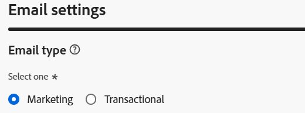

# Configuration d’pour le profil

## Objectif

Dans les étapes suivantes, vous allez créer une configuration de canal e-mail avec des Parcours et des campagnes orchestrées à l’aide de l’attribut de profil AEP `personalEmail.address`

## Créer une configuration de canal

1. Accédez à **Configurations de canal** dans le menu **Administration → Canaux → Paramètres généraux**
2. Cliquez sur le bouton **Créer une configuration**

   

3. Dans l’assistant Créer , définissez les valeurs suivantes :
   - **Name:** `Profile-Email`
   - **Canal:** `Email`
   - **Action marketing :** `Email Targeting`

>[!NOTE]
>
>Lorsque vous sélectionnez E-mail comme canal, une nouvelle section **Paramètres d’e-mail** s’affiche.

## Configurer le type d’e-mail

Définissez **Type d’e-mail** sur **Marketing**

## Configurer le sous-domaine

Dans la liste déroulante **Sous-domaine**, sélectionnez **email.dep-labs.com**

## Configurer les détails du groupe d’adresses IP

Dans la liste déroulante **pool d&#39;adresses IP**, sélectionnez **marketing**

## Configurer le désabonnement de la liste

1. Assurez-vous que le bouton (bascule) est **activé** pour list-unsubscribe
1. Sous la zone de préférence Désabonnement de la liste , assurez-vous que toutes les cases à cocher sont **cochées**
1. Sous Gestion des liens , assurez-vous que **Adobe géré** est sélectionné
1. Pour le niveau de consentement, assurez-vous qu’il est défini sur **Canal**

## Configurer les paramètres d’en-tête

1. Définissez les champs suivants comme suit :
   - **Nom de l’expéditeur :** `DEP Labs`
   - **Préfixe d’e-mail de l’expéditeur :** `dep`
   - **Nom de la réponse :** `DEP Labs Support`
   - **Répondre à un e-mail :** `reply@email.dep-labs.com`
   - **Préfixe de l’e-mail d’erreur :** `error`

## Configurer l’e-mail Cci

Laisser ce champ vide

>[!NOTE]
>
>Vous pouvez conserver une copie des e-mails envoyés en les envoyant à une boîte de réception en Cci. Saisissez l’adresse e-mail de votre choix afin que chaque e-mail envoyé soit copié de façon invisible vers cette adresse Cci. Notez que le domaine de l’adresse en copie (Cci) doit être différent de celui d’un sous-domaine délégué à Adobe. Cette fonctionnalité est facultative. *Utilisation de la fonctionnalité Cci pour les e-mails*

## Configurer les paramètres de reprise d’e-mail

Laissez les paramètres par défaut de **Heures** définis sur **84**

## Configuration des paramètres de tracking d’URL

Conserver les paramètres par défaut

## Détails d’exécution

1. Renseignez la section **Détails d’exécution**. Sous l’onglet **Parcours et action** -> **Dimension d’exécution**, sélectionnez **Profil** en tant que **Source** et cliquez sur l’icône Modifier de **Adresse de diffusion** sous la section **Adresse d’exécution**

   

2. Cliquez sur le dossier intitulé **E-mail personnel** pour l’ouvrir

   

3. Cliquez sur la **case à cocher** dans le champ `Address`, puis sur le bouton **Sélectionner**

   

4. Pour **Profil**, le `personalEmail.address` est désormais configuré comme **Adresse de diffusion** dans la section **Adresse d’exécution**

   

5. Cliquez sur l’onglet Campagne orchestrée et **cochez** la case Activé .

   

6. Sous l’en-tête Dimension d’exécution , configurez les éléments suivants :
   - **Diffuser un message par :** `Target Dimension`
   - **Profile Target Dimension :** `dep-rel: Customer Account - customer_id`

   Dimension Target

7. Sous Adresse d’exécution , configurez les éléments suivants :
   - **Source:** `Profile`
   - **Adresse de diffusion :** `click on the Edit icon`

   

8. Recherchez et cliquez sur le dossier `Personal Email` pour l’ouvrir

   

9. Sélectionnez le champ `Address` dans le dossier E-mail personnel et cliquez sur **Sélectionner**

   

10. Pour **Campagne orchestrée**, le **dep-rel : Compte client - customer\_id** est configuré comme **Dimension cible de profil** pour **Dimension d’exécution** avec **Adresse d’exécution** ayant un **Source** de **Profile** et `personalEmail.address` as **Adresse de diffusion**

>[!NOTE]
>
>Pour les campagnes orchestrées, vous ciblez le compte client avec un e-mail. Il vous suffit donc d’envoyer *un message par profil*.  L&#39;adresse d&#39;exécution que vous utilisez provient du profil lui-même (c&#39;est-à-dire ce qui est stocké dans le profil AEP sous l&#39;attribut **personalEmail.address**)

## Vérifier et enregistrer

1. Vérifiez à nouveau tous les détails pour vous assurer qu’ils correspondent.
1. Faites défiler vers le haut et cliquez sur **Soumettre**.

>[!NOTE]
>
>Il a été observé que le traitement de la configuration du canal e-mail prend jusqu’à 2 heures.  Aïe !
>
>Passez à l’exercice suivant pendant que vous attendez le traitement de cette configuration de canal.

>[!TIP]
>
>🚀 Une fois que le statut de configuration du canal e-mail est **Actif**, il est prêt et peut désormais être sélectionné directement dans les **Activités e-mail** des campagnes orchestrées.

## Récapituler

Vous avez maintenant appris à créer une configuration du canal e-mail pour utiliser l’attribut de profil AEP pour les campagnes Parcours et orchestrées.
