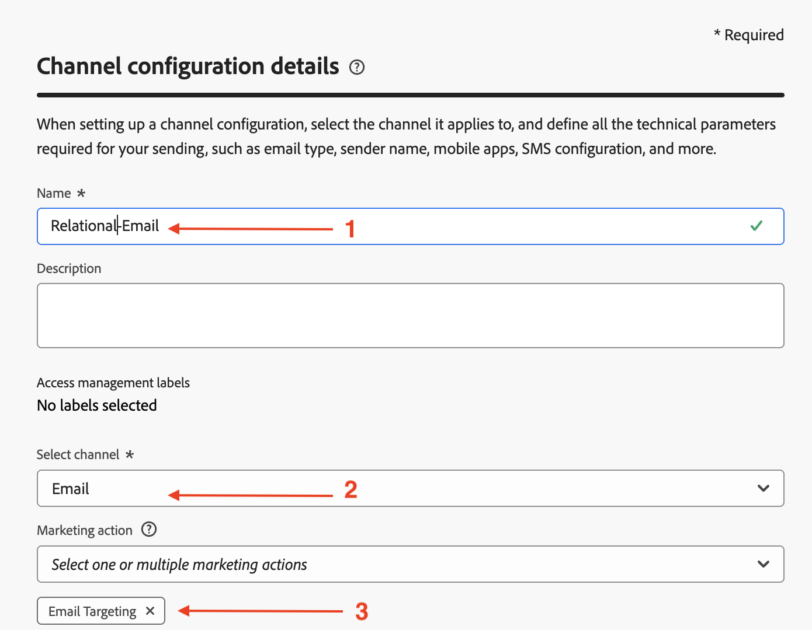

# Configurer pour le relationnel

## Objectif

Dans l’ensemble d’étapes suivant, vous allez créer une configuration du canal e-mail à utiliser uniquement avec des campagnes orchestrées, à l’aide de l’attribut `email` du `dep-rel: Customer Account` Schéma relationnel .

## Créer une configuration de canal

1. Accédez à **Configurations de canal** dans le menu **Administration → Canaux → Paramètres généraux**
2. Cliquez sur le bouton **Créer une configuration**

   

3. Dans l’assistant Créer , définissez les valeurs suivantes :
   - **Name:** `Relational-Email`
   - **Canal:** `Email`
   - **Action marketing :** `Email Targeting`

>[!NOTE]
>
>Lorsque vous sélectionnez E-mail comme canal, une nouvelle section Paramètres d’e-mail s’affiche.

## Configurer le type d’e-mail

Définissez **Type d’e-mail** sur **Marketing**

## Configurer le sous-domaine

Dans la liste déroulante **Sous-domaine**, sélectionnez **email.dep-labs.com**

>[!NOTE]
>
>Si vous choisissez votre propre rythme et ne disposez pas d’un sous-domaine préconfiguré, sélectionnez ici votre propre sous-domaine délégué à Adobe au lieu de `email.dep-labs.com`. Voir [Configuration](../../setup.md) pour savoir comment en déléguer un.

## Configurer les détails du groupe d’adresses IP

Dans la liste déroulante **pool d&#39;adresses IP**, sélectionnez **marketing**

## Configurer le désabonnement de la liste

1. Assurez-vous que le bouton (bascule) est **activé** pour le désabonnement de la liste
1. Sous la zone de préférence Désabonnement de la liste , assurez-vous que toutes les cases à cocher sont **cochées**
1. Sous Gestion des liens , assurez-vous que **Adobe géré** est sélectionné
1. Pour le niveau de consentement, assurez-vous qu’il est défini sur **Canal**

## Configurer les paramètres d’en-tête

1. Définissez les champs suivants comme suit :
   - **Nom de l’expéditeur :** `DEP Labs`
   - **Préfixe d’e-mail de l’expéditeur :** `dep`
   - **Nom de la réponse :** `DEP Labs Support`
   - **Répondre à un e-mail :** `reply@email.dep-labs.com`
   - **Préfixe de l’e-mail d’erreur :** `error`

## Configurer l’e-mail Cci

Laissez le champ E-mail Cci vide

>[!NOTE]
>
>Pour conserver une copie des e-mails envoyés, envoyez-les à une boîte de réception en Cci. Saisissez l’adresse e-mail de votre choix afin que chaque e-mail envoyé soit également envoyé à cette adresse Cci. Notez que le domaine de l’adresse en copie (Cci) doit être différent de celui d’un sous-domaine délégué à Adobe. Cette fonctionnalité est facultative. *Utilisation de la fonctionnalité Cci pour les e-mails*

## Configurer les paramètres de reprise d’e-mail

Laissez les paramètres par défaut de **Heures** définis sur **84**

## Configuration des paramètres de tracking d’URL

Conserver les paramètres par défaut

## Détails d’exécution

1. Dans l’onglet Campagne orchestrée et **cochez** la case Activé .

   

2. Sous la dimension Exécution , configurez les éléments suivants :
   - **Diffuser un message par :** `Target Dimension `
   - **Profile Target Dimension :** `dep-rel: Customer Account - customer_id`

   

3. Sous Adresse d’exécution , configurez les éléments suivants :
   - **Source:** `Target Dimension`
   - **Adresse de diffusion :** `click on the Edit button`

   Dimension Target](assets/configure-for-relational-execution-address-source-target-dimension.png)

5. Sélectionnez **E-mail** et cliquez sur le bouton **Sélectionner**

   

6. Une fois cette opération terminée, les détails de votre exécution finale ressemblent à la capture d’écran ci-dessous

>[!NOTE]
>
>Pour les campagnes orchestrées, vous ciblez le compte client avec un e-mail. Il vous suffit donc d’envoyer un seul message par Dimension Target.  L’adresse d’exécution que vous utilisez provient du Dimension cible lui-même (c’est-à-dire, ce qui est stocké dans la table **dep-rel : Compte client** pour **adresse e-mail**)

## Vérifier et enregistrer

1. Vérifiez à nouveau tous les détails pour vous assurer qu’ils correspondent.
1. Faites défiler vers le haut et cliquez sur **Envoyer**.
1. Lorsque vous avez terminé, vous voyez deux configurations de canal e-mail, probablement à l’état « traitement ».

>[!WARNING]
>
>Il a été observé que le traitement de la configuration du canal e-mail prend jusqu’à 2 heures.

## Récapituler

Vous savez maintenant comment créer une configuration du canal e-mail pour utiliser l’attribut de schéma relationnel pour les campagnes orchestrées.
