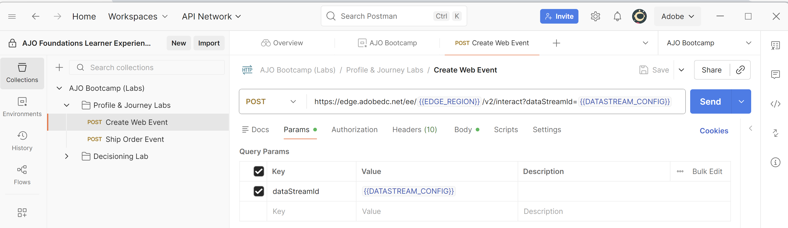

# Envoi d’un événement web Edge

## Objectif d’apprentissage

Envoyez un événement web simulé à Adobe Edge Network à l’aide de l’API .

Pour simuler le chargement et l’envoi d’une page web à AEP Edge, vous envoyez un appel Postman au flux de données que vous avez créé.

Cette opération envoie un événement sans jeton OAuth.  Vérifiez que Postman est ouvert sur votre ordinateur pour effectuer cet exercice pratique.

>[!NOTE]
>
>Comme vous ne transmettez pas de jeton authentifié, vous ne récupérez aucun attribut.

## Attentes du Lab

1. Événement d’expérience sur Edge
1. Configuration du flux de données
1. Configuration du flux de données pour utiliser le service AEP
   1. Audience Edge à exécuter
   2. Envoyer l’événement au hub
1. Réponse de Postman pour inclure l’audience Edge (mais pas d’attributs)
1. Magasin de profils pour recevoir l’événement et ajouter un fragment de profil d’événement
1. Magasin d’identités pour ajouter une relation
1. Jeu de données pour recevoir des données et les stocker dans le lac de données

## Mettre à jour la variable d’environnement Postman

Avant de pouvoir exécuter la requête API, vous devez ajouter l’identifiant du flux de données à l’environnement de la variable Postman. Collectez d&#39;abord les valeurs suivantes :

### Collecter l’identifiant du flux de données

1. Vous devriez déjà disposer de l’identifiant de flux de données **Datastream**

>[!NOTE]
>
>**Si vous avez perdu l’identifiant du flux de données**
>
>1. Dans le rail de gauche, cliquez sur **Flux de données** (sous l’en-tête Collecte de données)
>2. Sélectionnez votre flux de données et copiez la valeur **Identifiant du flux de données**
>
>

### Accéder à l’appel

1. **Barre latérale gauche de Postman** -> `Collections`
1. **Collection** -> `AJO Bootcamp (Labs)`
1. **Dossier** -> `Profile & Journey Labs`
1. **Requête API** -> `Create Web Event`

### Mettre à jour la variable DATASTREAM\_CONFIG

1. Cliquez sur **Variables dans la requête** dans le coin supérieur droit

2. Mettez à jour la **DATASTREAM_CONFIG** **Value** avec l’**ID de train de données** à partir de la première étape de la page.

3. **Enregistrer** votre mise à jour (ctrl + s ou commande + s)
4. Cliquez sur « **X** » dans le coin supérieur droit de la barre latérale de l’environnement pour fermer la barre latérale

5. La requête **Créer un événement web** est maintenant prête à être envoyée, car toutes les variables sont désormais bleues et ont une valeur dans l’environnement.

## Exécution de l’API

Exécutez votre demande en cliquant sur le bouton **Envoyer**.

La réponse ressemble à ce qui suit :

Ce que vous voyez dans la réponse, ce sont ces éléments fondamentaux :

- Une réponse 200 OK signifie que les données ont été envoyées et acceptées par Edge Network

## Récapituler

L’événement a été envoyé à et accepté par l’Edge Network
