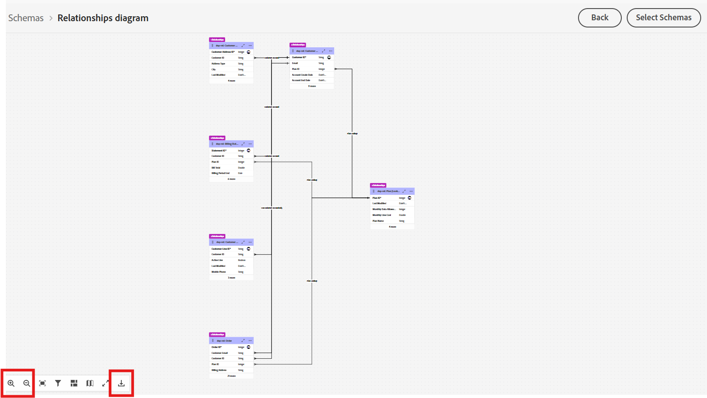

# Parcourir les schémas

## Objectif

Dans les étapes suivantes, vous allez parcourir l’interface utilisateur pour afficher les schémas et leurs relations.  Il est important de se familiariser avec les schémas et les relations disponibles lorsque vous créez votre campagne.

## Affichage des schémas

Le modèle de données relationnelles Connection 5G a déjà été créé pour vous. Vous pouvez afficher les schémas vous-même en accédant à la page **Schémas -> Parcourir** dans l’interface utilisateur.

Dans la zone de recherche, saisissez `dep-rel` pour afficher tous les schémas.

>[!NOTE]
>
>Notez que le type de tous les schémas est *Relationnel*

## Afficher le diagramme de relation

Avec les schémas XDM relationnels, vous pouvez facilement afficher le diagramme de relation d’entité (ERD) en sélectionnant n’importe quel schéma et en cliquant sur le bouton Afficher le diagramme de relation .

Procédez comme suit :

1. Cliquez sur l’onglet **Relations**, puis sur le bouton **Afficher le diagramme de relation**

&#x200B;2. Cliquez sur **Sélectionner des schémas**
&#x200B;3. Dans la fenêtre contextuelle, sélectionnez `dep-rel: Customer Account`, puis cliquez sur **Confirmer**

&#x200B;4. Sur l’ERD, cliquez sur les points **3** et sélectionnez **Afficher les entités associées**

&#x200B;5. Affichez l’ERD avec toutes les tables directement liées à Deep-rel : Customer Account. Vous pouvez éventuellement télécharger l’ERD sous la forme d’un fichier PNG.

>[!TIP]
>
>Plutôt cool hein ?!

## Récapituler

Vous avez maintenant vu à quel point il est facile de naviguer dans l’interface utilisateur Schéma et relations .  Vous pouvez sélectionner un ou plusieurs schémas spécifiques et accéder aux relations pour faciliter la compréhension et l’utilisation des données dans l’orchestration des campagnes.

Vous pouvez en savoir plus [ici](https://experienceleague.adobe.com/fr/docs/journey-optimizer/using/data-management/get-started-schemas) si cela vous intéresse.
