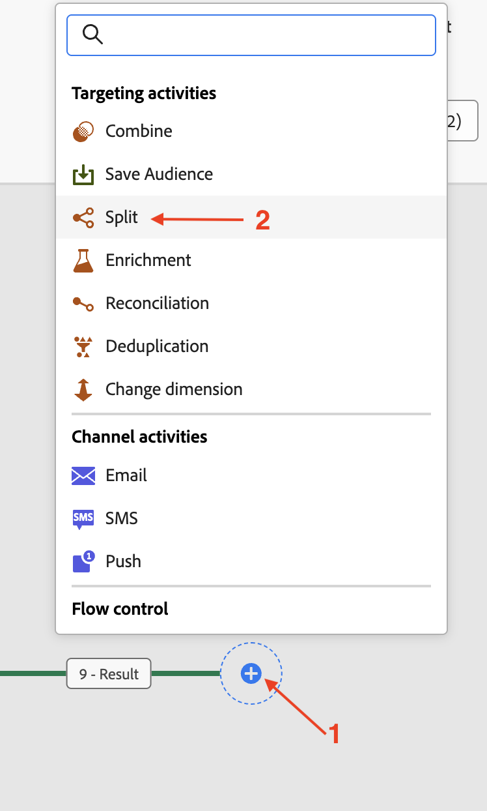

# Lire une audience

## Objectif

Dans les étapes suivantes, vous allez créer une campagne pour lire une audience depuis AEP et l’utiliser avec le Dimension cible de profil créé précédemment. Utilisez l’activité Partage pour partager les données en fonction d’une condition. Enfin, testez la campagne pour comprendre comment fonctionnent ces audiences lorsqu’elles sont utilisées avec le schéma relationnel.

## Lecture d’audience

Ce Lab couvre l’utilisation de l’activité Lecture d’audience conjointement avec le schéma relationnel pour l’enrichissement.

Orchestrated Campaign utilise le schéma relationnel pour toutes les activités. Lors de l’utilisation de l’activité Lecture d’audience , qui lit l’audience à partir d’AEP, une entité correspondante (Target Dimension) doit être configurée pour réconcilier l’audience avec le Dimension Campaign Target.

## Créer une campagne

1. Dans le rail latéral gauche, cliquez sur **Campagnes**

&#x200B;2. Cliquez sur **Créer une campagne**

&#x200B;3. Sélectionnez **Orchestration - Marketing**, puis cliquez sur **Confirmer**

&#x200B;4. Indiquez les détails de la campagne comme suit, puis cliquez sur le bouton **Enregistrer**
   - Nom : **OC-RSL-ReadAudience-Test**
   - Description : **Test d’audience de lecture RSL**

&#x200B;5. Attendre le message de confirmation

## Ajouter une activité Lecture d’audience

1. Cliquez sur le **+** dans la zone de travail pour ouvrir le menu d’options, puis sélectionnez **Lecture d’audience** dans les **Activités de ciblage**

&#x200B;2. Dans le volet d’informations **Lecture d’audience**, cliquez sur l’icône Rechercher pour **Audience**

&#x200B;3. Sélectionnez l’audience **dep: Basic Plan Members** avec un nombre de profils de **9** et cliquez sur **Ajouter une audience**

&#x200B;4. Cliquez ensuite sur la liste déroulante de **Entité** et sélectionnez le Dimension cible `dep-rel: Customer Account - customer_id` Campaign

>[!NOTE]
>
>D’autres attributs peuvent également être extraits du profil AEP pour être utilisés dans la zone de travail à l’aide du bouton **Ajouter un attribut**. Mais pour cet atelier, des attributs supplémentaires ne sont pas requis, cette étape est donc ignorée.

## Tester la campagne

1. Les paramètres de l’activité **Lecture d’audience** sont renseignés. Cliquez sur **Démarrer** pour exécuter la campagne en **Mode test**

>[!NOTE]
>
>Cela prend quelques minutes.
>
>Le mode test permet l’exécution de la campagne afin de vérifier et de surveiller son comportement, ainsi que les résultats de chaque activité. Les activités sont exécutées de manière séquentielle jusqu’à la fin de la zone de travail.

&#x200B;2. L’exécution du test démarre et les résultats s’affichent une fois celle-ci terminée. Cliquez sur le nœud **Résultat**, puis sur Prévisualiser les résultats pour afficher les résultats de l’exécution

&#x200B;3. Notez que les profils **2** (sur 9) de l’**Lecture d’audience** n’ont pas de **Dimension cible** correspondante du schéma relationnel (c’est-à-dire qu’ils existent dans la banque de profils mais pas dans la banque relationnelle). De plus, comme Orchestrated Campaign fonctionne à partir du schéma relationnel, le `customer_id` sans correspondance (**2**) de l’**Lecture d’audience** est supprimé et seuls les *correspondants*, **7** dans ce cas, sont utilisables dans les activités suivantes qui tirent parti de **données relationnelles** dans la campagne

>[!NOTE]
>
>Les étapes suivantes utilisent les données relationnelles pour confirmer que l’instruction ci-dessus de `customer_id` sans correspondance est supprimée.

&#x200B;4. Cliquez sur **Arrêter** pour arrêter le **Mode test** de la campagne

&#x200B;5. Cliquez sur le **+** à la fin du flux et ajoutez **Partage** depuis les **Activités de ciblage**

&#x200B;6. Dans le volet de détails de l&#39;activité **Partage**, développez le premier partage appelé **Sous-ensemble**

&#x200B;7. Renommez-le « **En magasin** » et cliquez sur **Créer un filtre** pour définir la condition de filtre

&#x200B;8. Dans le volet **Créer un filtre** r, cliquez sur **Ajouter une condition**

&#x200B;9. Puisqu’aucun autre attribut n’a été extrait du profil AEP, le seul attribut de profil AEP disponible ici est le `Customer ID`. Toutefois, les colonnes du magasin relationnel correspondant à la dimension cible correspondante sont disponibles pour configurer la condition de filtrage. Développez la **Dimension de ciblage** en cliquant sur **>**

&#x200B;10. Sélectionnez `Source` dans la liste et cliquez sur **Confirmer**

&#x200B;11. Les valeurs distinctes pour la colonne Source sont disponibles dans la liste déroulante. Pour la **Condition personnalisée**, sélectionnez **« En magasin »** dans la liste déroulante, puis cliquez sur **Confirmer** pour quitter

&#x200B;12. De retour dans le volet de détails de l&#39;activité **Partage**, les paramètres du premier Partage sont terminés. Cliquez sur **Ajouter un segment** à la deuxième division

Un nouveau segment nommé **Result** est créé

&#x200B;13. Renommez « **Result** » en « **Not In Store** » et cliquez sur **Créer un filtre** pour définir la condition de filtre

&#x200B;14. Dans le volet **Créer un filtre**, cliquez sur **Ajouter une condition**. Suivez la même approche que ci-dessus, développez la **dimension de ciblage** en cliquant sur **>**, puis sélectionnez `Source` dans la liste et cliquez sur **Confirmer**

&#x200B;15. Pour la **Condition personnalisée**, sélectionnez **« En magasin »** dans la liste déroulante et pour l’opérateur, sélectionnez « **différent de** ». Cliquez sur **Confirmer** pour quitter

&#x200B;16. De retour dans le volet de détails de l&#39;activité **Partage**, les paramètres des deux divisions sont terminés. Cliquez sur **Démarrer** pour exécuter la campagne en **Mode test**

&#x200B;17. L’exécution du test démarre et les résultats s’affichent à la fin du processus. Comme seule la dimension cible correspondant à **7** a été trouvée dans le schéma relationnel, le même nombre est observé après les opérations Partage (**7** et **0**) également

&#x200B;18. Cliquez sur chaque zone de résultat et **Prévisualiser les résultats** pour afficher les résultats

&#x200B;19. Cliquez sur **Arrêter** pour arrêter le **Mode test** de la campagne

>[!NOTE]
>
>Tandis que l’audience Lecture a affiché des profils **9**. Comme nous avons créé un filtre sur Source et que le champ Source existe dans le magasin relationnel, nous avons dû le joindre du magasin de profils au magasin relationnel pour le vérifier. Lorsqu’il a été joint au schéma relationnel, via le Dimension de Campaign Target, seuls 7 profils au total **7** correspondaient. Ces ID de client correspondants **7** peuvent être utilisés dans les activités suivantes qui tentent d’utiliser des données relationnelles. Tous les ID de client **7** avaient `Source` définis sur **« En magasin »**, ce qui était évident via les flux de partage.
>
>Par conséquent, le maintien de la cohérence des données est essentiel lors de l’utilisation des profils AEP avec leurs homologues relationnels à des fins d’enrichissement.

>[!TIP]
>
>Félicitations, vous venez de terminer l’atelier sur l’utilisation de l’activité Lecture d’audience avec le schéma relationnel.

## Récapituler

Vous avez maintenant vu à quel point il est facile de créer une campagne, d’effectuer une activité Lecture d’audience avec le Dimension Cible du profil pour exploiter le schéma relationnel. Vous avez utilisé l’activité Partage pour partager l’audience en fonction d’une condition. Enfin, le mode test a permis de comprendre qu’il est important d’avoir la cohérence des données entre le profil et le schéma relationnel.

Vous pouvez en savoir plus [ici](https://experienceleague.adobe.com/en/docs/journey-optimizer/using/campaigns/orchestrated-campaigns/design-campaigns/read-audience) si cela vous intéresse.
