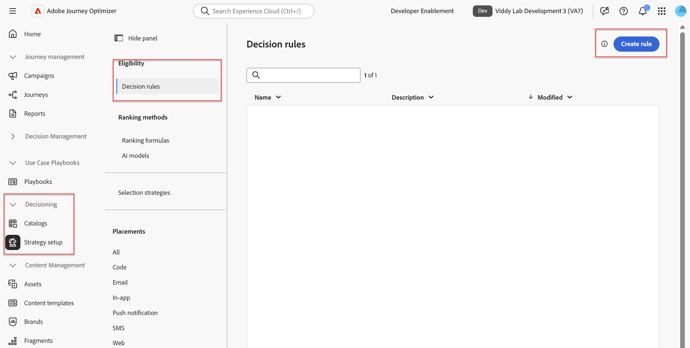

# Créer une règle de décision

## Objectif

L&#39;éligibilité étant l&#39;un des éléments clés d&#39;une offre, la première étape consiste à créer les entités nécessaires pour la soutenir. Dans de nombreux cas, l’appartenance à l’audience est le facteur décisif, mais dans ce cas, nous utiliserons les règles de décision. Avec la connexion 5G, les iPhone 17 haut de gamme ne peuvent être activées que pour les utilisateurs disposant d’un plan de niveau supérieur. Par conséquent, nous utiliserons une règle de décision pour nous assurer que les offres pour les téléphones haut de gamme ne sont disponibles que pour ceux qui ont un forfait suffisamment élevé.

## Création de la règle de décision

1. Si nécessaire, connectez-vous à Adobe Experience Cloud et accédez à **Adobe Journey Optimizer.**
2. Développez l’élément de menu **Prise de décision** dans le rail de gauche si nécessaire, puis cliquez sur **Configuration de la stratégie**.

>[!WARNING]
>
>Assurez-vous que vous êtes dans le menu Prise de décision et NON dans le menu Gestion des décisions . Si le menu Gestion des décisions est développé, réduisez-le pour éviter toute confusion de navigation au cours de cet atelier.

3. Cliquez sur **Règles de prise de décision** dans le menu « Éligibilité », suivi du bouton **Créer une règle** dans le coin supérieur droit.

4. Un écran semblable à l’interface utilisateur du créateur de segments s’ouvre. Ajoutez l’attribut ID de plan à la zone de travail des règles en cliquant sur **Profil individuel XDM > DEP > Détails du plan**, puis en faisant glisser l’attribut **ID de plan** vers la zone de travail.
5. Modifiez la liste déroulante de égal à **contient.**
6. Saisissez le texte **2** dans la zone, appuyez sur la touche **Tab** pour accepter la valeur 2, puis saisissez une valeur **3,** appuyez à nouveau sur **Tab** afin que la règle recherche tous les ID de plan contenant un 2 ou un 3
7. Utilisez la zone de texte **Nom** dans le rail de droite pour nommer la règle de décision **Plans de niveau supérieur**. Ajoutez une description, le cas échéant. Lorsque vous avez terminé, votre règle de décision doit se présenter comme suit :

8. Une fois que la règle est correcte, cliquez sur le bouton bleu **Créer** dans le coin supérieur droit, et vous revenez à la page Configuration de la stratégie avec la règle de décision que vous venez de créer répertoriée comme la seule règle de décision.

>[!NOTE]
>
>Pourquoi utiliser une règle de décision au lieu d’une audience ? En pratique, les principales raisons seraient la nécessité de critères d’éligibilité spécifiques au package Decisioning ou d’attributs des offres dans les critères. Les attributs de l’offre ne sont pas disponibles dans le créateur d’audiences.
>
>La règle de prise de décision des plans de niveau supérieur utilisée dans cet atelier serait probablement une audience réelle dans une implémentation réelle, étant donné sa réutilisation probable en dehors de la prise de décision. Cependant, une règle de prise de décision a été utilisée ici à des fins éducatives et pour présenter sa fonctionnalité et les multiples façons dont l’éligibilité peut être appliquée.

## Récapituler

Vous avez maintenant créé une règle de décision réutilisable, que vous utiliserez pour l&#39;éligibilité de l&#39;offre.
