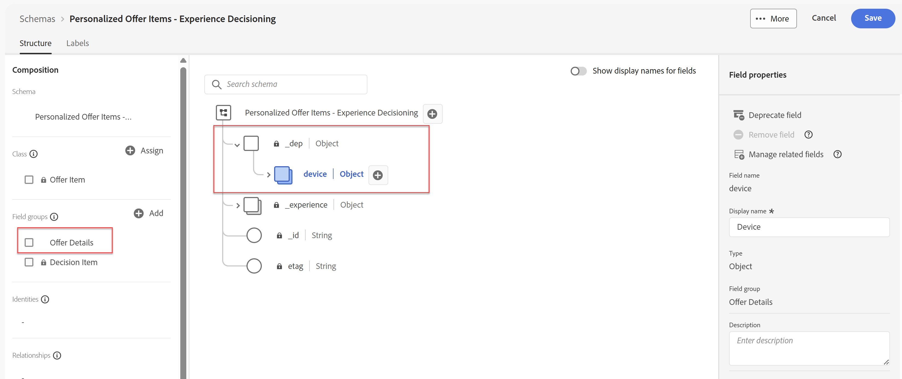

# Créer des attributs d’offre

## Objectif

Dans cette section, vous allez ajouter des champs XDM personnalisés au schéma XDM d’offre standard. Ces champs personnalisés peuvent être utilisés dans le classement, le tri et les critères d’éligibilité. Il peut également s’agir de données renvoyées à l’appareil demandeur.

## Créer un objet parent Appareil personnalisé

1. Développez l’élément de menu **Prise de décision** dans le rail de gauche si nécessaire, puis cliquez sur **Catalogues.**
2. Par défaut, la page Offres s’affiche. Cliquez sur le bouton **Modifier le schéma** dans le coin supérieur droit.

>[!TIP]
>
>La page qui en résulte est l’éditeur de schéma XDM standard. Tout comme XDM est utilisé pour définir la structure de données des jeux de données, XDM est utilisé ici pour définir les attributs d’une offre.

>[!NOTE]
>
>Le schéma « Éléments d’offre personnalisés - Experience Decisioning » est un schéma standard généré par le système qui s’applique à toutes les offres. Cependant, vous pouvez ajouter des éléments à ce schéma pour répondre à des besoins métier uniques, ce que vous ferez dans cette section.
>
>De plus, parcourir la page des offres est un raccourci pour accéder à ce schéma. Vous pouvez également y accéder à partir du menu Schéma dans le rail de gauche.

&#x200B;3. Cliquez sur l’icône **+** à droite du niveau racine du schéma, puis, à l’aide du menu « Propriétés du champ » désormais visible dans le rail de droite, renseignez les champs suivants avec les valeurs fournies :
   - Nom du champ : **device**
   - Nom d’affichage : **Device**
   - Liste déroulante Type : **Objet**
   - Affecter au groupe de champs (saisir cette valeur dans) : **Détails de l’offre**

>[!NOTE]
>
>Le groupe de champs Affecter à semble être une liste déroulante, mais il accepte également la saisie de texte directe. Par conséquent, saisissez le texte « Détails de l’offre ». Lorsque vous la saisissez, un élément « Détails de l’offre (nouveau) » s’affiche également. Tout nouvel attribut doit être affecté à un groupe de champs. Par conséquent, au cours de cette étape, vous êtes en train de créer un groupe de champs appelé Détails de l’offre.

&#x200B;4. Assurez-vous que toutes les propriétés ont été renseignées comme la capture d’écran ci-dessous :

&#x200B;5. Une fois que vous avez vérifié que tous les champs sont corrects, cliquez sur le bouton bleu **Appliquer** en bas du menu « Propriétés du champ » (rail de droite) pour voir vos modifications appliquées au schéma :

>[!TIP]
>
>Comme pour un XDM normal, les attributs personnalisés sont regroupés sous un espace de noms spécifique à l’organisation IMS, à savoir l’identifiant du client imsorg ou « dep » dans ce cas. Vous constatez également que le nouveau groupe de champs « Détails de l’offre » est désormais répertorié dans le volet « Composition », à gauche du schéma.

>[!WARNING]
>
>Notez que ces modifications ne sont PAS enregistrées. Ils sont simplement « appliqués ». Si vous quittiez la page sans enregistrer, vous perdriez votre travail. Suivez les étapes de cette section avant de quitter .

## Créer des attributs d’appareil personnalisés

Maintenant que l’objet XDM de l’appareil a été créé, vous pouvez passer à la création de champs spécifiques à l’appareil.

1. Cliquez sur l’icône **+** située à droite du nouvel objet **device** que vous venez de créer, puis, à l’aide du menu « Propriétés du champ » dans le rail de droite, renseignez les champs suivants avec les valeurs fournies :
   - Nom du champ : **make**
   - Nom d’affichage : **Marque**
   - Liste déroulante Type : **Chaîne**
   - Affecter au groupe de champs : **Détails de l’offre** (doit déjà être sélectionné)
   - Une fois que vous avez vérifié que tous les champs sont corrects, cliquez sur le bouton bleu **Appliquer** pour voir vos modifications appliquées au schéma
2. Répétez les étapes précédentes pour ajouter deux attributs supplémentaires pour **Modèle** et **Niveau**. Utilisez le même modèle de dénomination, le même type et le même groupe de champs. Lorsque vous avez terminé, le schéma doit se présenter comme suit :

&#x200B;3. Une fois tous les nouveaux champs/attributs XDM créés, cliquez sur **Enregistrer** dans le coin supérieur droit et vous recevrez un message « Schéma enregistré avec succès » vert en bas de l’écran. Vous avez maintenant terminé les étapes de cette section.

>[!WARNING]
>
>Le schéma que vous venez de mettre à jour s’applique à TOUTES les offres, y compris toutes les offres futures. L’ajout d’attributs à ce schéma doit être réalisé avec la plus grande prudence. Dans notre exemple de cas d’utilisation d’une société de télécommunications qui vend des téléphones portables, les attributs de marque, de modèle et de niveau de l’appareil seront probablement largement utilisés pour de nombreuses offres et pour les années à venir. Il est donc logique de les ajouter. Lorsque vous réfléchissez aux attributs nécessaires à une offre, évitez d’ajouter des attributs propres à une campagne spécifique. Sur plusieurs mois ou années, ce schéma peut devenir hypertrophié et entraîner des problèmes lors de la création d’offres. Vous verrez comment cela s’applique dans la section où vous allez créer des offres.

## Récapituler

Vous avez réussi à mettre à jour le schéma des offres standard avec des champs personnalisés réutilisables qui seront utilisés dans les parties ultérieures de l’atelier lors de la création et de l’évaluation des offres.
