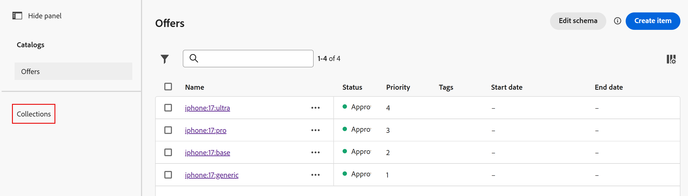

# Créer une collection d’offres

## Objectif

Maintenant que vos offres ont été créées, elles doivent être organisées en une collection. Une collection comporte un ou plusieurs éléments d’offre, et un élément d’offre peut se trouver dans plusieurs collections.

## Création de la collection d’offres iPhone

1. Si nécessaire, développez **Prise de décision** dans le rail de gauche, puis cliquez sur **Catalogues**. Les quatre offres que vous avez créées dans la section précédente s’affichent.
2. Cliquez sur **Collections** à gauche du nom de l&#39;offre

   

3. Cliquez sur le bleu **Créer une collection** pour créer la collection.
4. Nommez la collection **iPhone 17 Collection**
5. Dans la section « Règles de collecte », cliquez sur la zone de texte contenant le texte **_Cliquez pour créer un élément de décision_**. Une fois que vous avez cliqué dessus, les options de création de la règle s’affichent.

   

6. Cliquez sur le bouton **Sélectionner un attribut**, puis parcourez le schéma d’élément d’offre en cliquant sur **Appareil > Marque**. Cliquez sur **Enregistrer** et vous verrez que l’attribut « Créer » se trouve désormais dans la règle de décision.

   

   >[!NOTE]
   >
   >Notez que les options disponibles sont les mêmes champs configurables que ceux utilisés lors de la création des éléments d’offre. Étant donné qu’une collection est un regroupement d’éléments d’offre, il est logique que les règles permettant de les regrouper dépendent de leurs attributs.

7. Laissez l’opérateur « Est égal à » en place et saisissez le texte **** dans le champ de valeur, et vous verrez que le nombre d’éléments passe à 4, indiquant que tous les éléments de votre offre répondent à ce critère

   

   >[!NOTE]
   >
   >Vous pouvez également cliquer sur le bouton **Prévisualiser la collection** et voir les éléments d’offre qui répondent aux critères.

8. Lorsque les quatre éléments d’offre sont sélectionnés, cliquez sur le bouton bleu **Créer**. Vous accédez alors à une page qui affiche la collection que vous venez de créer.

>[!NOTE]
>
>Une collection est plus qu&#39;un simple moyen d&#39;organisation. Dans les étapes qui suivent, vous verrez que dans la prise de décision, nous appliquons une logique de sélection à une collection d’offres. Si l’on considère une implémentation à l’échelle de l’entreprise, il n’est pas difficile d’imaginer le nombre d’offres qui seraient créées au fil des années d’utilisation. Afin de déterminer les offres auxquelles une stratégie de sélection devrait s&#39;appliquer, met en lumière l&#39;importance d&#39;une bonne gestion des collections.
>
>Dans ce cas, une collection avec uniquement « iPhone » comme critère apporterait trop d’offres après quelques années de versions d’iPhone. Nous aurions pu utiliser des critères supplémentaires tels que « Make equals 17 » ou utiliser les balises AEP pour baliser les offres pour une campagne spécifique. Mais pour plus de simplicité, nous utilisons cette logique simple pour créer une collection.

## Récapituler

Vous avez maintenant créé une collection d’offres qui regroupe les éléments d’offre que vous avez précédemment créés. Vous avez ajouté toutes les offres iPhone 17 dans une collection et défini une règle basée sur les attributs de l’offre (comme le marque de l’appareil) afin que seules les offres pertinentes appartiennent à cette collection.
