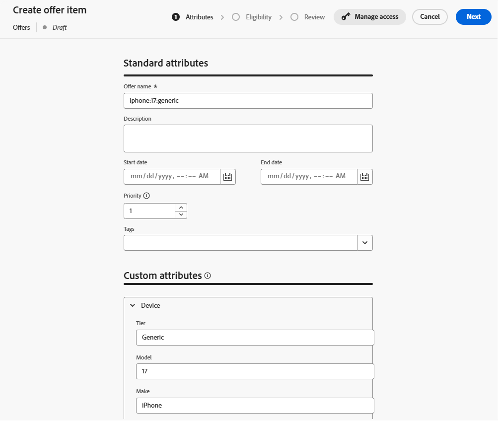
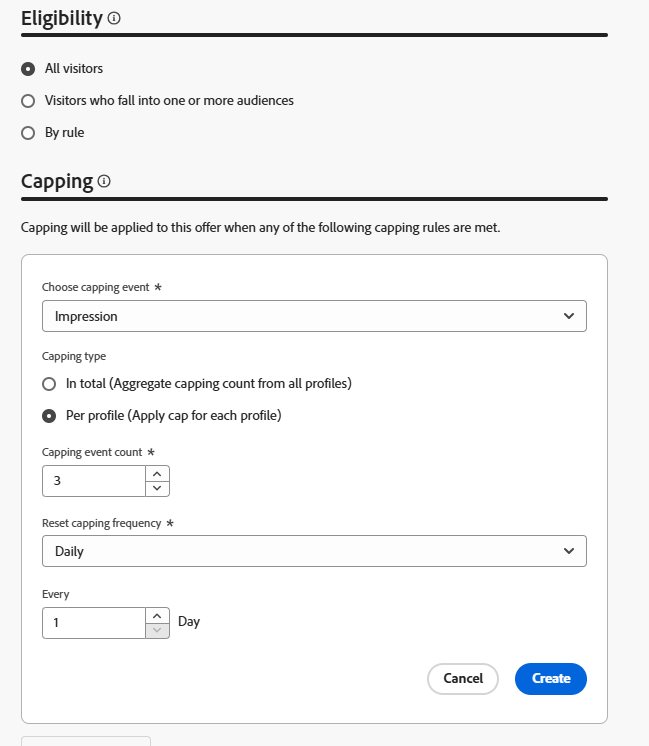

# Créer des éléments d’offre

## Objectif

Dans cette section, vous allez créer les éléments d’offre réels que l’expérience basée sur le code (CBE) renverra au client demandeur. Certains des éléments de l’offre auront des exigences d’éligibilité et un capping de la fréquence, d’autres non.

## Présentation du scénario

Toutefois, avant de créer les articles de l’offre, voici quelques rappels rapides de notre scénario. Tout d’abord, notre scénario comporte 3 niveaux iPhone 17 : Ultra, Pro et Base. Vous créez 4 offres au total, 1 pour chaque niveau, ainsi qu&#39;une offre de secours générique que le système récepteur peut utiliser pour afficher des informations générales sur iPhone 17 à tous les niveaux.

Deuxièmement, seuls les clients dont l&#39;ID de plan est de 2 ou 3 sont éligibles aux téléphones Ultra et Pro.

Ensuite, l&#39;entreprise a demandé que chaque offre ne soit présentée que trois fois par jour avant la présentation du prochain téléphone de premier rang.

Enfin, toutes choses égales par ailleurs, Connection 5G préférerait vendre le niveau Ultra, suivi du Pro, puis du modèle de base. Ainsi, ces priorités s’affichent lorsque vous attribuez un score de priorité à chaque élément d’offre.

## Créer un élément d&#39;offre par défaut/de secours

Le premier élément d’offre que vous créez est l’offre de secours, que tout le monde peut consulter pendant une période illimitée.

1. Si nécessaire, développez **Prise de décision** dans le rail de gauche, puis cliquez sur **Catalogues**
2. Une page d’offres vide s’affiche :

   

3. Cliquez sur le bouton bleu **Créer un élément**. La page Créer un élément d’offre s’ouvre.
4. Dans le champ &#39;Nom de l&#39;offre&#39;, saisissez le texte **iphone:17\:generic**. Saisissez une description si vous le souhaitez.

   >[!NOTE]
   >
   >La convention d’affectation des noms, entièrement en minuscules et séparée par des deux-points, n’est qu’une de nos propres conceptions qui pourrait servir de modèle à suivre pour un client réel. Dans la pratique, vous pouvez développer une stratégie de dénomination différente pour vos éléments d’offre. Assurez-vous qu’elle est documentée et cohérente avant de créer des articles d’offre. Cela permet de s’assurer que les éléments de l’offre sont faciles à trouver et à regrouper dans des collections. J&#39;en reparlerai plus tard.

5. Puisqu’il s’agit de l’élément d’offre par défaut/de priorité la plus faible, laissez la priorité par défaut à 1.

   >[!NOTE]
   >
   >Dans Decisioning, plus le nombre est faible, plus la priorité est faible. Par exemple, un élément d’offre avec une priorité de 100 s’affiche avant un élément d’offre avec une priorité de 1

6. Développez l’élément **Appareil** dans la zone « Attributs personnalisés », puis saisissez les informations suivantes dans les zones de texte :
   - Niveau : **Générique**
   - Modèle : **17**
   - Marque : ****

   Il s’agit des valeurs de texte réelles qui décrivent l’offre et ce qui peut être utilisé dans le tri, le classement et les critères d’éligibilité. Il s’agit également des valeurs de texte qui peuvent être renvoyées à l’appareil demandeur.

   

   >[!NOTE]
   >
   >La zone Appareil que vous avez développée est le même objet parent « Appareil » qui a été créé lors de la mise à jour du schéma « Éléments d’offre personnalisés - Experience Decisioning » avec des attributs personnalisés dans la section précédente. Les champs Niveau, Modèle et Marque sont les attributs individuels qui ont été ajoutés :
   >
   >

   >[!WARNING]
   >
   >La section précédente a mentionné la nécessité de faire très attention lors de l’ajout d’attributs personnalisés au schéma « Éléments d’offre personnalisés - Experience Decisioning » généré par le système. Chaque nœud personnalisé supplémentaire s’affichera désormais comme un champ possible pour chaque élément d’offre. La création d’attributs inutiles ou spécifiques à une campagne encombre l’interface utilisateur de création d’élément d’offre et peut prêter à confusion.

7. Cliquez sur le bouton bleu **Suivant** dans le coin supérieur droit pour passer à l’étape suivante.
8. Cette offre doit être disponible pour tout le monde/tous les visiteurs et visiteuses et ne doit pas comporter de capping de la fréquence. Il n’est donc pas nécessaire d’apporter des modifications aux sections « Éligibilité » ou « Capping ». Cliquez de nouveau sur le bouton bleu **Suivant** pour passer à la dernière étape.
9. À l’étape « Vérifier », vérifiez que toutes les données sont correctes :

   

10. Apportez les modifications nécessaires. Une fois prêt, cliquez sur le bouton bleu **Enregistrer**.
11. Une fois enregistré, un bouton blanc « Approuver » apparaît à l’endroit où se trouvait auparavant le bouton « Enregistrer ». Cliquez sur le bouton blanc **Approuver** pour approuver cet élément d&#39;offre. Un indicateur « Approuvé » vert s’affiche sous le titre de l’objet de l’offre :

>[!NOTE]
>
>Dans la pratique, et pour les offres plus complexes, un processus de validation approprié doit être en place pour s’assurer que les éléments de l’offre ont été créés correctement. Pour gagner du temps dans cet atelier, il vous suffit d’approuver chaque élément d’offre que vous créez.

12. Cliquez sur la **flèche de gauche** en regard du titre de l’élément d’offre pour revenir à la page « Offres », et votre offre iphone:17\:générique est répertoriée.

## Créer un article d’offre de modèle de base

Maintenant que l’élément d’offre générique a été créé, vous pouvez créer l’élément d’offre prioritaire suivant pour le modèle de base d’iPhone 17.

1. Cliquez de nouveau sur le bouton bleu **Créer un élément** et nommez l’offre **iphone:17\:base**
2. Puisqu’il s’agit de l’élément d’offre de priorité la plus faible suivant, augmentez le champ **Priorité** sur **2**
3. Développez la zone **Appareil** et donnez aux champs les valeurs suivantes :
   - Niveau : **de base**
   - Modèle : **17**
   - Marque : ****

   Lorsque vous avez terminé, l’élément d’offre ressemble à ceci (la boîte rouge est ajoutée pour s’assurer que la priorité est correcte) :

   

   Lorsque tout est correct, cliquez sur le bouton bleu **Suivant** pour passer à l’étape suivante.

4. Cet élément d’offre doit être disponible pour tous. Il n’y a donc pas d’exigence d’éligibilité, mais il doit être limité à 3 impressions par jour. Cliquez sur le bouton « **+ Créer une limitation »**.
5. Dans la nouvelle règle de limitation, remplacez **Choisir l’événement de limitation** par **Impression.**
6. Remplacez **Nombre d’événements de limitation** par **3**. Une fois l’opération terminée, votre règle de limitation ressemble à ceci :

   

   Une fois la correction effectuée, cliquez sur le bouton bleu **Créer** pour enregistrer la règle de limitation.

   >[!NOTE]
   >
   >Remarquez comment créer une règle de limitation supplémentaire. En pratique, vous pouvez ajouter plusieurs règles. Dans ce cas, nous aurions pu ajouter une règle pour limiter cette valeur si un événement spécifique avait été affiché, tel qu’un événement d’achat. Cet atelier simplifie le processus avec une seule règle de limitation.
   >
   >

   >[!NOTE]
   >
   >Les « jours » mentionnés dans les règles de capping de la fréquence se rapportent aux jours du fuseau horaire GMT.  Capping de la fréquence avec les jours dans la logique réinitialisée à minuit, GMT.

7. Cliquez sur **Suivant** pour passer à l’étape de révision.
8. Vérifiez que tout apparaît comme prévu et cliquez sur le bouton **Enregistrer**. Une fois enregistré, cliquez sur **Approuver.**
9. Une fois la validation effectuée, cliquez sur la flèche de gauche en regard du titre et revenez à la page des offres. Vous voyez désormais deux offres, chacune ayant la priorité appropriée.

## Créer des éléments d’offre de modèle de niveau supérieur

Maintenant que les offres de modèle générique et de base ont été créées, vous pouvez passer aux éléments d’offre pour les modèles pro et ultra. Ces éléments d’offre doivent également inclure un élément d’éligibilité, car seuls les membres disposant d’un certain niveau de plan doivent voir ces offres.

1. En suivant les mêmes étapes et modèles de dénomination que ceux décrits dans les sections ci-dessus, créez une offre appelée **iphone:17\:pro** et définissez sa priorité sur **3.**
2. Définissez l’attribut **Niveau** sur **Pro** et les autres attributs personnalisés comme vous l’avez fait dans les autres offres.
3. A l&#39;étape &#39;Éligibilité&#39;, sélectionnez le bouton radio **Par règle**.
4. Le rail de gauche n’affiche qu’une seule règle de décision, celle créée précédemment et appelée « Plans de niveau supérieur ». Cliquez sur l’icône **+** en regard de cette règle pour l’ajouter à la zone de travail.
5. Comme mentionné précédemment, l’entreprise a déclaré que les offres autres que de secours doivent avoir une limite de fréquence de 3 affichages (ou impressions) par jour. Suivez les étapes de la section précédente pour créer une règle de limitation pour 3 impressions par jour. Lorsque vous avez terminé, votre page ressemble à ceci :

   

6. Une fois que vous avez vérifié que tout est correct, cliquez sur **Suivant**. La configuration de l’élément d’offre final ressemble à ceci :

   

7. Une fois que tout semble correct, **Enregistrer** et **Approuver** l’élément d’offre.
8. Revenez à la page des offres et vérifiez que les 3 offres y sont et qu’elles ont chacune la priorité appropriée.
9. Créez l’élément d’offre final et nommez-le **iphone:17\:ultra** attribuez-lui une priorité de **4,** et définissez les autres attributs personnalisés avec les mêmes valeurs que les autres offres.
10. Comme pour le dernier élément d’offre, définissez l’éligibilité à la règle de décision « Plans de niveau supérieur » et définissez un capping de la fréquence de 3 impressions par jour. Lorsque vous avez terminé, l’élément de votre offre ressemble à ceci :

11. Une fois que vous avez vérifié que tous les paramètres sont corrects, enregistrez et approuvez cet élément d&#39;offre. Vous voyez désormais les quatre éléments de l’offre, chacun ayant une priorité unique.

>[!NOTE]
>
>Les instructions de cet atelier mettent l’accent sur la nécessité de s’assurer que les priorités sont différentes pour chaque élément d’offre. Dans ce cas d’utilisation simple, c’est important, mais rien dans l’interface utilisateur ne vous force à donner une priorité unique à chaque élément de l’offre. Au fil du temps, il est probable que vous ayez plusieurs éléments d’offre avec la même priorité. Vous verrez pourquoi il est important de comprendre cela dans les sections suivantes.

## Récapituler

Vous avez défini plusieurs offres pour les différents niveaux d’iPhone 17, y compris une offre de secours générique et des offres spécifiques au niveau (de base, pro et ultra). Vous avez également approuvé les quatre éléments d’offre avec les paramètres corrects de priorités, d’éligibilité et de limitation des impressions afin qu’ils soient prêts à être utilisés dans votre package Decisioning.
