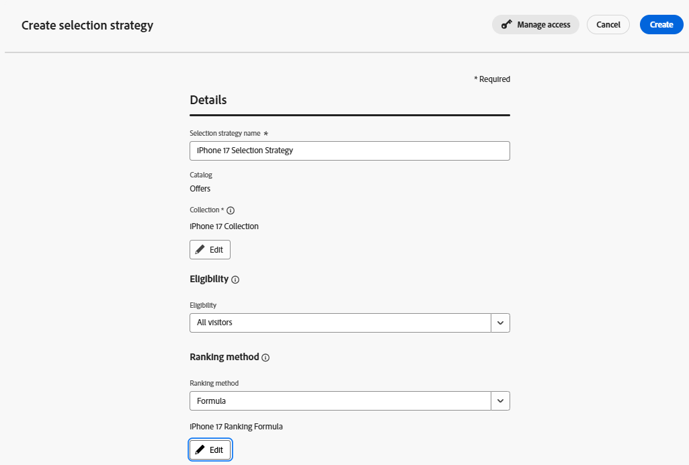

# Créer une stratégie de sélection

## Objectif

Jusqu’à présent, vous avez créé des offres, défini l’éligibilité des offres avec une règle de décision, les avez regroupées dans une collection et créé une formule qui les réorganise dynamiquement en fonction des attributs du profil demandant la personnalisation. Comme nous n’utilisons qu’un seul ensemble de 4 offres pour un seul cas d’utilisation, il est tentant de penser que chacun de ces éléments est lié, en particulier lorsque nous les nommons de la même manière. Cependant, il est important de réfléchir de manière plus abstraite lorsque vous envisagez une stratégie à long terme et une portée à l’échelle de l’entreprise. Les offres peuvent être triées en une ou plusieurs collections. Les formules de classement peuvent être appliquées à n’importe quelle collection d’offres. En réalité, la première fois que vous connectez réellement ces éléments, c’est lors de la création d’une stratégie de sélection.

Imaginez que nous ayons des centaines d’offres utilisées dans quarante collections et une douzaine de formules de classement. Comment un package de décision saurait-il quelle formule de classement appliquer à quelle collection d’offres ? La stratégie de sélection établit ce lien. Lorsque vous ajoutez Decisioning à un canal, vous ajoutez une ou plusieurs stratégies de sélection.

## Création de la stratégie de sélection

1. Si nécessaire, développez **Prise de décision** dans le rail de gauche, puis cliquez sur **Configuration de la stratégie**. Vous accédez à la page « Règles de prise de décision », où vous voyez la règle de décision « Plans de niveau supérieur » que vous avez précédemment créée et utilisée comme conditions d’éligibilité pour les éléments d’offre téléphonique de niveau supérieur.
2. Cliquez sur **Stratégies de sélection** juste en dessous du menu « Méthodes de classement ». Aucune stratégie de sélection n’étant disponible, cliquez sur le bouton bleu **Créer une stratégie de sélection**.

   

3. Nommez la stratégie de sélection **Stratégie de sélection iPhone 17**
4. Vous pouvez voir qu&#39;une stratégie de sélection nécessite 3 choses.
   - Une collection d’offres
   - Conditions d&#39;éligibilité
   - Une Méthode De Classement

   Cliquez sur le bouton **Sélectionner la collection**, cochez la case en regard de la seule collection que vous avez (**Collection iPhone 17**), puis cliquez sur **Enregistrer**.

5. Laissez le menu déroulant « Éligibilité » défini sur Tous les visiteurs.

   >[!NOTE]
   >
   >L&#39;éligibilité peut être appliquée au niveau de l&#39;offre, de la stratégie de sélection ou au niveau du Parcours/de la campagne via les critères de saisie du Parcours ou de la campagne. Tout dépend du cas d’utilisation que vous essayez de réaliser. Si vous cliquez sur le menu déroulant **Éligibilité**, vous verrez les mêmes options d’audience et de règle de décision que celles que vous avez vues au niveau de l’offre. Dans notre cas d’utilisation, nous souhaitions uniquement limiter les offres spécifiques. Il était donc logique de définir l’éligibilité au niveau de l’offre.

6. Définissez la **Méthode de classement** sur **formule** puis cliquez sur le bouton **Sélectionner la formule**

   >[!NOTE]
   >
   >Vous avez peut-être remarqué les options « Priorité des offres » et « Modèle d’IA » dans le menu déroulant Méthode de classement . Si vous souhaitez vraiment renvoyer uniquement des offres en utilisant uniquement leur priorité d’origine, vous devez choisir l’option « Priorité des offres ».
   >
   >L’option Modèle d’IA utilise un modèle d’IA qui analyse les impressions, les clics et les conversions des offres renvoyées afin de déterminer l’offre à afficher à l’individu. Nous ne les utiliserons pas dans ce laboratoire, car il existe des seuils de données minimum ainsi que deux semaines nécessaires pour entraîner les modèles.

7. Cochez la case en regard de la seule formule de classement que vous avez (**Formule de classement iPhone 17**) et cliquez sur **Enregistrer**. Lorsque vous avez terminé, votre stratégie de sélection se présente comme suit :

   

8. Une fois votre stratégie de sélection correcte, cliquez sur le bouton bleu **Créer**.

>[!TIP]
>
>Votre stratégie de sélection iPhone 17 apparaît désormais dans le menu « Stratégie de sélection »

>[!NOTE]
>
>Decisioning permet une sélection et un ordre des offres très simples ou très complexes. À l’extrémité simple, vous pouvez avoir une collection d’offres avec leur priorité par défaut, une éligibilité définie sur tous les visiteurs et la méthode de classement de « Priorité des offres », et tous les utilisateurs finaux verront les offres dans l’ordre de leurs scores de priorité d’origine. À l’autre extrême, vous pourriez avoir une énorme collection avec des scores de priorité initiaux complexes, une formule de classement sur mesure et des règles d’éligibilité superposées au niveau de la stratégie d’offre et de sélection. Ce que vous avez créé dans cet atelier se trouve au milieu et a été conçu pour démontrer les différentes manières dont les packages de prise de décision peuvent être configurés.

## Récapituler

Sur cette page, vous avez créé une stratégie de sélection qui relie les composants principaux que vous avez créés jusqu’à présent : la collection d’offres, les règles d’éligibilité et la formule de classement.
