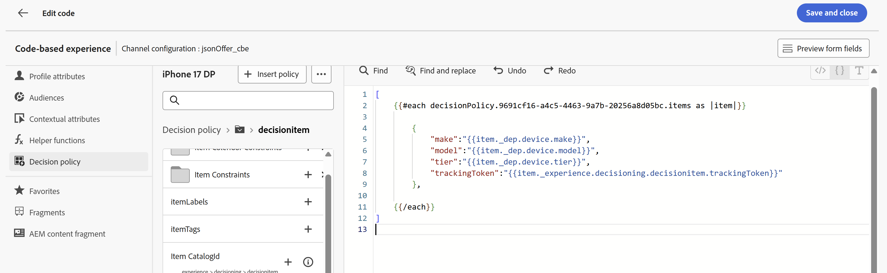

# Création du Parcours

## Nommer et définir les critères d’entrée

1. Si nécessaire, développez l’élément de menu **Gestion des Parcours** dans le rail de gauche, puis cliquez sur **Parcours**. Vous atterrissez sur la page « Parcours ».
2. Cliquez sur le bouton bleu **Créer un Parcours**.
3. Lorsque le recouvrement « Créer un Parcours » apparaît, sélectionnez **Créer en partant de zéro** et cliquez sur **Confirmer**
4. Dans le rail de droite, nommez le Parcours **Parcourir les abandons d’iPhone 17** et cliquez sur le bouton bleu **Enregistrer** pour commencer à ajouter des actions à la zone de travail du Parcours.
5. Faites glisser l’événement **Qualification de l’audience** sur la zone de travail.
6. Dans le rail de droite, cliquez sur l’icône **Crayon** pour sélectionner l’audience de cet événement.
7. Sélectionnez l’audience **dep : intéressé par iPhone 17**.
8. Assurez-vous que la liste déroulante **Espace de noms** est définie sur **customerID.** À ce stade, votre Parcours ressemble à ceci :

Zone de travail de Parcours 

9. Une fois que tout le monde a l’air correct, cliquez sur le bouton bleu **Enregistrer** pour enregistrer votre progression.

>[!NOTE]
>
>L’audience « dep : Intéressé par iPhone 17 » est une audience de diffusion en continu où le critère d’entrée est de regarder la page fictive d’aperçu de Connexion 5G iPhone 17 3 fois dans la même journée. Comme de nombreuses pages de présentation du produit, la page de présentation de Connection 5G d’iPhone 17 est une page dynamique comportant plusieurs éléments qui se mettent à jour sans qu’il faille recharger la page. Vous pouvez comparer les différents niveaux d’iPhone 17 et leurs fonctionnalités sur cette page unique. Par conséquent, si une personne consulte cette page 3 fois le même jour, elle est susceptible d’avoir un intérêt pour iPhone 17. Cependant, comme tous les éléments de la page ne sont pas balisés et mesurés, Connection 5G utilisera l’âge des utilisateurs authentifiés pour déterminer le niveau de téléphone à afficher lorsqu’ils interagissent avec différents points de contact de la marque Connection 5G.


## Configurer le CBE et la politique de décision

1. Développez l’accordéon **Actions** à gauche de la zone de travail, faites glisser l’élément **Action** sur la zone de travail et connectez-le au premier nœud.
2. Lorsque le recouvrement « Sélectionner le type d’action » apparaît, sélectionnez l’action **Expérience basée sur le code** et cliquez sur le bouton bleu **Ajouter**.
3. Dans les propriétés désormais visibles « Action\:Expérience basée sur le code », cliquez sur le bouton **Configurer l’action**.


4. Remplacez la liste déroulante **Configuration basée sur le code** par le cbe **jsonOffer\_cbe** que vous avez créé dans la dernière section.


5. Cliquez sur le bouton **Modifier le contenu** juste au-dessus de la liste déroulante « Configuration basée sur le code ».
6. Sur l’écran de l’éditeur d’expérience basé sur le code qui s’affiche, cliquez sur le bouton **Modifier le code**. L’écran qui en résulte vous permet d’ajouter le fichier JSON renvoyé aux requêtes d’événement d’expérience


7. À l’extrémité gauche de l’éditeur de code, cliquez sur l’élément de menu **Politique de décision**, puis sur le bouton **Ajouter une politique de décision** dans le nouveau menu.


>[!NOTE]
>
>Si une stratégie de sélection consiste à lier une collection d’offres à une méthode de classement (et à appliquer une éligibilité au niveau de la stratégie), une politique de décision consiste à lier une stratégie de sélection à une diffusion spécifique d’un canal.

8. Nommez cette politique de décision **iPhone 17 DP** et laissez le Nombre d’éléments défini sur 1.

>[!NOTE]
>
>Jusqu’à présent, vous avez configuré les offres et la manière de les commander, mais vous n’avez pas configuré le nombre de retours. C’est là que vous configurez le nombre d’offres à renvoyer.

9. Cliquez sur le bouton bleu **Suivant**. C’est là que vous ajoutez la stratégie de sélection. Cliquez sur le bouton **+Ajouter** (vous devrez peut-être faire défiler la page vers le bas pour l’afficher), puis choisissez **Stratégie de sélection**.
10. Cochez la case en regard de la seule stratégie de sélection que vous devriez avoir (**Stratégie de sélection iPhone 17**) et cliquez sur **Enregistrer**. Lorsque vous avez terminé, voici ce que vous voyez :


>[!NOTE]
>
>Notez comment ajouter plusieurs stratégies de sélection ou simplement ajouter les éléments de décision eux-mêmes. Quand utiliseriez-vous plusieurs stratégies de sélection ? Imaginez que vous ayez une grille de recommandations 4 X 4 sur l’une de vos propriétés numériques. Vous souhaitez tous les remplir avec 16 offres. Ces offres peuvent être réparties sur quelques collections, ou les deux premières lignes nécessitent une stratégie de sélection, tandis que les deux dernières lignes nécessitent une stratégie différente. Dans l’écran précédent, vous auriez choisi 16 puis utilisé cet écran pour ajouter autant de stratégies de sélection ou d’offres que nécessaire pour atteindre 16.
>
>L’offre de secours est facultative, car elle ne s’appliquerait que s’il était possible pour les utilisateurs finaux d’être (ou de devenir) inéligibles à l’une des offres. Dans notre cas, notre stratégie de sélection s’adressait à tous les visiteurs, et les seules personnes qui accédaient au nœud CBE étaient celles qui accédaient au Parcours. L’authentification est une exigence pour l’entrée au Parcours (l’espace de noms défini dans le Parcours est celui qu’ils auraient seulement s’ils étaient authentifiés). Nous avons également intégré une offre de secours à notre formule de classement. Dans notre cas, il n’est donc pas nécessaire de définir cette offre de secours.

11. Cliquez sur le bouton bleu **Suivant** pour passer en revue la politique de décision.


12. Une fois que tout semble correct, cliquez sur le bouton bleu **Créer**. Une fois créé, vous revenez à la page de l’éditeur d’expression.
13. Un écran similaire à celui ci-dessous devrait s’afficher. Dans le cas contraire, cliquez de nouveau sur **Politique de décision** pour faire apparaître votre politique de décision.


14. Cliquez sur le bouton **+ Insérer une politique** pour afficher une boucle ForEach dans l’éditeur de code :


>[!NOTE]
>
>Pourquoi un pour chaque boucle ? Dans notre cas, nous ne renvoyons qu&#39;une seule offre. Toutefois, considérez les étapes précédentes au cours desquelles nous pouvions renvoyer plusieurs offres. En ce qui concerne la fonctionnalité, le mécanisme de boucle a ici un sens.

15. Ajoutez un fichier JSON valide dans les limites de la boucle pour renvoyer la marque, le modèle et le niveau du téléphone qui doivent être proposés à l’utilisateur final. Comme le capping de la fréquence est également en place, un trackingToken doit être ajouté à la réponse. Vous trouverez plus d’informations à ce sujet plus loin dans les instructions. Pour gagner du temps, copiez et collez simplement ces lignes de code dans l’éditeur de code au sein de la boucle For Each :

```javascript
   {
        "make":"",
        "model":"",
        "tier":"",
        "trackingToken":""
    },
```


>[!NOTE]
>
>Rappelez-vous que vous avez ajouté des attributs au schéma XDM de l’offre standard, en particulier la marque, le modèle et le niveau. Vous avez ensuite renseigné ces attributs lors de la création des offres. Vous ajoutez maintenant ces attributs en tant que variables qui sont renseignées avec des valeurs de l’offre sélectionnée. Le champ trackingToken est une valeur générée par le système utilisée pour le suivi des clics et des impressions.

16. Placez le curseur entre les **« »** du nœud « make ». Insérez le nom de l’offre en accédant dans le menu de politique de décision au nœud **\_dep > Appareil > Nom**.  Cliquez sur l’icône **+** sur l’élément **Make** pour le voir remplir l’éditeur.


17. Ajoutez les attributs **model** et **tier** de la même manière.
18. Cliquez sur **Politique de décision** dans la navigation d’attributs pour revenir au niveau racine.
19. Renseignez l’attribut trackingToken en accédant à la valeur du jeton de suivi via le chemin **\_experience > prise de décision > decisionitem > Jeton de suivi** .
20. Enfin, placez l’ensemble du code entre crochets (**\[]**). Votre code JSON final doit se présenter comme suit :



>[!WARNING]
>
>Assurez-vous d’inclure les crochets « \[ ] » autour de l’ensemble de l’élément de décision. Confus ? Reportez-vous à l’étape #20.


21. Une fois que tout se présente comme dans la capture d’écran ci-dessus, cliquez sur le bouton **Enregistrer et fermer** en haut à droite pour enregistrer votre code. Vous revenez alors à la page Expérience basée sur le code .
22. Cliquez sur la flèche vers l’arrière **\&lt;** icône en regard du nom du Parcours pour revenir à la zone de travail.


23. Cliquez sur le bouton bleu **Enregistrer** pour enregistrer le nœud d’action CBE. Votre Parcours ressemble désormais à ceci :


24. Une fois le Parcours terminé, cliquez sur le bouton bleu **Publier** en haut à droite et **Publier** à nouveau lorsque la zone de confirmation s’affiche. Après un moment ou deux, vous verrez que votre Parcours est maintenant en ligne !

Parcours de navigation Abandon d’iPhone 17 publié et actif](assets/create-the-journey-published-live.png)![

>[!TIP]
>
>Votre Parcours est maintenant prêt à diffuser des offres JSON pour ce package de prise de décision.

>[!NOTE]
>
>Pourquoi un nœud d’attente a-t-il été automatiquement créé après le placement du CBE sur la zone de travail ? N’oubliez pas qu’un CBE est un canal entrant. Contrairement à un e-mail ou une notification push qui est envoyé de manière proactive à l’utilisateur final, un CBE est envoyé à Edge, et il attend que l’utilisateur final accède à la propriété numérique et demande une offre. La durée d’attente est définie par ce nœud d’attente. Par défaut, elle est définie sur 3 jours, mais elle est configurable. Ce Lab le laisse sur une période de 3 jours, mais dans un scénario réel, vous souhaiterez probablement le prolonger plus longtemps, car lorsque le temps d’attente est écoulé, le Parcours de cet utilisateur ou de cette utilisatrice progresse jusqu’au nœud final et le CBE est supprimé de la banque de profils d’Edge pour cet utilisateur ou cette utilisatrice.
>
>Cela met également en évidence une architecture et un calendrier importants. À quel moment le code CBE de cet utilisateur est-il envoyé au magasin de profils d’Edge ? Lorsque l’utilisateur ou l’utilisatrice passe à ce nœud, c’est-à-dire après s’être qualifié pour le segment. Cela signifie qu’il s’écoulera de quelques secondes à plusieurs minutes après que l’utilisateur a affiché cette troisième page avant l’exécution de la segmentation en flux continu. L’utilisateur est placé dans ce segment, il accède au parcours et passe au nœud CBE, puis cet élément CBE est projeté dans Edge pour cet utilisateur.  Dans une organisation de test avec très peu de données et de demandes de traitement, l’ensemble de ce processus ne prend que quelques secondes ou minutes. Pour une organisation plus grande avec un débit beaucoup plus élevé, prévoyez au moins 15 minutes avec un potentiel de 2 heures.


## Récapituler

Sur cette page, vous avez configuré un canal d’expérience basée sur le code (CBE) qui permet aux systèmes externes de demander des décisions d’offre via un canal entrant de style API. Cette configuration incluait la spécification des paramètres de surface/emplacement que les systèmes clients enverraient, et le choix du format de sortie JSON.
