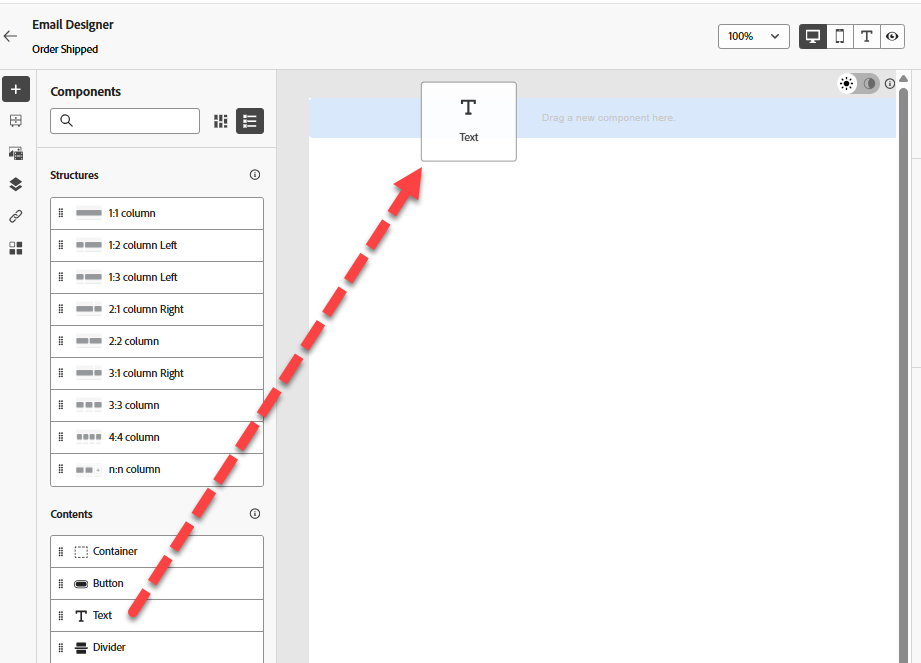
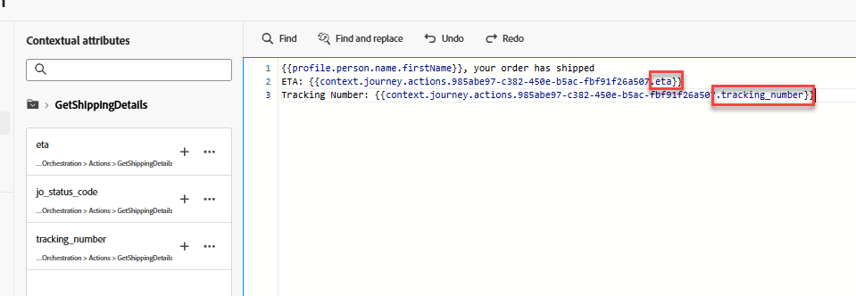

# Créer un parcours

## Objectif d’apprentissage

Créez un parcours unitaire qui commence par l’événement de commande expédiée configuré, obtient l’ETA d’un service externe et envoie un e-mail.

## Créer un parcours

Accédez à **&#x200B;**&#x200B;puis cliquez sur **Créer un Parcours - Créer en partant de zéro**


## Propriétés du parcours

1. Mettez à jour les propriétés du Parcours dans le rail de droite avec les éléments suivants :
   - **Nom** : `Order Shipped Journey`
   - **Description** : `Notify customer that order has shipped. Include shipping details.`
   - **Balises** : `Default`
   - **mesures de Parcours** : *laisser vide*

     >[!NOTE]
     >
     >**Liste déroulante vide ?**
     >
     >Ne vous inquiétez pas et passez à autre chose. Le tout premier parcours créé dans un sandbox doit « amorcer la pompe ».  Une fois que nous aurons publié le parcours, cette liste déroulante aura le choix entre différentes options.

   - **Autoriser une reprise** : `checked`

   - **Période d’attente de reprise :** `5 minutes`

   - **Libellés d’accès** : *laisser vide*

   - **Fuseau Horaire** : `Your Local timezone`

   - **Utilisez le fuseau horaire du profil dans les attentes et conditions** : `NOT checked`

   - **Date de début/fin** : *laisser vide*

   - **Temporisation ou erreur** : `30`

   - **Règles de limitation :** *laisser vide*

   - **Priorité** : `0`


2. Si tout semble correct, cliquez sur le bouton **Enregistrer**


## Zone de travail des parcours

### Ajouter un événement unitaire

Dans le volet de gauche du menu **Événements** faites glisser l’événement **orderShipped** et déposez-le sur la zone de travail, comme illustré ci-dessous


### Ajouter une action personnalisée

1. Si le volet de gauche développe le menu **Actions**, puis fait glisser et dépose sur la zone de travail l’action que vous avez créée nommée **GetShippingDetails** après l’événement orderShipped


&#x200B;2. Dans le rail de droite, sous la liste déroulante Configuration de l’accès et de la confidentialité —> Action marketing , assurez-vous que la valeur est définie sur **Aucune**


&#x200B;3. Sous le menu Configuration du point d’entrée —> Paramètres de requête, cliquez sur l’icône **Crayon** à côté de orderid


&#x200B;4. Dans la boîte de dialogue modale qui s’affiche, développez **Context** -> **orderShipped** -> **Order**, puis sélectionnez **ID de commande (orderID)** et cliquez sur **OK**


&#x200B;5. De retour dans le rail de droite, assurez-vous que l’option Temporisation ou erreur n’est **décochée**, puis cliquez sur le bouton **Enregistrer**


### Ajouter une action e-mail

1. Sous le menu Actions , faites glisser et déposez l’action **Action** sur la zone de travail après l’action GetShippingDetails


&#x200B;2. Sélectionnez **E-mail** pour l’action marketing, puis **Ajouter**.


&#x200B;3. Dans le rail de droite, cliquez sur **Configurer l’action**


&#x200B;4. définissez **Configuration du canal e-mail** sur `Profile-Email`, puis cliquez sur **Modifier le contenu**


### Ajouter le contenu du corps de l’e-mail

Pour le contenu, vous allez garder les choses simples. Comme stupide simple.

1. Mettez à jour la variable Objet sur `Order Shipped`, puis cliquez sur le bouton **Modifier le corps de l’e-mail**


&#x200B;2. Dans la barre supérieure, cliquez sur le bloc de contenu **Créer en partant de zéro**


&#x200B;3. Dans la barre de gauche située sous le conteneur Structure , faites glisser &#39;n et déposez la colonne **1:1** sur la zone de travail


&#x200B;4. Ensuite, sous le conteneur Contenu, faites glisser et déposez le composant **Texte** dans votre colonne **1:1**



&#x200B;5. Cliquez dans le composant Texte et **supprimez le texte actif** puis cliquez sur l’icône **Ajouter Personalization**


&#x200B;6. Dans le rail de gauche, cliquez sur le dossier **Attributs contextuels**, puis accédez à **Journey Orchestration** -> **Actions** et sélectionnez **GetShippingDetails**


&#x200B;7. Dans le corps principal de l’e-mail, effectuez désormais **copier et coller** le code JSON ci-dessous dans l’**éditeur** de Personalization.

```json
{{profile.person.name.firstName}}, your order has shipped
ETA: 
Tracking Number: 
```

&#x200B;8. Ajoutez les champs de personnalisation comme suit (**cliquez sur le signe plus « + » en regard du champ du rail de gauche**) :
   - **ETA:** `eta`
   - **Numéro de suivi :** `tracking_number`



>[!NOTE]
>
>Cliquez sur le symbole **+** ajouter des attributs de personnalisation du rail à la zone de travail.  Il les placera à l’endroit où se trouve votre curseur pour vous assurer que vous êtes bien « aligné »

>[!NOTE]
>
>Votre e-mail utilisera une combinaison d’attributs de contexte (ETA et numéro de suivi) et d’attributs de profil (prénom). Si vous souhaitez ajouter d’autres attributs de profil, vous pouvez cliquer sur l’onglet Attributs de profil et sélectionner tout ce qui s’affiche.
>
>

&#x200B;9. En bas de l’écran, cliquez sur le bouton **Valider** et vérifiez que vous n’avez aucune erreur


&#x200B;10. Si tout semble correct, cliquez sur le bouton **Enregistrer** en haut à droite
&#x200B;11. Cliquez ensuite de nouveau sur le bouton **Enregistrer** en haut à droite, puis sur la flèche **\&lt;- gauche** en haut à gauche


&#x200B;12. Enfin, cliquez sur l’icône **\&lt; Précédent** en haut à gauche pour revenir à la zone de travail de Parcours


>[!TIP]
>
>Puis cliquez de nouveau sur le bouton **Précédent**... Plaisanterie ! Il s&#39;agit du dernier bouton Précédent... dans cette section 😜


### Remplacer les paramètres d’e-mail

De retour sur la zone de travail de Parcours principale, sur le nœud E-mail, assurez-vous que vous pouvez voir les champs en lecture seule (vous devrez peut-être cliquer sur l’icône **Afficher les champs en lecture seule**)


1. Faites défiler jusqu’à **Paramètres d’e-mail** et cliquez sur l’icône **Activer le remplacement du paramètre**


&#x200B;2. Cliquez dans la zone de texte vide, puis, dans le rail de gauche, accédez à **Context** -> **orderShipped** -> **\_dep** et cliquez sur le champ **personalEmail**.  Cliquez ensuite sur le bouton **OK**


>[!WARNING]
>
>Il est dangereux d’éviter cette méthode, sauf si vous devez l’utiliser dans un contexte de production.  Cette option remplace l’emplacement par défaut que Parcours recherche sur le profil pour exécuter les messages.


&#x200B;3. Cliquez sur le bouton **Enregistrer** en haut à droite, puis sur la **flèche retour** \&lt;- en haut à gauche pour **fermer** le Parcours


## Récapituler

Un parcours publié capable de répondre au déclencheur d’événement de commande envoyée, d’obtenir l’ETA d’un service externe et d’envoyer un e-mail.
