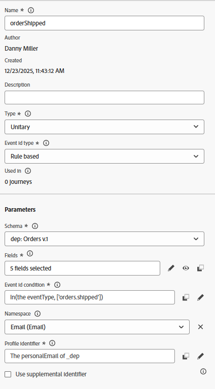

# Configurer l’événement

## Objectif d’apprentissage

Créez et configurez un événement qui déclenchera un parcours client lorsque l’action post-achat (commande envoyée) aura lieu.

## Accès à Journey Optimizer

Dans le coin supérieur droit de votre navigateur, cliquez sur le **Cube**, puis sélectionnez **Journey Optimizer**

## Configurer l’événement de commande expédiée

Pour créer un Parcours qui utilise un événement unitaire, nous devons d’abord configurer l’événement .

1. Dans le rail de gauche, sous le menu Administration, cliquez sur **Configurations** puis, sur la mosaïque Événements, cliquez sur le bouton **Gérer**

2. Dans le coin supérieur droit, cliquez sur le bouton **Créer un événement**

3. Mettez à jour les paramètres de l’événement comme suit :
   - **Name** = `orderShipped`
   - **Type** = `Unitary`
   - **Type d’identifiant d’événement** = `Rule based`
   - **Schéma** = `dep: Orders v.1`

4. Dans la zone de saisie `Fields`, cliquez sur l’icône **Crayon**

5. Sélectionnez les champs suivants à ajouter à l’événement et, lorsque vous avez terminé, cliquez sur le bouton **OK**
   - `Event Type (eventType)`
   - `Order ID (orderID)`

>[!NOTE]
>
>Veillez à sélectionner uniquement le champ ID de commande et non tous les champs du 😁 de commande

6. Dans la `Event Id condition input`, cliquez sur l’icône **Crayon**

7. **Faire glisser** le champ `Event Type` sur la zone de travail

8. Dans la zone de sélection qui s’affiche, recherchez et vérifiez la valeur intitulée **orders.shipping.**. Cliquez ensuite sur le bouton **OK**.

9. Mettez ensuite à jour les deux dernières valeurs d’Espace de noms et d’Identifiant de profil avec les valeurs affichées ci-dessous :
   - **Espace de noms** —> `Email`
   - **Identifiant de profil** —> `personalEmail`

>[!NOTE]
>
>**À quoi servent l’espace de noms et l’identifiant de profil ?**
>
>Pour tout parcours qui utilise un événement, vous devez spécifier pour cet événement l’espace de noms d’identité et l’identifiant de profil associé à utiliser pour rechercher le profil. Il est important de comprendre que le fait de choisir une identité plutôt qu’une autre peut avoir une incidence sur le fonctionnement du parcours.
>
>*Exemple rapide :*
>
>La payload d’événement est une page vue contenant des identités comme ECID (identité principale) et ID de client (facultatif)
>
>- ECID choisi —> il s’agit probablement de la première fois qu’Identity Service voit cette relation. Lorsqu’un parcours reçoit cet événement, il tente donc de rechercher le profil à l’aide de l’ECID et ne parvient pas à trouver un profil.  Pourquoi ? La relation n’existe pas encore entre l’ECID et l’ID client et les caractéristiques du profil sont probablement stockées par rapport à l’identifiant client connu
>- ID de client choisi —> il n’est pas nécessaire de renseigner cette identité qui sera probablement vide sur la plupart des pages vues.  Par conséquent, si cette identité a été choisie, le seul moment où un Parcours se déclenche est lorsqu’il existe une page vue authentifiée pour laquelle l’ID de client est défini.
>
>Réponse courte : il n’existe pas de bonne réponse, juste des compromis à faire en fonction du cas d’utilisation 😃

## Configuration finale de l’événement orderShipped

Vérifiez les correspondances de votre configuration d’événement finale ci-dessous.  Si tout semble correct, cliquez sur le bouton **Enregistrer**

>[!TIP]
>
>Vous avez configuré votre premier événement AJO. Fais-toi plaisir !

## Récapituler

Événement d’expédition de commande configuré dans Adobe Journey Optimizer qui peut être utilisé comme point d’entrée pour un parcours
