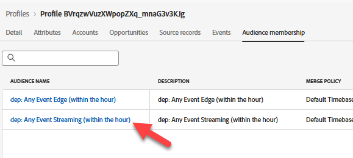

# Valider l’événement ingéré

## Objectif d’apprentissage

Vérifiez que l’événement a bien été ingéré dans Adobe Experience Platform.

## Valider l’événement dans le profil

1. Accédez à vos **Profils** et recherchez votre profil pour voir que l’événement a été ingéré dans le profil.  Il s’affiche en secondes.
   - **Espace de noms d’identité** -> `email`
   - **Valeur de l’identité** -> `henry.creel@emailsim.io`
2. Cliquez sur l’onglet **Événements**. Recherchez `orders.shipped` événement .

   

   >[!WARNING]
   >
   >Avez-vous reçu des événements **message.feedback** ?  Elles proviennent de Parcours et indiquent généralement un échec ou une exclusion.  Cliquez dessus et regardez le `reason`.
   >
   >Voici quelques exemples que vous pouvez rencontrer en production :
   >
   >- EmailNoAddressFoundInProfile (vous avez tenté d&#39;envoyer un e-mail à un profil qui n&#39;en avait pas)
   >- EmailNoConsent (vous avez essayé d&#39;envoyer un e-mail à un profil pour lequel le consentement a été défini sur non.

3. Vérifiez que le profil est qualifié pour le **audiences** (cela peut prendre quelques minutes).
   - Tout événement Edge (dans les 15 minutes)
   - Diffusion en continu de tout événement (dans les 15 minutes)

## Essayer avec votre propre e-mail

Maintenant que vous avez validé l’entrée du profil, envoyez certains événements de commande expédiée à l’aide de votre propre e-mail.

1. Revenez à Postman et recherchez l’**événement de commande d’expédition**.
2. cliquez sur le **Corps** et remplacez le **adresse e-mail** par le vôtre.

   

3. **Enregistrer** et appuyez sur **Envoyer**.
4. Revenez aux étapes 1 à 3 et validez à l’aide de votre adresse e-mail.

## Récapituler

L’événement apparaît dans la banque de profils et le profil fait désormais partie des audiences qui recherchaient l’événement.
