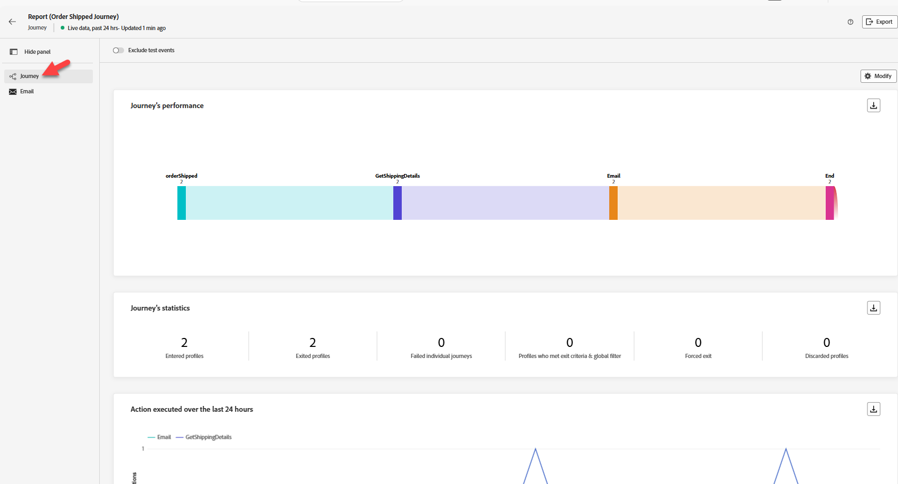

# Validation du parcours

## Objectif d’apprentissage

Vérifiez que le parcours a été déclenché et exécuté comme prévu.  Vérifiez que les rapports affichent les mesures mises à jour comme prévu.

## Vérification de votre parcours

1. Accédez à votre Parcours de commande expédié, ouvrez-le si vous l&#39;avez fermé
2. Au moins 2 profils ont été saisis


&#x200B;3. Cliquez sur **Afficher le rapport** -> **Dernières 24 heures** en haut à droite.
&#x200B;4. Par défaut, vous vous trouvez dans l’onglet **Parcours** (sur le rail de gauche)
   - Des entrées et des sorties s’affichent (le nombre dépend du nombre d’événements que vous avez envoyés, des tests effectués, des erreurs éventuelles, etc.)



Si tout a été nettoyé, vous disposez des éléments suivants (faites défiler l’écran vers le bas pour vérifier) :

**Statistiques du Parcours**

3 profils entrés (Henry, vous et les tests que nous avons effectués)

Vous pouvez cliquer sur le bouton en haut pour **exclure les événements de test** si vous le souhaitez et que ces chiffres changent

3 profils sortis (Henry, vous et les tests que nous avons effectués)

**Actions exécutées et erreurs**

6 actions (3 e-mail, 3 getShippingDetails)

**Causes des erreurs dans les actions**

0 erreur (espérons)

**Événements**

3 Événements (orderShipped)

3 événements externes

&#x200B;5. Cliquez sur l’onglet **E-mail** (dans le rail de gauche).
   - **E-mail - Performances d’envoi**
     - Certaines valeurs s’affichent pour **Diffusés** et **Envoyés** (le nombre dépendra du nombre d’événements que vous avez envoyés, des erreurs éventuelles, etc.)
     - J&#39;espère que vous n&#39;avez pas d&#39;erreurs (à moins que vous ayez rencontré des problèmes plus tôt)
   - **E-mail - Statistiques**
     - E-mail : 3 ciblés, envoyés, diffusés


&#x200B;6. Allez vérifier votre **boîte de réception e-mail** et voyez si vous avez reçu l’e-mail (il ressemble à ce qui suit ci-dessous)
   - *,* votre commande a été expédiée ETA : ** Numéro de suivi : *051009364*

&#x200B;> [!NOTE]
>
>Vérifiez votre dossier Spam pour les campagnes AJO [ajo-campaigns@email.dep-labs.com](mailto:ajo-campaigns@email.dep-labs.com)

>[!NOTE]
>
>**Pourquoi le prénom est-il manquant ?**
>
>Nous avons modifié le nœud E-mail afin d’examiner le contexte d’événement de l’adresse e-mail.  Mais le prénom dans la personnalisation est extrait de \{\{profile.person.name.firstName\}\}.
>
>Lorsque vous recherchez votre profil pour votre e-mail, avez-vous un prénom ?


&#x200B;7. *Après 30 à 60 minutes* vous pouvez même vérifier votre jeu de données dans le lac de données avec les éléments suivants : **Requêtes** -> **Créer une requête** -> **Copier/Coller SQL** -> **Exécuter**

>[!NOTE]
>
>L’événement de commande expédiée a été diffusé en continu dans. Ainsi, bien qu’il ait mis à jour le profil rapidement, il faut un certain temps avant que le lac de données ne soit mis à jour.

```sql
SELECT * FROM dep_orders
WHERE timestamp >= CURRENT_DATE
LIMIT 10
```


## Bonus (vérifier les événements d’étape)

>[!NOTE]
>
>Les événements d’étape enregistrent chaque fois qu’un profil lance un parcours et chaque étape du parcours. Remarque : l’enregistrement de ces événements dans le jeu de données peut prendre quelques minutes.


1. Dans Query Service, vous pouvez afficher ce que le jeu de données d’événements d’étape capture en exécutant ce SQL. Copiez le code SQL ci-dessous et collez-le dans une requête.

```sql
select timestamp,
  identityMap,
  _experience.journeyOrchestration.stepevents.journeyVersionName,
  _experience.journeyOrchestration.stepevents.NodeName,
  _experience.journeyOrchestration.stepevents.*
  from journey_step_events
limit 50
```

Les résultats comportent plus de 100 colonnes et vous donnent une idée des enregistrements d’événements d’étape.

>[!NOTE]
>
>Pour en savoir plus sur la signification de chaque champ, consultez le dictionnaire de schémas d’AJO et remplacez la liste déroulante par le schéma Événements d’étape en Parcours : [https://experienceleague.adobe.com/tools/ajo-schemas/schema-dictionary.html?lang=fr](https://experienceleague.adobe.com/tools/ajo-schemas/schema-dictionary.html?lang=fr)


## Récapituler

L’instance de parcours apparaît dans les rapports ou journaux de parcours et l’action configurée est exécutée
