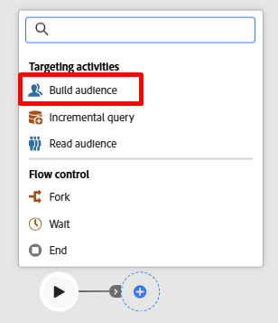
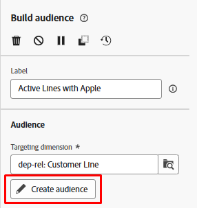

# Créer une audience

## Objectif

Dans les étapes suivantes, vous allez créer l’audience que vous souhaitez cibler pour la campagne, c’est-à-dire tous les détenteurs de ligne actifs dont la marque correspond au téléphone phare qui est lancé.  L’objectif étant le groupe que vous souhaitez cibler avec un SMS les incitant à mettre à niveau leurs téléphones.

## Ajouter une activité Créer une audience

1. Sur la zone de travail, cliquez sur le symbole **+** puis sélectionnez l’activité **Créer une audience** pour l’ajouter au workflow

   

2. Dans le rail de droite, vous voyez les propriétés Créer une audience . Mettez à jour le libellé pour qu’il indique ce qui suit : `Active Lines with Apple`

## Sélectionner la dimension de ciblage

L’étape suivante consiste à sélectionner la **dimension de ciblage** (c’est-à-dire la table sur laquelle vous souhaitez effectuer une requête). Procédez comme suit :

1. Cliquez sur l’**icône de recherche** dans la zone Dimension de ciblage .

   

2. Dans la fenêtre contextuelle, recherchez et sélectionnez la table nommée **dep-rel : Customer Line**, puis cliquez sur le bouton **Confirmer**.

>[!NOTE]
>
>Gardez toujours à l’esprit la **dimension de ciblage** de chaque audience que vous créez. Vous apprendrez sa signification dans les étapes suivantes.

>[!NOTE]
>
>si vous sélectionnez un schéma créé par Adobe, vous remarquerez que le schéma commence par -> *(caas)*. Il s’agit simplement d’un espace de noms appliqué aux tables du magasin relationnel et qui correspond à Campaign as a Service :)

## Créer une audience

Maintenant que vous avez sélectionné votre dimension de ciblage (le schéma relationnel que vous allez interroger), vous pouvez commencer à créer votre définition.

1. Dans le rail de droite, cliquez sur le bouton **Créer une audience**

   

2. Cliquez ensuite sur le bouton **Ajouter une condition**

## Créer une ou plusieurs conditions

Il est maintenant temps d’écrire la logique de l’audience à l’aide des attributs trouvés dans le schéma . L’objectif est de rechercher toutes les lignes de clients et clientes actifs et utilisant une marque d’Apple.

### Créer un #1 de condition

1. Définissez la condition à l’aide des informations suivantes :
   - **Attribut** : `Active Line`
   - **Valeur** : `true`

   

2. Cliquez sur l’icône **Actualiser** pour afficher les chiffres d’éligibilité de la condition.

>[!TIP]
>
>Le résultat 241 s’affiche si vous avez créé la condition correctement

### Créer un #2 de condition

1. Cliquez sur le bouton **Ajouter une condition** et sélectionnez le schéma **dep-rel:** **Product \[Lookup]** en cliquant sur l’icône **>**

   ![Sélectionnez le schéma dep-rel : Product [Lookup] en cliquant sur l’icône > ](assets/build-an-audience-select-product-lookup-schema.png)

2. Recherchez le champ nommé **Marque**, cliquez sur les trois points et sélectionnez **Répartition des valeurs**

   

3. Notez les différentes valeurs. Vous voulez seulement `Apple` et heureusement il n&#39;a pas 100 orthographes différentes. Cliquez sur le champ **** pour le sélectionner, puis cliquez sur le bouton **Sélectionner un attribut et une valeur** en haut à droite.

   

   >[!NOTE]
   >
   >Il s’agit d’un excellent exemple d’emplacement où l’architecte de données aurait dû concevoir le schéma avec des énumérations.  Ainsi, un spécialiste marketing n’a pas à sélectionner/saisir manuellement la valeur.  Honte à l’architecte de données !

4. Le champ `Make` est automatiquement ajouté avec les conditions présentées ci-dessous.
   - **Operator:** `Equal to`
   - **Value:** `Apple`
   - **Sensible à la casse :** `Enabled`

5. Cliquez sur l’icône **calculer** et le résultat est 85.

>[!NOTE]
>
>Notez l’utilisation de l’opérateur AND dans le groupe . Que vous la créiez dans un seul groupe, comme illustré, ou dans plusieurs groupes, l’opérateur AND est important, car il indique aux campagnes orchestrées que les deux conditions doivent être vraies.

## Vérifier les comptages

1. Cliquez sur l’**icône Calculer** qui se trouve dans le rail de droite sous l’en-tête Profils ciblés pour obtenir une estimation exacte de la taille de l’audience. Vous voyez **65** comme le **décompte final**.

   

   >[!NOTE]
   >
   >Notez que chaque condition individuelle a renvoyé un nombre différent (condition #1 —> 241 et condition #2 —> 85), mais la taille finale de l’audience était la moins élevée des deux conditions.  Ceci est dû à l’opérateur AND.

2. Si le décompte final est de **65** cliquez sur le bouton **Confirmer** en haut à droite de l’écran, puis sur le bouton **Enregistrer** en haut à droite pour enregistrer votre travail.

## Défi

Supposons un instant que vous ayez saisi dans la dernière condition de sorte que `Make` soit égal à `apple` (en minuscules) et que vous ayez laissé l’option de configuration pour `Case sensitive` basculement de `on`.  Cela rendrait le nombre d’enregistrements des conditions égal à 0.  Donc vous auriez 241 lignes actives et 0 où la marque est la pomme.

**Quelle serait la taille finale de l’audience dans ce cas ?**

## Réponse

C&#39;est zéro. Savez-vous pourquoi ?

## Récapituler

Vous avez créé votre première audience. Vous devriez maintenant voir à quel point il est facile de développer et de valider vos comptes dans l’activité Créer une audience .

