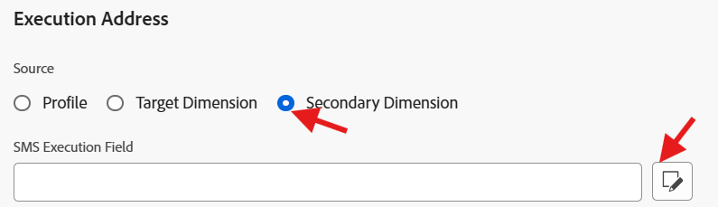

# Configurer le canal SMS

## Objectif

Dans l’ensemble d’étapes suivant, vous configurez le canal SMS. Cette étape est requise afin que vous puissiez envoyer ultérieurement des messages à des détenteurs de ligne individuels lors de la création de votre campagne.

## Accès aux canaux

1. Dans Adobe Journey Optimizer, accédez au menu **Administration** -> **Canaux**.
1. Sélectionnez **Paramètres SMS** → **Informations d’identification de l’API**.
1. Cliquez sur **Créer des informations d’identification d’API**.

## Définir les informations d’identification de l’API SMS

Commencez par créer le connecteur API qu’AJO utilise pour envoyer les requêtes SMS sortantes.

1. Sous Fournisseur SMS, choisissez **Twilio**.
1. Saisissez les informations d’identification d’API suivantes à l’aide de votre propre compte d’évaluation [Twilio](https://www.twilio.com/try-twilio) :
   - **Name:** `DEP SMS`
   - **SID du compte :** présent dans le tableau de bord de la console Twilio
   - **Jeton d’authentification :** présent dans le tableau de bord de la console Twilio (cliquez sur **Afficher** pour l’afficher).
1. Cliquez sur **Envoyer** pour enregistrer les informations d’identification de l’API

>[!NOTE]
>
>Vous aurez besoin d&#39;un compte d&#39;essai Twilio gratuit avec un numéro de téléphone vérifié avant de commencer cette étape. Inscrivez-vous à l’adresse , puis recherchez le SID de votre compte et le jeton d’authentification dans le tableau de bord de la console Twilio. Voir le [guide de prise en main](https://www.twilio.com/docs/usage/tutorials/how-to-use-your-free-trial-account) de Twilio pour une présentation complète.

## Créer une configuration de canal SMS

Vous allez à présent mapper ces informations d’identification d’API à une configuration de canal que les parcours et les campagnes peuvent utiliser.

1. Accédez à **Canaux** → **Paramètres généraux** → **Configurations de canal**.

   

2. Cliquez sur **Créer une configuration de canal**.

   

3. Renseignez les Paramètres de configuration du canal SMS avec les valeurs suivantes :
   - **Name:** `Relational-SMS-Multi-Entity`
   - **Canal:** `Mobile Message`
   - **Action marketing :** `SMS Targeting`

>[!NOTE]
>
>Si vous obtenez une erreur indiquant que l’utilisateur ne dispose pas de l’autorisation nécessaire, ignorez-la et continuez.

## Paramètres SMS

Lorsque vous sélectionnez Canal comme Message mobile, une nouvelle section appelée Paramètres SMS s’affiche. Renseignez-le avec les détails suivants :

- **Type de message mobile :** `Marketing`
- **Configuration des messages mobiles :** `DEP SMS`
- **Numéro expéditeur :** `01234567890`
- **Subdomain:** `leave blank`
- **Numéro d’opt-out :** `leave blank`

## Détails d’exécution

1. Sous Détails d’exécution, cliquez sur l’onglet **Campagne orchestrée**

   

2. Vérifiez que la case **Activé** est cochée

   

3. Ensuite, sous la sous-section **Dimension d’exécution** assurez-vous que les éléments suivants sont configurés comme suit :
   - **Diffuser sur le message per:** `Target + Secondary Dimension`
   - **Profile Target Dimension :** `dep-rel: Customer Account - customer_id`
   - **Dimension Secondaire:** `Customer Line`

   

   

   >[!NOTE]
   >
   >Ce paramètre indique aux campagnes orchestrées que lorsqu’elles envoient des messages, elles doivent diffuser un message par enregistrement correspondant au Dimension cible du profil.

4. Sous l’en-tête Adresse d’exécution , assurez-vous de sélectionner le bouton radio pour **Dimension Secondaire** puis cliquez sur le bouton de modification sur le **Champ d’exécution du SMS**

   

5. Sur la fenêtre pop-up, cliquez dans le schéma **dep-rel : Customer Line** et sélectionnez **Téléphone mobile**.

   

   

6. Confirmez la dernière correspondance de la section Détails d’exécution ci-dessous

## Envoyer et réviser

1. Cliquez sur le bouton **Envoyer** pour terminer la configuration et afficher un message de réussite

   

2. Sur la page d’inventaire des configurations de canal, assurez-vous que le statut indique **Actif** avant de continuer

   

   >[!CAUTION]
   >
   >Patientez jusqu’à ce que l’état devienne **Actif** sinon les prochaines étapes de l’atelier échoueront

3. Lorsque l’état devient Actif , vous avez terminé.

>[!TIP]
>
>🚀 Booyah ! Votre canal SMS est maintenant en ligne et prêt à être utilisé.

## Récapituler

Vous savez maintenant comment configurer un canal SMS.  Notez que cette configuration est un SMS basé sur une API. Selon votre fournisseur, il peut donc utiliser d’autres méthodes d’authentification.

Vous pouvez en savoir plus [ici](https://experienceleague.adobe.com/en/docs/journey-optimizer/using/channels/sms/configure-sms/sms-configuration) si cela vous intéresse.
