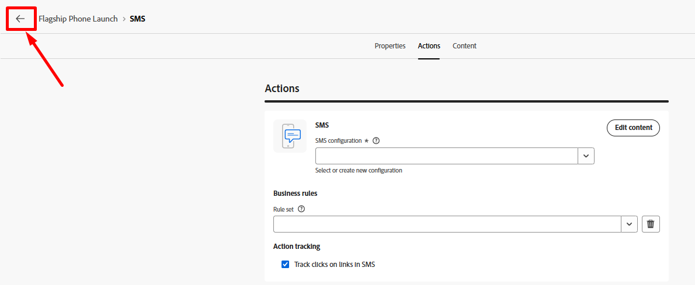

# Filtrer les lignes

## Objectif

Dans les étapes suivantes, vous allez filtrer toutes les lignes qui ne sont pas réellement autorisées à être ciblées avec un SMS en raison de leur opt-out au niveau de la ligne.  Vous ne pouvez pas vous fier ici au consentement du profil, car il s’agit d’une cible au niveau de la ligne.

## Configurer l’activité de partage

1. Cliquez sur l’icône **+** sur la transition inférieure de l’activité Branchement et sélectionnez l’activité **Partage** dans la fenêtre contextuelle.

   

2. Dans le rail de droite, mettez à jour le Libellé pour indiquer ce qui suit : `Filter out opt'd out lines`

   

3. Dans le rail de droite, développez la section Segment par défaut **Sous-ensemble** et cliquez sur le bouton **Créer un filtre**

   

4. Ajoutez une condition pour vous assurer de supprimer toutes les lignes client exclues de la messagerie SMS, puis cliquez sur **Confirmer**.

   

   >[!NOTE]
   >
   >Vous devez comprendre comment créer la condition, mais le résultat final correspond à la capture d’écran ci-dessus.  C&#39;est bon !

5. Cliquez sur le bouton Enregistrer en haut à droite pour enregistrer votre travail.  Votre zone de travail ressemble à ceci maintenant\...

## Ajouter l’activité SMS

1. Dans la zone de travail du workflow, cliquez sur l’icône **+** après la condition de partage que vous avez ajoutée et sélectionnez l’activité **SMS**

   

   

2. Dans le rail de droite, cliquez sur le bouton Modifier le SMS pour démarrer la configuration du SMS

   

3. Dans le volet de navigation supérieur, cliquez sur l’élément de menu Actions , puis dans la liste déroulante Configuration des SMS , sélectionnez le canal que vous avez précédemment créé.

>[!CAUTION]
>
>Oh non 🫨 !  Pourquoi n’obtenez-vous aucun résultat ?  N’avez-vous pas déjà configuré votre canal SMS ?  Le produit est-il cassé ?
>
>PANIQUE!!!!!!!!!

## Moment d’interruption

La transition du branchement possède actuellement une dimension de ciblage de Ligne client (c’est-à-dire la table à laquelle le résultat actuel se rapporte dans le magasin relationnel).  Ce qui est unique avec les campagnes orchestrées, c’est que vous rejoignez toujours le profil client en temps réel au moment de l’envoi, de sorte que les informations de diffusion et de suivi des messages sont attribuées à un profil.  Cette jointure a été préconfigurée pour vous à partir du tableau des comptes clients.

La configuration du canal pour les SMS a déjà été configurée pour vous au préalable et elle ressemble actuellement à ceci...

**Voici comment vous l’avez lu :**

- Diffusez un message par dimension cible (par exemple, Compte client) sur le nombre d’enregistrements associés trouvés dans la dimension secondaire (par exemple, Ligne client)
- Exécutez chaque diffusion SMS à l’aide du numéro de téléphone mobile figurant dans la dimension secondaire (c’est-à-dire Ligne du client)

Cette capacité unique d’envoyer de nombreux messages à un profil est l’une des principales fonctionnalités des campagnes orchestrées, qui la différencie des Parcours.

Comment faire pour que ça marche ?  Ajout d’un 😀 de changement de dimension

## Ajouter une dimension de modification

1. Cliquez sur le bouton Précédent dans l’écran de modification des SMS

   

2. Dans la zone de travail du workflow, cliquez sur le **+** **icône** entre les activités Filtrer et SMS et sélectionnez **Modifier la dimension**.

   

3. Dans la partie droite, mettez à jour la dimension de changement avec les informations suivantes :
   - **Libellé :** `Convert Line to Account`
   - **Nouvelle dimension cible :**`dep-rel: Customer Account`

   

4. Cliquez sur le bouton **Enregistrer** en haut à droite de la zone de travail pour enregistrer votre travail. Une fois terminé, votre workflow ressemble désormais à ceci...

## Configuration des messages SMS

Maintenant que vous avez corrigé le workflow, reconfigurez le SMS.

1. Cliquez sur l’activité SMS dans la zone de travail du workflow, puis, dans le rail de gauche, cliquez sur le bouton **Modifier le SMS**

   

   >[!NOTE]
   >
   >Le chargement de cet écran prend un certain temps.  Je sais que c&#39;est ennuyeux, croyez-moi, c&#39;est en train d&#39;être réparé

2. Dans le volet de navigation supérieur, cliquez sur l’élément de menu **Actions**, puis, dans la liste déroulante Configuration des SMS , sélectionnez le canal que vous avez précédemment créé.

>[!TIP]
>
>Ça fait du bien, non 😮‍💨

## Récapituler

Vous avez réussi à passer au travers de celui-ci et j&#39;espère que vous avez appris deux choses très importantes :

1. La dimension de ciblage des résultats finaux doit correspondre à la configuration de canal que vous souhaitez utiliser
1. L’activité Changement de dimension deviendra probablement votre meilleure amie pour vous assurer que cela se produit
