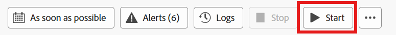
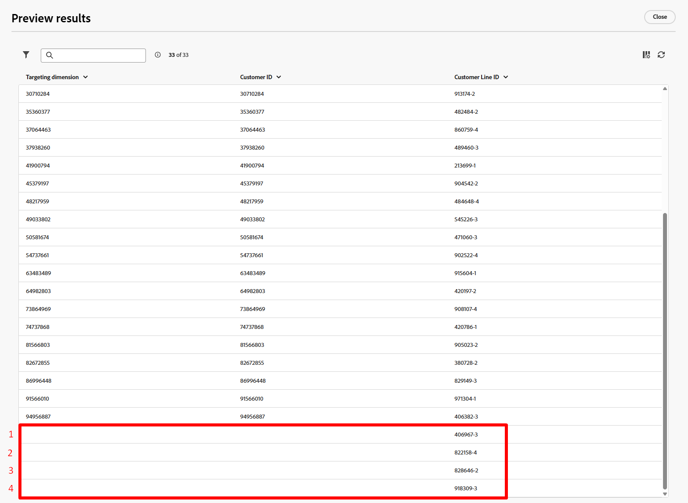

# Exécution du workflow

## Objectif

Dans les étapes suivantes, vous apprendrez à tester votre workflow et, plus important encore, votre activité SMS à l’aide du mode test.

## Vérifier le workflow

1. Lorsque vous avez terminé, le workflow final ressemble à ce qui suit. Vérifiez que tout semble correct. Vous voyez :

   

2. Si vous n’avez pas encore arrêté votre workflow, assurez-vous de le faire maintenant en cliquant sur le bouton **Arrêter** en haut à droite.

   

   >[!NOTE]
   >
   >Vous pouvez éventuellement essayer de cliquer sur le bouton Redémarrer , mais il est probable qu’une erreur s’affiche, car vous avez ajouté des activités après la création du workflow et son cache n’est plus valide.

3. Cliquez ensuite sur le bouton **Démarrer** pour exécuter et tester le workflow de bout en bout

   

4. Passez en revue le résultat entrant dans l’activité SMS en cliquant sur **Résultat** (il existe deux résultats, alors utilisez le résultat de gauche comme illustré ci-dessous), puis, dans le rail de gauche, en cliquant sur le bouton **Prévisualiser les résultats**.

   

   

5. Vous voyez des enregistrements **33** et la dimension de ciblage correspond à l’identifiant du client (la clé de jointure si vous souhaitez créer un profil)

Enregistrements 

## Tester l’activité SMS

1. Fermez la fenêtre précédente et cliquez sur l&#39;activité **SMS** puis sur le bouton **Exécuter le test** dans le rail de droite

   

2. Presque immédiatement, un nouveau bouton apparaît intitulé **Afficher le rapport**.  Cliquez sur le bouton **Afficher le rapport** pour accéder à l’écran du rapport.

   

   >[!NOTE]
   >
   >Cet écran ne sera pas renseigné initialement, car l’exécution du test prend du temps. Vous devrez peut-être actualiser plusieurs fois avant d’afficher les résultats.

3. Lorsque vous obtenez des résultats, vous constatez que 100 % d’entre eux ont été ciblés.

   

   *Attendez, une minute... le résultat entrant était 33 enregistrements, alors où sont passés les 4 ?*

4. Revenez à la zone de travail du workflow et cliquez sur la transition **Résultat** en accédant à l’activité SMS, puis cliquez sur **Prévisualiser les résultats** dans le rail de droite.

   

5. Dans l’écran Aperçu des résultats , faites défiler l’écran jusqu’au bas du tableau et vous remarquerez que les enregistrements **4** ont une **dimension de ciblage vide**.

Enregistrements 

## Explication

Voici ce qui s&#39;est passé.

- Vous vouliez envoyer un SMS à 33 lignes client
- Après le changement de dimension, l&#39;activité 4 de ces lignes client n&#39;avait plus de compte client associé
- Pour rejoindre le profil client en temps réel, vous devez disposer d’un ID client. Comme il n’y en a aucun sur ces 4 enregistrements, il n’est pas possible de rechercher un profil ou d’en créer un à la volée

Résultat —> Campagnes orchestrées supprime ces 4 enregistrements lors de l&#39;exécution du message

>[!NOTE]
>
>Une amélioration est prévue pour aider à résoudre ce problème de deux façons :
>
>1. Assurez-vous qu&#39;un journal des exclusions est créé pour les enregistrements auxquels il manque une dimension de ciblage à l&#39;envoi
>2. Mettez à jour l’activité Changement de dimension pour effectuer une jointure interne ou externe qui déposerait ces 4 enregistrements au préalable

>[!TIP]
>
>Félicitations ! Vous êtes maintenant officiellement certifié pour lancer vos propres campagnes orchestrées et diffuser des messages dans le monde entier - de manière responsable, nous l&#39;espérons. Allez de l&#39;avant et commercialisez comme un majestueux magicien numérique !

## Publier le workflow

Vous n’allez pas le faire dans le laboratoire, mais voici, pour vous donner un contexte, ce qui se passe au moment de la publication :

1. Le planificateur se déclenche si un planning est défini pour la campagne
1. Les activités Enregistrer l’audience créent le shell d’audience dans dans le portail d’audience et les profils qualifiés commencent à ingérer
1. L&#39;exécution du message démarre pour la première activité de message du workflow
   - Les recherches de profil se produisent par rapport à l’instantané de profil
     - Les profils correspondants respectent le consentement trouvé sur le profil
     - Les profils non correspondants sont créés à la volée
   - Les logs de diffusion sont créés dans le `AJO Message Feedback Event Dataset`
