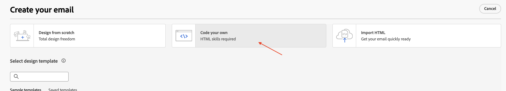
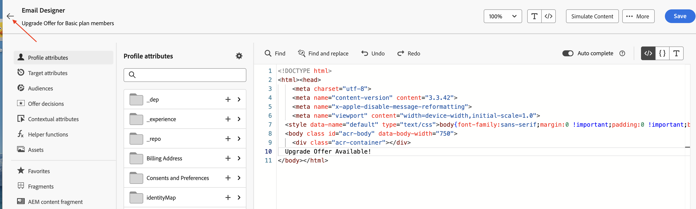

# Ajouter des activités d’e-mail

## Objectif

Dans les étapes suivantes, vous allez développer la campagne pour ajouter deux activités E-mail aux deux branches d’activité Branchement . Vous allez configurer les deux activités E-mail pour utiliser les canaux E-mail, créés précédemment. Enfin, vous ajouterez également la configuration de base des e-mails (objet et corps) à chacune de ces activités d’e-mail.

>[!CAUTION]
>
>Avant de continuer, vous devez vous assurer que les deux configurations de canal e-mail sont activées dans leur statut.
>
>

## Ajouter l’activité d’e-mail de branche principale

1. Cliquez sur le **+** du flux supérieur et sélectionnez **E-mail** dans les **Activités de canal**

Le volet de détails **E-mail** s’ouvre

2. Renommez le libellé en **E-mail à l’aide de l’attribut de profil** pour l’activité **E-mail**, puis cliquez sur **Modifier l’e-mail**. Notez que la création du corps de l’e-mail n’est proposée qu’à des fins de test

3. Sélectionnez l’onglet **Actions** et, dans la liste déroulante, sélectionnez **Profile-Email** configuration du canal

4. Cliquez ensuite sur **Modifier le contenu** pour ajouter du contenu de test

5. Fournissez une **Objet** (« Offre de mise à niveau pour les membres du plan de base ») et cliquez sur le bouton **Modifier le corps de l’e-mail**

6. Il existe de nombreuses options pour ce test. Pour ce faire, choisissez **Coder le vôtre** l’option HTML .

7. Dans le Designer d’e-mail **, insérez une ligne de test « Offre de mise à niveau disponible ! »** juste avant les balises `</body></html>` comme illustré et cliquez sur **Enregistrer**

8. Attendez que le message de confirmation s’affiche dans le coin inférieur droit

9. Cliquez sur la **flèche de gauche** en regard de la **Designer d’e-mail** pour quitter

10. Une boîte de dialogue de confirmation s’affiche, cliquez sur le bouton **Enregistrer et fermer**

11. Examinez les propriétés et les actions de l’e-mail, y compris le texte ajouté au corps de l’e-mail. Cliquez sur la **flèche de gauche** pour revenir à la zone de travail de campagne

## Ajouter l’activité d’e-mail de la branche inférieure

De retour dans la zone de travail de campagne, cliquez sur le **+** du flux inférieur et sélectionnez **E-mail** dans les **Activités de canal**. Suivez les mêmes étapes que ci-dessus (étapes 2 à 11), à l’exception des suivantes :

- Renommez le libellé en **E-mail à l’aide de Target Dimension** pour l’activité **E-mail**
- Dans les paramètres d’e-mail, choisissez la configuration **Relational-Email** Canal e-mail .

## Récapituler

Vous avez maintenant vu comment configurer les activités E-mail avec les canaux e-mail. Chaque activité a ensuite été configurée avec un objet et un corps d’e-mail très basiques. L’ensemble de la campagne sera ensuite testé.
