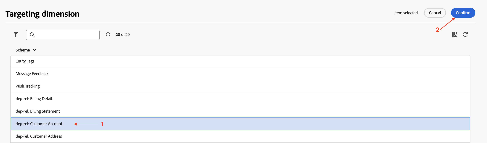
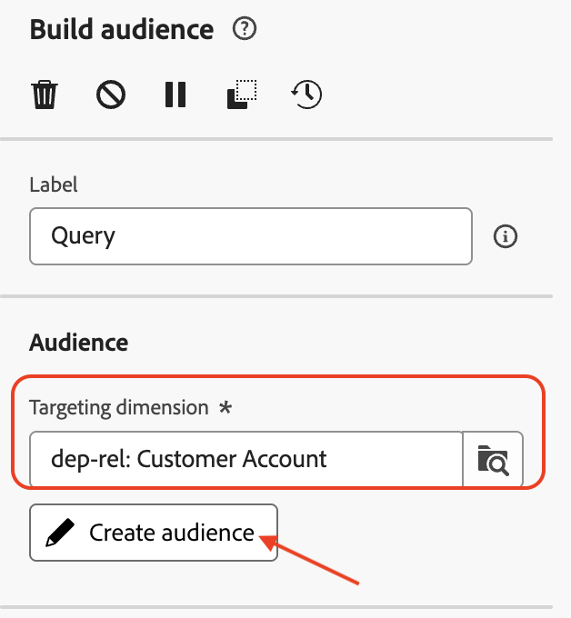

# Créer une audience

## Objectif

Dans l’ensemble d’étapes suivant, vous allez créer une audience à partir du schéma relationnel en sélectionnant la dimension de ciblage appropriée et en définissant les conditions appropriées. Vous utiliserez également l’option actualiser pour vérifier le nombre de lignes attendu.

## Créer une audience

1. Une fois la campagne générée, cliquez sur le **+** dans la zone de travail pour ouvrir le menu d’options, puis sélectionnez **Créer une audience** dans les **Activités de ciblage**

2. L’activité **Créer une audience** ouvre le volet de détails à droite. Cliquez ensuite sur l’icône Rechercher pour sélectionner la **dimension de ciblage**.

3. Sélectionnez `dep-rel: Customer Account` dans la liste et cliquez sur **Confirmer**

4. Une fois la **dimension de ciblage** configurée, cliquez sur Créer une audience pour lancer le processus de création de l’audience à partir du schéma relationnel

5. Le volet Créer une audience s’ouvre. Cliquez sur **Ajouter une condition**

6. Faites défiler vers le bas et développez le `dep-rel: Plan Lookup` en cliquant sur le **>** en regard de celui-ci

7. Sélectionnez `dep-rel: Plan Name` et cliquez sur **Confirmer**

8. Dans le panneau Condition personnalisée , laissez l’opérateur sur « égal à » et, pour Valeur, sélectionnez De base dans la liste déroulante.

>[!NOTE]
>
>Notez que toutes les valeurs distinctes disponibles pour la colonne sélectionnée s’affichent dans la liste déroulante, ce qui facilite la création de conditions personnalisées.

9. Une fois la condition personnalisée configurée, cliquez sur l’icône Actualiser pour calculer et afficher le nombre. Il existe deux emplacements pour faciliter le calcul des résultats

>[!NOTE]
>
>L’opération d’actualisation évalue la condition par rapport aux données relationnelles et affiche les résultats attendus. Cette opération ne prend généralement que quelques secondes et est extrêmement utile pour affiner les critères et s’assurer qu’ils répondent aux attentes.

10. Les nombres (**38**) indiquent le nombre de lignes du magasin relationnel qui correspondent à la condition spécifiée. Cliquez sur **Confirmer** pour quitter le volet **Créer une audience**

>[!NOTE]
>
>Il existe des options dans la section Propriétés des règles pour obtenir plus de détails. Cliquez sur **Afficher les résultats** pour afficher les résultats réels renvoyés. Utilisez l’option **Affichage du code** pour afficher la requête en cours d’exécution.

## Récapituler

Vous avez maintenant vu à quel point il est facile d’utiliser l’activité Créer une audience dans la campagne en choisissant la dimension de ciblage appropriée dans le schéma relationnel. Vous avez ensuite ajouté une condition pour affiner les critères de création de l’audience et utilisé l’option actualiser pour vérifier le nombre de lignes attendu.

Vous pouvez en savoir plus [ici](https://experienceleague.adobe.com/en/docs/journey-optimizer/using/campaigns/orchestrated-campaigns/design-campaigns/build-audience) si cela vous intéresse.
