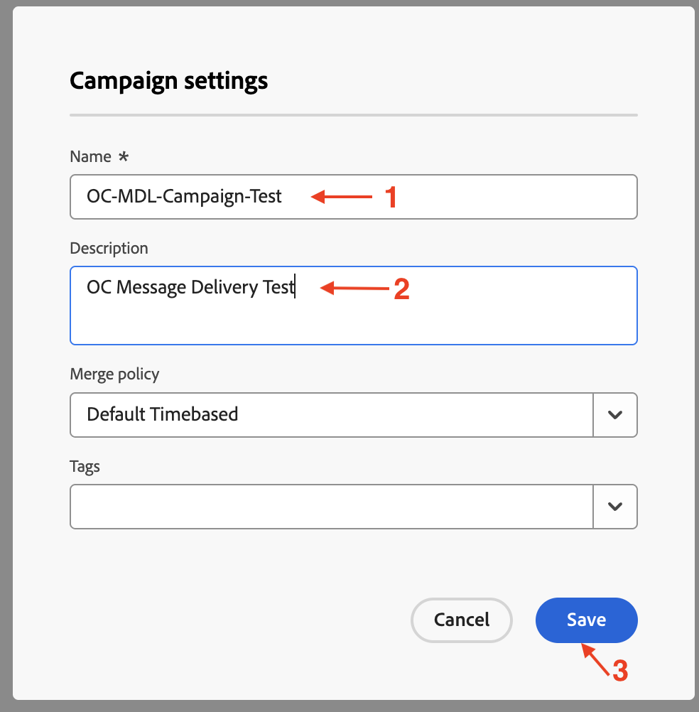
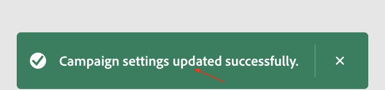

# Créer une campagne

## Objectif

Dans les étapes suivantes, vous allez commencer par créer une campagne orchestrée.

## Créer une campagne

1. Dans le rail latéral gauche, cliquez sur **Campagnes**

   

2. Cliquez sur **Créer une campagne**

   

3. Sélectionnez **Orchestration - Marketing**, puis cliquez sur **Confirmer**

   

4. Fournissez les détails de la campagne ci-dessous, puis cliquez sur le bouton **Enregistrer** lorsque vous avez terminé
   - **Name:** `OC-MDL-Campaign-Test`
   - **Description :** `OC Message Delivery Test`

   

5. Attendre le message de confirmation avant de continuer

## Récapituler

Vous avez créé une campagne orchestrée avec tous les paramètres de base configurés qui seront utilisés dans le prochain ensemble d’étapes.
