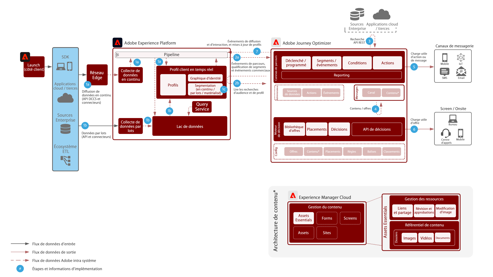

# Plans directeurs d’expérience digitale

Les plans directeurs d’expérience digitale sont des implémentations reproductibles pour mettre au point une stratégie et rapidement résoudre les problèmes commerciaux établis. Chaque plan directeur offre une série de ressources qui expliquent le problème commercial, les architectures, les étapes de mise en œuvre, les considérations techniques et les liens vers la documentation pertinente.

## Nouveautés

* **[Plan directeur pour l’activation d’audiences et de profils vers des destinations d’entreprise](/help/blueprints/audience-activation/enterprise-destinations.md)**

   *Tenir les profils clients à jour sur tous les systèmes afin de renforcer les capacités de vos équipes de vente et d’assistance.*
* **[Plan directeur du centre d’activité client](/help/blueprints/audience-activation/customer-activity.md)**

   *Fournit le contexte pour l’aide et les ventes assistées par un agent.*
* **[Plan directeur pour l’analyse des données et la Data Intelligence](/help/blueprints/data-insights/analysis.md)**

   *Exécute des requêtes exploratoires et analyse des données dans le lac de données.*

## Plans directeurs

<table style="table-layout:fixed">
<tr>
  <td>
    
    
<a href="https://experienceleague.adobe.com/docs/blueprints-learn/architecture/customer-journeys/journey-optimizer.html"><strong>Messages déclenchés et Adobe Experience Platform</strong></a>

    
<em>Déclenchez des messages et des expériences en utilisant [!UICONTROL Platform] comme hub central.</em>

  </td>
  <td>
    
    
<a href="https://experienceleague.adobe.com/docs/blueprints-learn/architecture/audience-activation/online-offline.html"><strong>Activation d’audience en ligne / hors ligne</strong></a>

    
<em>Diffusion de publicité cross-canal activée par le public.</em>

  </td>
  <td>
    
    
<a href="https://experienceleague.adobe.com/docs/analytics-platform/using/cja-usecases/cross-channel.html?lang=en"><strong>Analyse de parcours cross-canal</strong></a>

    
<em>Disposez d’une vue consolidée unique du comportement des clients sur différents canaux.</em>

  </td>
</tr>
</table>

## Articles de blog

* [[!DNL Introducing Adobe Experience Platform’s New Digital Experience Blueprints]](https://medium.com/adobetech/introducing-adobe-experience-platforms-new-digital-experience-blueprints-93a6b5f5da7c)
* [[!DNL Blueprint for Audience Activation in Adobe Experience Platform]](https://medium.com/adobetech/a-blueprint-for-audience-activation-in-adobe-experience-platform-b2b30fae90fd)
* [[!DNL Blueprint for Web Personalization using Adobe Experience Platform Real-Time Customer Profile]](https://medium.com/adobetech/blueprint-for-web-personalization-using-adobe-experience-platform-real-time-customer-profile-fef2ce7a4b2f)
* [[!DNL Blueprint for Multi-Channel Orchestration in Adobe Experience Platform]](https://medium.com/adobetech/blueprint-for-multi-channel-orchestration-in-adobe-experience-platform-c68317e94184)
