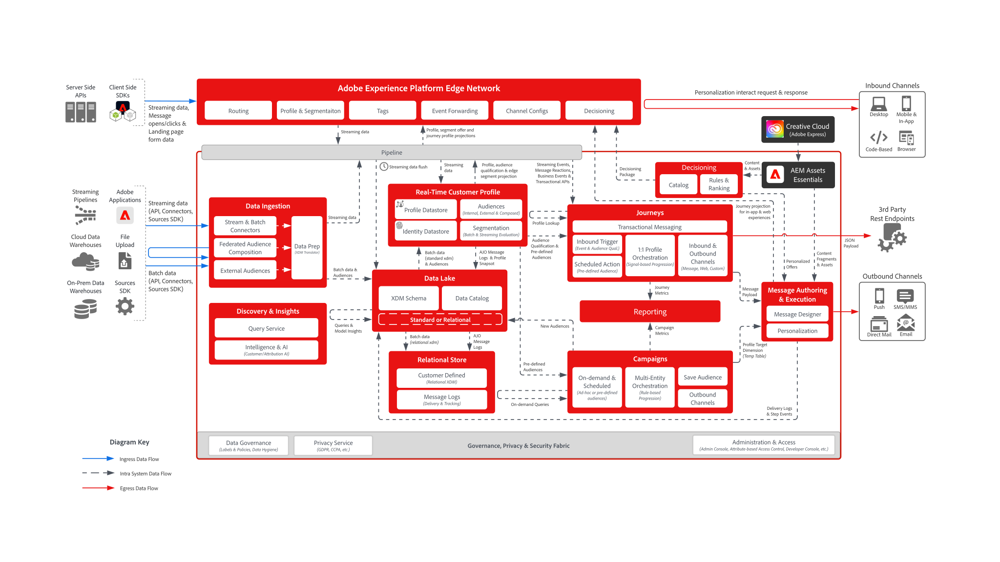

# Objectifs commerciaux, cas d’utilisation et diagrammes d’architecture de Customer Experience Orchestration

Ce site contient **Objectifs commerciaux clés** qui décrivent des exemples de valeur commerciale principale et d’objectifs pouvant être atteints avec Adobe Experience Platform et les applications. **Modèles de cas d’utilisation** décrivez les fonctionnalités courantes des plateformes et des applications avec des approches d’implémentation répétables. **Cas d’utilisation du secteur** appliquez des modèles à des scénarios d’entreprise spécifiques à la verticale. Les **schémas et plans directeurs d’architecture** sont des schémas de référence d’architecture visuelle et de flux de données qui illustrent les points d’intégration du système, les flux de données et de contenu et la séquence d’opérations, fournissant ainsi une référence technique pour la conception de solutions. Ensemble, ces couches relient la valeur commerciale aux dépendances et à l’architecture d’implémentation.

## Objectifs commerciaux clés

Résultats stratégiques que les organisations cherchent à atteindre par le biais d’initiatives d’expérience digitale. Chaque objectif correspond à des modèles de cas d’utilisation qui décrivent comment implémenter Adobe Experience Platform et les applications.

<table>
<tr>
  <td><a href="business-objectives/overview.md#acquisition--growth"><strong>Acquisition et croissance</strong></a></td>
  <td><a href="business-objectives/overview.md#revenue--monetization"><strong>Chiffre d’affaires et monétisation</strong></a></td>
  <td><a href="business-objectives/overview.md#cost--efficiency"><strong>Coût et efficacité</strong></a></td>
</tr>
<tr>
  <td><a href="business-objectives/overview.md#customer-experience"><strong>Expérience client</strong></a></td>
  <td><a href="business-objectives/overview.md#analytics--insights"><strong>Analytics et Insights</strong></a></td>
  <td><a href="business-objectives/overview.md#qualification--sales-b2b"><strong>Qualification Et Ventes (B2B)</strong></a></td>
</tr>
</table>

[Afficher tous les objectifs commerciaux](business-objectives/overview.md)

## Modèles de cas d’utilisation

Approches d’implémentation reproductibles qui décrivent des fonctionnalités spécifiques, la chaîne de fonction qui les fournit et les applications impliquées.

<table>
<tr>
  <td><a href="use-case-patterns/overview.md#audience-building--activation"><strong>Création et activation d’audiences</strong></a></td>
  <td><a href="use-case-patterns/overview.md#personalization"><strong>Personnalisation</strong></a></td>
  <td><a href="use-case-patterns/overview.md#campaign-management--orchestration"><strong>Gestion et orchestration des campagnes</strong></a></td>
</tr>
<tr>
  <td><a href="use-case-patterns/overview.md#analysis"><strong>Analyse</strong></a></td>
  <td><a href="use-case-patterns/overview.md#conversational-experience"><strong>Expérience de conversation</strong></a></td>
  <td></td>
</tr>
</table>

[Afficher tous les modèles de cas d’utilisation](use-case-patterns/overview.md)

## Explorer par secteur

Cas d’utilisation adaptés à des secteurs spécifiques, chacun associé à des modèles d’implémentation et à des objectifs métier.

<table>
<tr>
  <td><a href="industry-use-cases/retail/retail-overview.md"><strong>Grande distribution</strong></a></td>
  <td><a href="industry-use-cases/financial-services/financial-services-overview.md"><strong>Services Financiers</strong></a></td>
  <td><a href="industry-use-cases/healthcare/healthcare-overview.md"><strong>services de santé</strong></a></td>
</tr>
<tr>
  <td><a href="industry-use-cases/automotive/automotive-overview.md"><strong>Automobile</strong></a></td>
  <td><a href="industry-use-cases/travel-hospitality/travel-hospitality-overview.md"><strong>Voyage et hébergement</strong></a></td>
  <td><a href="industry-use-cases/telecommunications/telecommunications-overview.md"><strong>Télécommunications</strong></a></td>
</tr>
<tr>
  <td><a href="industry-use-cases/media-entertainment/media-entertainment-overview.md"><strong>Médias et divertissement</strong></a></td>
  <td><a href="industry-use-cases/insurance/insurance-overview.md"><strong>Assurance</strong></a></td>
  <td><a href="industry-use-cases/b2b/b2b-overview.md"><strong>B2B</strong></a></td>
</tr>
</table>

[Afficher tous les cas d’utilisation du secteur](industry-use-cases/use-case-catalog.md)

## Diagrammes et plans directeurs d’architecture

Diagrammes de référence d’architecture visuelle et de flux de données qui illustrent les points d’intégration du système, les flux de données et de contenu, ainsi que la séquence d’opérations pour Adobe Experience Platform et les applications.

<table>
<tr>
  <td>
    
    

      <a href="experience-platform/guardrails.md">
    <strong>Diagramme de l’architecture et des mécanismes de sécurisation Experience Platform Hub et Edge</strong>
    </a>
    

  </td>
   <td>
    
    

      <a href="experience-platform/deployment/websdk.md">
    <strong>Web SDK et diagramme de séquence Edge Network</strong>
    </a>
    

  </td>
  <td>
    
    

      <a href="customer-journeys/journey-optimizer/journey-optimizer-overview.md">
    <strong>Diagramme De Présentation De </strong>
    </a>
    

  </td>
</tr>
</table>