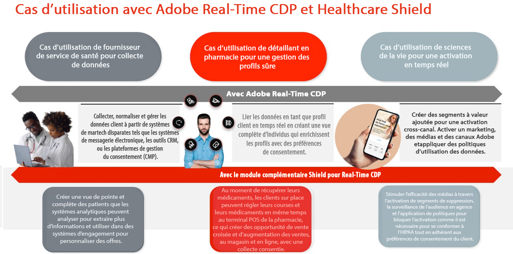
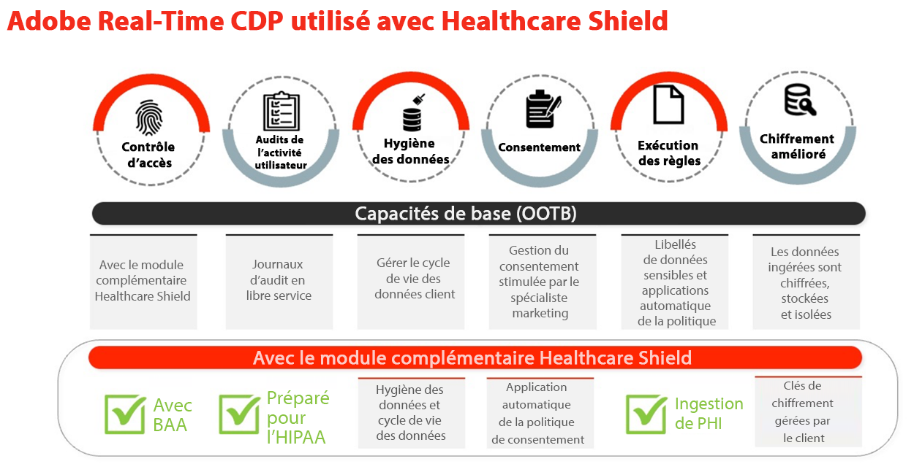
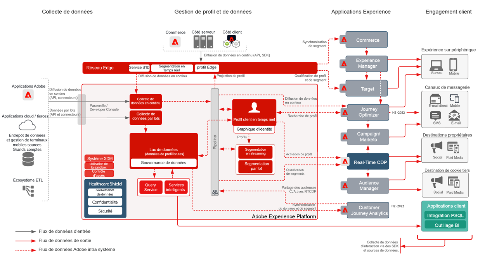
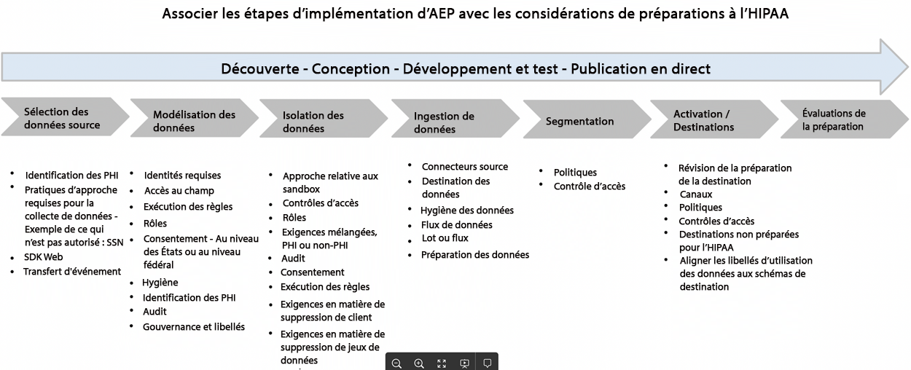
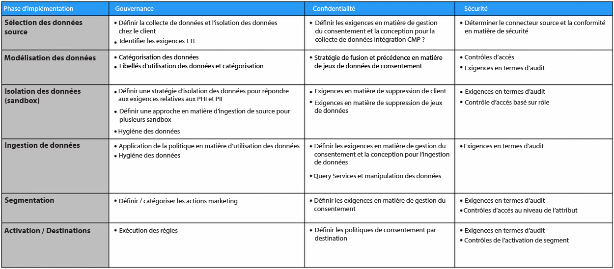

# Bouclier de santé

Healthcare Shield est un module complémentaire Adobe Experience Platform destiné aux applications Adobe Experience Platform telles que Real-time Customer Data Platform, Customer Journey Analytics et Adobe Journey Optimizer. Il est conçu pour que ces applications soient prêtes à l’HIPAA et répondent aux exigences relatives au traitement et à l’utilisation des informations sur la santé protégées.

## Questions fréquentes sur Healthcare Shield

Les questions fréquentes suivantes apportent des réponses aux questions courantes sur Healthcare Shield.

### Qu’est-ce que le HIPAA ?

Le HIPAA est la Loi sur la responsabilité et la portabilité de l&#39;assurance-maladie. C&#39;est une réglementation américaine qui établit des protections importantes pour les entreprises. Ces protections limitent l’utilisation et la divulgation d’informations sur la santé protégées (PHI) lorsqu’elles sont créées, reçues, conservées ou transmises par une entité couverte par le HIPAA ou des associés commerciaux (tels que les clients d’Adobe) à un associé d’entreprise (partenaires technologiques tels que l’Adobe).

Adobe est prêt pour le HIPAA en tant qu’associé commercial concernant les solutions d’Adobe spécifiques prêtes pour le HIPAA et la conformité aux règles de sécurité, de confidentialité et de notification d’infraction du HIPAA.

### Qu’est-ce qu’un accord d’association de travail (AAA) et pourquoi est-ce important ?

Lorsqu’une entité couverte ou un associé d’entreprise (un client d’Adobe) utilise les services d’un associé d’entreprise (tel qu’un Adobe) pour créer, recevoir, gérer ou transmettre certains types de données de consommateur qui sont des données de santé protégées (PHI) ou une ePHI (version électronique de l’API), l’entité couverte et l’associé d’entreprise sont tenus de souscrire à un accord d’association d’entreprise.

Le contrat BAA requiert un Adobe, en tant qu’associé de l’entreprise pour protéger de manière appropriée l’intégrité sanitaire des données en se conformant aux exigences des règles de confidentialité, de sécurité et de notification d’infraction du HIPAA.

Grâce au module complémentaire Healthcare Shield pour Real-Time CDP, Adobe peut désormais exécuter une version BAA avec des clients qui disposent de licences pour cette fonctionnalité, ainsi que les flux de consommation d’Adobe Real-Time CDP B2P Edition et d’Adobe Real-Time CDP B2C.

### Pourquoi le Healthcare Shield pour Real-Time CDP (et les futures applications basées sur Platform) est-il disponible uniquement aux États-Unis ?

Puisque le HIPAA est une loi américaine, nous limitons la disponibilité du Healthcare Shield aux États-Unis et aux entreprises soumises à l&#39;HIPAA. Adobe a l&#39;intention d&#39;étendre la couverture à d&#39;autres juridictions à mesure que nous définissons les exigences locales et que nous sommes sûrs que nous pouvons les satisfaire.

### Qu’est-ce que le Bouclier de santé pour Real-Time CDP ?

Healthcare Shield pour Real-Time CDP est destiné aux clients qui sont une entité couverte ou un associé d’entreprise et qui ont l’intention d’utiliser l’PHI dans Real-Time CDP pour l’ingestion de données, la création d’audiences et l’activation cross-canal, ainsi que pour avoir besoin d’un Adobe pour exécuter une API BAA. Le Bouclier de santé est requis pour les entités couvertes avec HIPAA dans les cas d’utilisation requis pour la plateforme de données clients en temps réel.

### Pourquoi les perspectives de santé de Real-Time CDP devraient-elles acheter Healthcare Shield ?

En tant que module complémentaire de Real-Time CDP, Healthcare Shield met à niveau l’application vers un statut &quot;prêt pour le HIPAA&quot;. Cela signifie que l’application a mis en place les mesures de protection pour utiliser l’intégrité sanitaire conformément aux exigences de l’HIPAA. En outre, avec Healthcare Shield, l’Adobe est prêt et en mesure d’autoriser le client à importer certains types de données personnelles sensibles autorisées dans les applications prêtes pour le HIPAA. Adobe signe des accords d’association commerciale (BAA) avec des clients qui autorisent Healthcare Shield pour une application compatible basée sur Platform.

### Quels types de données sont autorisés pour Real-Time CDP avec Healthcare Shield (et lesquels ne le sont pas) ?

Avec Healthcare Shield, les marques peuvent introduire les PHI suivantes dans les applications basées sur Platform telles que Real-Time CDP (Permitted Sensitive Personal Data) :

* Informations financières d’un individu
* Médical
* Informations sur la santé

Mais nous excluons spécifiquement les données qui identifient l&#39;abus de substances, la santé mentale, les registres de santé génétique ou les dossiers de santé d&#39;un mineur, le numéro de compte complet, le numéro de carte de crédit complet, les identifiants gouvernementaux (comme le numéro de sécurité sociale) et les informations personnelles des enfants. Les enfants sont protégés par toute loi de protection de l’enfance (comme les informations personnelles définies en vertu de la loi COPPA (Children’s Online Privacy Act) des États-Unis).

### Avec Healthcare Shield, les clients Real-Time CDP peuvent-ils utiliser n’importe quel type d’IIP pour créer des audiences et les activer ?

Même lorsqu’un client peut importer des données personnelles sensibles autorisées dans des applications natives à Platform, les clients doivent comprendre qu’ils sont seuls responsables de la conformité à toutes les réglementations applicables et de l’obtention des autorisations, consentements, autorisations et autorisations appropriées de la part des consommateurs pour utiliser les données de la manière prévue.

### Quelles sont les nuances de l’ingestion et de l’activation de données client avec des applications d’Adobe non compatibles avec HIPAA ?

Il est interdit à un client d’utiliser, d’ingérer, de collecter, de partager ou d’intégrer des données personnelles sensibles autorisées à des applications et services d’Adobe non compatibles avec HIPAA.

Par exemple, un client ne doit pas activer les segments qui contiennent une API dans les applications telles que Audience Manager, Adobe Target et Adobe Analytics. Les clients qui accordent des licences pour Healthcare Shield peuvent ingérer des données personnelles sensibles aux autorisations ou des données personnelles autorisées dans des applications d’Adobe prêtes pour le HIPAA, que la source de données soit considérée comme prête ou non pour le HIPAA.

### Quelles sont les nuances de l’ingestion et de l’activation de données client avec des applications non compatibles avec les HIPAA ?

Un client qui accorde une licence pour Healthcare Shield doit faire preuve d’un bon jugement pour déterminer où il active des segments qui contiennent des PHI en dehors des applications d’Adobe. Adobe ne contrôle pas (et n’est pas responsable) les fournisseurs tiers et les données envoyées par un client à un fournisseur tiers qui peut ne pas prendre en charge le traitement des données conformément aux libellés d’utilisation des données d’Adobe dans le schéma des clients. De plus, Adobe ne peut pas fournir de conseils juridiques à nos clients.

## Cas d’utilisation clés de Healthcare Shield

| Cas d’utilisation standard de l’Édition B2C RTCDP | Description |
|-----|-----|
| Collecte de données par flux | <ul><li>Modèles de données normalisés et flexibles utilisables sur les connexions d’Adobe et non d’Adobe<li>Schémas de données basés sur les personnes et les comptes conçus pour le marketing B2C.<li>La gestion des balises et le transfert d’événement collectent et distribuent des données au niveau de l’événement en temps réel.<li> Profils optimisés qui accélèrent la diffusion de l’expérience.</li></ul> |
| Gestion des profils approuvés | <ul><li>Profils unifiés contenant des données d’attributs du consommateur, de comportement et de préférences.<li> Le cadre de gouvernance des données est flexible, transparent et appliqué aux profils unifiés avec création de stratégies et application automatique afin d’empêcher toute utilisation abusive des données. </li></ul> |
| Activation en temps réel | <ul><li>Segmentation par glisser-déposer conçue pour les spécialistes du marketing B2C.<li>Résolution des identités au niveau de la personne et du compte et enrichissement des profils pour l’activation cross-canal.<li> Expériences client cohérentes par l’orchestration de l’audience et l’activation en temps réel sur les canaux et environnements (Adobe et non-Adobe).</li></ul> |
| Acquisition client | <ul><li>Informations sur la conversion d’utilisateurs non authentifiés en utilisateurs reconnus/authentifiés.<li>Encourager les utilisateurs non enregistrés à s’inscrire.<li> Augmentez et/ou récupérez les abonnements.<li> Analysez les profils client pour comprendre la propension (par ex. . comparer des segments à forte valeur ajoutée avec des segments peu performants et optimiser pour l’acquisition).</li></ul> |
| Engagement client | <ul><li>Offres Target basées sur la récence du comportement des consommateurs et la fréquence des offres (en ligne et hors ligne).<li>Unifiez les propriétés numériques pour une expérience connectée (par exemple, encourager les téléchargements d’applications mobiles et utiliser l’activation de segments sur plusieurs canaux pour connecter des expériences).</li></ul> |
| Personnalisation à l’échelle | <ul><li> Evaluez les segments sur la périphérie pour une personnalisation en temps réel de la même page et de la page suivante.<li>Augmentez l’engagement en fournissant des expériences ciblées et uniques aux visiteurs qui abandonnent une session au fil des parcours (par exemple, abandonnez le panier, répétez les visiteurs qui ne parviennent pas à effectuer de conversion).<li> Unifiez et connectez les comportements hors ligne et en ligne pour optimiser et impliquer les utilisateurs.</li></ul> |
| Vente croisée / Mise à niveau | <ul><li>Conserver les clients tout en développant et en maintenant des relations existantes avec les utilisateurs.<li>Stimuler les nouvelles sources de revenus grâce à des offres/unités opérationnelles/marques croisées afin d’augmenter la valeur de durée de vie des clients.<li>Obtenez des informations sur AOV à travers les produits et les SKU (par exemple, les lots fréquents, le respect des prix).</li></ul> |
| Fidélité de la clientèle | <ul><li> Réactivez les consommateurs pour accroître la fidélité et éviter le attrition des clients&lt;.li>Traitez les recommandations de produits personnalisées pour les clients à forte valeur ajoutée en fonction des préférences et de la propension.<li>Créez une cadence standard d’engagement et d’offres spéciales pour les clients fidèles.<li> Liez les préférences en ligne et hors ligne pour optimiser les offres sur l’ensemble des canaux.</li></ul> |
| Collaboration de données | <ul><li> Créez des poignées de main dans une interface utilisateur pour créer des workflows de collaboration de données.<li>(Tirez parti des chevauchements de données propriétaires dans les secteurs d’activité pour prendre des décisions stratégiques et des campagnes éclairées.<li>Ventilez les silos de données et comprenez les parcours client holistiques.<li> Respectez les préférences et le consentement par cas d’utilisation.</li></ul> |
| Efficacité des médias/du marketing et optimisation | <ul><li> Gagnez en efficacité organisationnelle en centralisant et en gérant les canaux d’activation et de données client dans un seul système d’enregistrement.<li>Prendre en charge les campagnes de suppression pour optimiser les dépenses et l’efficacité des médias.<li> Respectez les politiques informatiques par le biais de la gouvernance et de l’application des politiques.<li>Accédez aux données selon les besoins, en temps réel, afin de prendre en charge les campagnes en temps réel.</li></ul> |

## Fonctionnalités techniques pertinentes

### Différences

| Type | Prêt à l’emploi | Bouclier de santé |
|-----|-----|-----|
| Chiffrement | [Cryptage des données dans AEP](https://experienceleague.adobe.com/docs/experience-platform/landing/governance-privacy-security/encryption.html?lang=en) | [Cryptage des données dans AEP](https://experienceleague.adobe.com/docs/experience-platform/landing/governance-privacy-security/encryption.html?lang=en) + Clés gérées par le client |
| Hygiène des données | **Fondement :** Outil en libre-service permettant aux clients de gérer le cycle de vie des données. Cela inclut la suppression des données client, les mises à jour au niveau des champs et la définition de l’expiration des données sur les jeux de données pour supprimer les données une fois expirées.<ul><li>Limite de **10 000 requêtes de suppression** par mois<li>Limite de 2 TTL de jeux de données</li></ul> | **Premium**: Étendez la capacité/le seuil quotidiens de la fonctionnalité d’hygiène des données pour traiter des jeux de données plus volumineux en moins de temps.<ul><li>Limite de **2 000 000 requêtes de suppression** par mois dans le cadre du Bouclier de santé<li>Limite de 20 TTL de jeux de données</li></ul> |
| Consentement | **Fondement**: Consentement granulaire et préférences en ajoutant manuellement les attributs liés au consentement et aux préférences à la segmentation de l’audience. | **Premium**: Créez et appliquez automatiquement des stratégies sur la manière dont les données client doivent être utilisées en fonction du consentement et des préférences. |

### Gouvernance

**Assurance des données**

* [Présentation de l’hygiène des données](https://experienceleague.adobe.com/docs/platform-learn/tutorials/data-hygiene/overview.html?lang=en)
* [Veille des données sur Adobe Experience Platform](https://experienceleague.adobe.com/docs/experience-platform/hygiene/home.html?lang=en)

**Application des stratégies**

* [Présentation de la gouvernance des données](https://experienceleague.adobe.com/docs/experience-platform/data-governance/home.html?lang=en)
* [Présentation des stratégies d’utilisation des données](https://experienceleague.adobe.com/docs/experience-platform/data-governance/policies/overview.html?lang=en)
* [Gouvernance, confidentialité et sécurité dans Adobe Experience Platform](https://experienceleague.adobe.com/docs/experience-platform/landing/governance-privacy-security/overview.html?lang=en#consent)

### Confidentialité

**Consentement**

* [Application automatique des stratégies](https://experienceleague.adobe.com/docs/experience-platform/data-governance/enforcement/auto-enforcement.html?lang=en#consent-policy-evaluation)

### Sécurité

**Chiffrement amélioré**

Liens utiles :

* [Livre blanc sur la sécurité AEP](https://www.adobe.com/content/dam/cc/en/security/pdfs/AEP_SecurityOverview.pdf)

* [Chiffrement des données dans Adobe Experience Platform](https://experienceleague.adobe.com/docs/experience-platform/landing/governance-privacy-security/encryption.html)

* [Fonctions de hachage dans Data Prep](https://experienceleague.adobe.com/docs/experience-platform/data-prep/functions.html?lang=en#hashing)

* [Chiffrement des données de balises](https://experienceleague.adobe.com/docs/experience-platform/tags/api/guides/encrypting-values.html?lang=en)

**Contrôles d’accès**

* [Contrôle d’accès basé sur les attributs - Aperçu](https://experienceleague.adobe.com/docs/experience-platform/access-control/abac/overview.html)

**Audits des activités des utilisateurs**

* [Journaux d’audit](https://experienceleague.adobe.com/docs/experience-platform/landing/governance-privacy-security/audit-logs/overview.html)

**Cryptage amélioré**

* [Présentation de la sécurité Adobe Experience Platform](https://www.adobe.com/content/dam/cc/en/security/pdfs/AEP_SecurityOverview.pdf)
* [Chiffrement des valeurs](https://experienceleague.adobe.com/docs/experience-platform/tags/api/guides/encrypting-values.html?lang=en)
* [Cryptage des données dans Adobe Experience Platform](https://experienceleague.adobe.com/docs/experience-platform/catalog/data-protection.html)
* [Fonctions de mappage de la préparation de données - Hachage](https://experienceleague.adobe.com/docs/experience-platform/data-prep/functions.html?lang=en#hashing)

**Experience Cloud**

* [Adobe Real-time Customer Data Platform et Healthcare Shield](https://experienceleague.adobe.com/docs/customer-data-management-voices-events/events/governance/healthcare-shield.html?lang=en)

   La diffusion sur l’expérience promet, avec un accès à moins de données. Dans cette vidéo, découvrez Adobe Real-Time CDP et Healthcare Shield, un module complémentaire Adobe Experience Platform pour les applications basées sur Adobe Experience Platform conçu pour préparer ces applications en HIPAA et répondre aux exigences de l’HIPAA concernant le traitement et l’utilisation des données de santé protégées (PHI).

**Experience Platform**

* [Présentation des journaux d’audit](https://experienceleague.adobe.com/docs/experience-platform/landing/governance-privacy-security/audit-logs/overview.html)

   Découvrez comment les journaux d’audit vous permettent de savoir qui a effectué quelles actions dans Adobe Experience Platform.

* [Présentation de l’hygiène des données](https://experienceleague.adobe.com/docs/experience-platform/hygiene/home.html?lang=en)

   L’hygiène des données Adobe Experience Platform vous permet de gérer le cycle de vie de vos données en mettant à jour ou en purgeant des enregistrements obsolètes ou inexacts.

* [Application automatique des stratégies](https://experienceleague.adobe.com/docs/experience-platform/data-governance/enforcement/auto-enforcement.html?lang=en)

   Ce document décrit la manière dont les stratégies d’utilisation des données sont automatiquement appliquées lors de l’activation de segments vers des destinations dans Experience Platform.

* [Présentation du contrôle d’accès basé sur les attributs](https://experienceleague.adobe.com/docs/experience-platform/access-control/abac/overview.html)

   Découvrez le contrôle d’accès basé sur les attributs dans Adobe Experience Platform.

## HIPAA et produits et services d’Adobe

Adobe continue d’innover et de s’adapter pour répondre aux besoins de ses clients dans le secteur de la santé afin de répondre à leurs besoins spécifiques en matière de confidentialité et de sécurité.

Voir [HIPAA et produits et services d’Adobe](https://www.adobe.com/trust/compliance/hipaa-ready.html).

## Diagramme marketing de haut niveau

Produits prêts (et non) pour l’application HIPAA :

**Schéma de l’architecture marketing**

* Les applications illustrées en gris ne sont pas encore prêtes pour HIPAA.

## Approche

Cette section décrit les étapes de mise en oeuvre et la phase d’entretien.

### Etapes de mise en oeuvre

Aspects à prendre en compte à chaque étape :

Cette section décrit certaines bonnes pratiques à suivre et se divise en trois phases :

### Phase d’entretien

Le processus d’entretien avec les parties prenantes est essentiel pour comprendre les aspects suivants :

* Objectif : Type de cas d’utilisation : conversion, prospection, engagement, etc.
* Performances : Toutes les attentes de niveau de service
* Sources de données : Web/Analytics, hors ligne/en ligne, CRM, fidélité, etc.
* Volume de données
* Exigences SLT/SLA
* Identités : nombre d’identités, gestion des données authentifiées ou anonymes
* Format des données : JSON, CSV, etc.
* Qualité des données, besoin de transformations des données
* N’importe quel projet de correspondance de segment (partage) avec des partenaires
* Toute audience externe à importer
* Chiffrement : Clé gérée par défaut ou par le client
* Combinaison de données : est considéré comme un e-PHI
* Collecte de données de consentement - OneTrust, SDK de consentement
* Besoins en matière de destination : Exigences en matière de fréquence et de latence et de contrôle d’accès
* Contrôle d’accès
* Exigences de nettoyage des données
* Exigences de mise à jour des données
* Besoins en matière d’alertes
* Accès aux API

### Phase de conception

Sur la base du processus d&#39;entretien, la phase de conception portera sur les points suivants. Il va sans dire que la documentation de conception doit être révisée et validée. Le document de conception peut couvrir les aspects suivants :

* Valeur des données :
   * Volume : quantité de données ingérées
   * Durée : durée de résidence des données ingérées.
   * Fidélité - Richesse des profils
* Tenez compte des barrières de sécurité AEP ainsi que des exigences SLT/SLA
* Utilisation de la licence
* Besoins en isolation des données : plusieurs environnements de test dans une ou plusieurs organisations
* Filtrage des données
* Exigences en matière d’hygiène des données (quantité de données et fréquence)
* Processus et méthodologie pour répondre aux exigences en matière de suppression/mise à jour de données
* Besoins en matière de transformation des données - Mise en amont, préparation des données, Query Service
* Comprendre et déterminer les identités Principal et autres
* [Conception de schéma XDM](https://experienceleague.adobe.com/docs/experience-platform/xdm/schema/composition.html?lang=en)
* Déterminer le nombre de jeux de données, profilés ou non profilés
* Conception de la stratégie de fusion
* Gestion des données de consentement
* Gouvernance : Rôles, libellés, stratégies, actions marketing et contrôle d’accès
* [Enrichissement du profil](https://experienceleague.adobe.com/docs/experience-platform/profile/guardrails.html?lang=fr)
* Exigences de conception de la segmentation pour Edge/Streaming/Batch
* Destinations attendues et plans d’activation. Tenez compte des besoins de destination prêts pour le HIPAA uniquement
* Formules pour Analytics
* Alertes
* Ajout des exigences d’accès aux API

### Phase de mise en oeuvre

Une fois le document de conception examiné et approuvé, la phase de mise en oeuvre peut commencer à traiter les domaines suivants :

* Nombre d’environnements de test requis : Dev/Test/Prod
* Contrôle d’accès aux environnements de test
* Méthodologie de déploiement
* Besoins et fréquence TTL (hygiène des données)
* Schéma XDM et contrôle d’accès
* Application du consentement
* Gouvernance : Rôles, libellés, stratégies et actions marketing
* Segmentation
* Jeux de données et contrôle d’accès
* Configuration de l’hygiène des données
* Configuration des destinations et contrôle d’accès
* Configurer des alertes
* Mise en oeuvre des exigences d’accès aux API
* Test de bout en bout avec des données fictives
