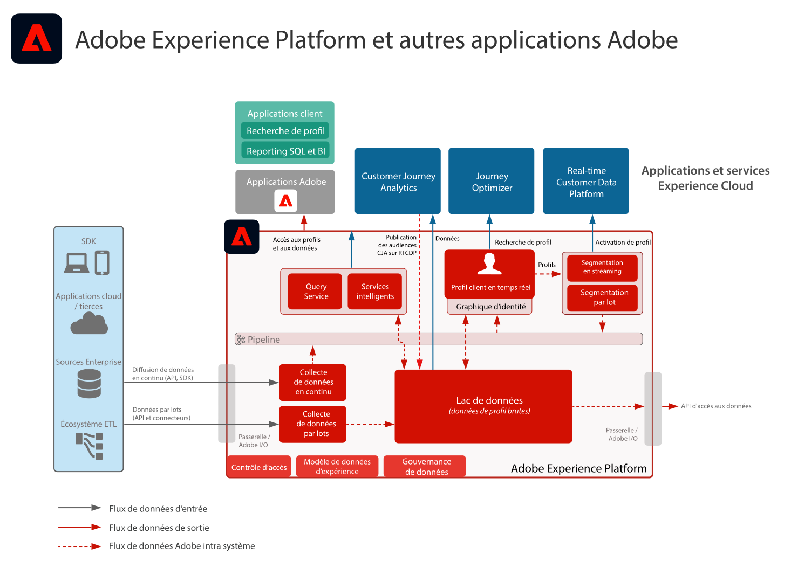

# Témoignages client avec des plans directeurs d’expérience digitale

Découvrez comment les clients conçoivent de superbes expériences et réussissent grâce aux plans directeurs d’expérience digitale. Ces mises en œuvre répétables et éprouvées vous permettent de développer de nouvelle stratégies et de résoudre rapidement des problèmes d’activité.

## Témoignages client en vedette

<table style="table-layout:fixed">
<tr>
  <td>
    
    </td>
  <td>
    

</td>
  <td>
    
  </td>
  <td>
    
  </td>
</tr>
<tr>
  <td>
    
<a href="https://experienceleague.adobe.com/docs/blueprints-learn/architecture/vertical-blueprints/apparel.html?lang=fr"><strong>Secteur de l’habillement</strong></a>

    
<em>Marketing en temps réel, activation cross-channel et cross-channel analytics.</em>

  </td>
  <td>
    
<a href="https://experienceleague.adobe.com/docs/blueprints-learn/architecture/vertical-blueprints/retail.html?lang=fr"><strong>Secteur de la vente au détail</strong></a>

    
<em>Expériences client en temps réel sur les médias numériques, par e-mail, par notifications push et sur les canaux web.</em>

  </td>
  <td>
    
<a href="https://experienceleague.adobe.com/docs/blueprints-learn/architecture/vertical-blueprints/telecommunications.html?lang=fr"><strong>Secteur des télécommunications</strong></a>

    
<em>Personnalisation en temps réel tout en bénéficiant d’une intégration efficace à la clientèle, pour s’assurer de leur fidélité à long terme.</em>

  </td>
  <td>
    
<a href="https://experienceleague.adobe.com/docs/blueprints-learn/architecture/vertical-blueprints/travel-hospitality.html?lang=fr"><strong>Secteur du tourisme et de l’hôtellerie</strong></a>

    
<em>Des décisions en temps réel grâce à une vue consolidée du comportement des clients sur différents canaux.</em>

  </td>
</tr>
</table>

## Autres témoignages client

* <a href="https://business.adobe.com/customer-success-stories/index.html?Products+%26+Services=Experience">Adobe Experience Cloud</a>
* <a href="https://business.adobe.com/customer-success-stories/index.html?Products+%26+Services=Experience+Platform">Adobe Experience Platform</a>
* <a href="https://business.adobe.com/customer-success-stories/index.html?Products+%26+Services=Intelligent+Services">Adobe Intelligent Services</a>
