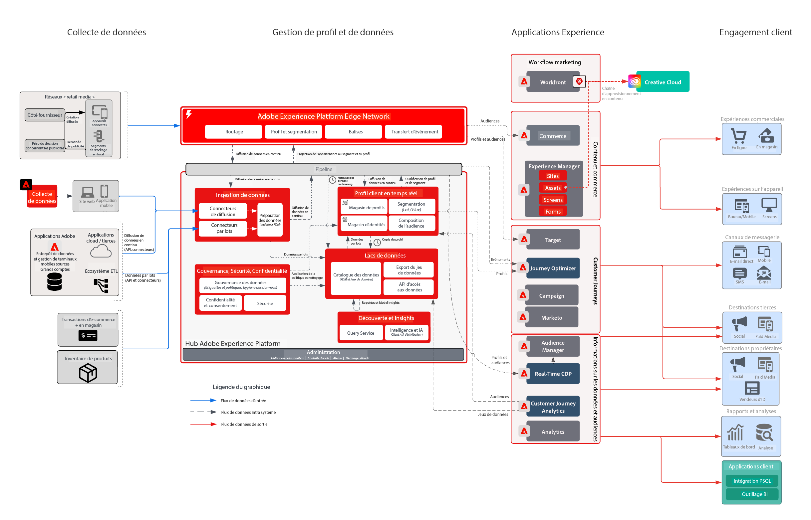

# Problématique relative au secteur de la vente au détail

Cette entreprise d’expérience intégrée a cherché à personnaliser l’ensemble du parcours client afin d’accroître leur fidélité, de réaliser de nouvelles ventes auprès de clients existants et d’optimiser les dépenses marketing pour l’ensemble de leurs campagnes. La stratégie pour atteindre cet objectif consiste à étendre sa capacité numérique afin d’inclure les données client et les données de transaction hors ligne afin de stimuler sa croissance.

## L’approche d’Adobe

* Générez un profil client unifié qui inclut toutes les données en ligne/hors ligne pertinentes qui peuvent être activées en temps réel.
* Orchestrez les interactions client sur les différents canaux web, média et push afin de générer un comportement d’achat pour la première ou la seconde fois.

## Valeur commerciale offerte

| Objectifs | Stratégies | Valeur débloquée |
|---|---|---|
| **Orchestration des parcours client en temps réel **  ** Incitation à des achats récurrents auprès de nouveaux clients **  ** Amélioration de l’efficacité marketing et réduction des coûts liés aux médias**</ul> | <ul><li>Des données et une stratégie d’identité solides pour alimenter un profil en temps réel complet.</li><li>Streaming de données client et transactionnelles en temps réel, avec charge historique sur 90 jours.</li><li>Segmentation du streaming vers les réseaux de publicité et Adobe Target afin d’optimiser les dépenses médias et les efforts de personnalisation.</li><li>Parcours client en temps réel via Adobe Campaign comprenant une stratégie de mesure des performances.</li></ul> | <ul><li><strong>Real-time Customer Data Platform :</strong> diffusion d’expériences client en temps réel sur les médias, par e-mails, par notifications push et sur le web</li><li><strong>Sources de données</strong> : données de streaming couvrant le stockage des profils, le système de commande, le catalogue de produits et les points de vente au détail de ce détaillant ou de cette détaillante.</li><li><strong>Activation multimédia en temps réel</strong> : streaming de segments vers les réseaux de publicité pour l’attribution et la suppression des publicités.</li><li><strong>Personnalisation web en temps réel</strong> : streaming de segments vers Adobe Target afin de les activer sur l’expérience web du magasin de vente au détail.</li><li><strong>Journey Orchestration à grande échelle</strong> : messagerie déclenchée en temps réel, enrichie de toutes les données client disponibles, et activation en temps réel dans les canaux e-mail et push.</li></ul> |

## Cas d’utilisation

| Catégorie | Objectif | Cas d’utilisation | Description |
|:----|:----|:----|:----|
| Parcours clients | Acquisition | Série Bienvenue | Accueil des nouvelles personnes abonnées avec présentation de l’entreprise, des produits et des services |
| | | 1er programme d’achat | |
| | Améliorer les ventes | Panier abandonné/Parcourir | Récupérer les personnes pouvant éventuellement acheter un article et augmenter les ventes |
| | | Avis sur les produits/vente croisée de produits | Vente croisée d’un plus grand nombre d’articles grâce aux avis sur les produits. |
| | | Promotions de produit |  |
| | | Commande répétitive | Rappel récurrent pour les produits/services cycliques |
| | Loyauté envers la marque | Reconquérir la clientèle | Récupérer les clientes et clients n’ayant enregistré aucune activité. |
| | | Rappels d’anniversaire | Établissez une relation plus personnelle avec les clientes et clients en participant à leur anniversaire ! |
| Merchandising | Gestion du stock | Réapprovisionnement du stock | Amélioration de l’inventaire en indiquant aux clientes et clients que les produits souhaités sont de nouveau en stock. |
| | | Meilleure catégorie suivante | Identification des meilleures catégories/ventes pour les utilisateurs et utilisatrices. |
| | | Vendeurs et vendeuses affichant les meilleures performances | |
| | | Rappels de baisse de prix | Annoncer aux utilisateurs et utilisatrices une baisse de prix sur leurs articles préférés. |
| | | Produits similaires |  |
| Personnaliser | Augmenter la conversion | Bons de réduction/Offres | Présenter les meilleures offres/bons de réduction aux clientes et clients |
| | | Recherche de produit personnalisée | Amélioration de l’expérience de recherche |
| | | Recommandations de produit | Amélioration de l’expérience de navigation des produits |
| | | Expérience omnicanal | Toucher la clientèle sur tous les canaux |
| Mesurer | Présentation des parcours client | Campagne cross-canal | Mesure des campagnes cross-canal |
| | | Performances des segments | Comprendre la contribution et les performances des segments |
| | | Rapports sur les abandons | Visualiser les conversions à chaque étape |
| | | Analyse des cohortes | Mesure de l’engagement entre les groupes de segments |
| | | Rapports « click-to-brick » | Découvrez comment les conversions de la clientèle mènent à une expérience en magasin |
| | | Attribution | Identifier le point de contact/l’expérience qui influence le plus la conversion d’achat |
| | | Informations prédictives | En savoir plus sur la propension de la clientèle |

## Architecture

## Plans directeurs associés

| Cas d’utilisation/intégration  | Lien |
|:----|:----|
| CJA + AEP | [Vue d’ensemble des plans directeurs de Customer Journey Analytics](https://experienceleague.adobe.com/docs/blueprints-learn/architecture/customer-journey-analytics/overview.html?lang=fr) |
| | [Customer Journey Analytics – Cas d’utilisation](https://experienceleague.adobe.com/docs/analytics-platform/using/cja-usecases/cja-usecases.html?lang=fr) |
| AJO + AEP | [Adobe Journey Optimizer – Cas d’utilisation](https://experienceleague.adobe.com/docs/blueprints-learn/architecture/customer-journeys/journey-optimizer/journey-optimizer.html?lang=fr) |
| | [Gestion des décisions](https://experienceleague.adobe.com/docs/blueprints-learn/architecture/customer-journeys/journey-optimizer/decision-management/decision-management-overview.html?lang=fr) |
| RTCDP + AEP | [Activation d’audience en ligne/hors ligne](https://experienceleague.adobe.com/docs/blueprints-learn/architecture/audience-activation/known-customer-audience-activation/known.html?lang=fr) |
| | [Experience Platform + Activation d’application](https://experienceleague.adobe.com/docs/blueprints-learn/architecture/audience-activation/platform-and-applications.html?lang=fr) |
| Marketo + AEP | [Activation et marketing B2B ](https://experienceleague.adobe.com/docs/blueprints-learn/architecture/b2b-activation/overview.html?lang=fr) | |
| Target + AEP | [Cas d’utilisation d’Adobe Target – Personnalisation comportementale web ou mobile](https://experienceleague.adobe.com/docs/blueprints-learn/architecture/web-personalization/behavioral.html?lang=fr) | [Personnalisation web/mobile avec des données client connues](https://experienceleague.adobe.com/docs/blueprints-learn/architecture/web-personalization/known-personalization.html?lang=fr) | |
