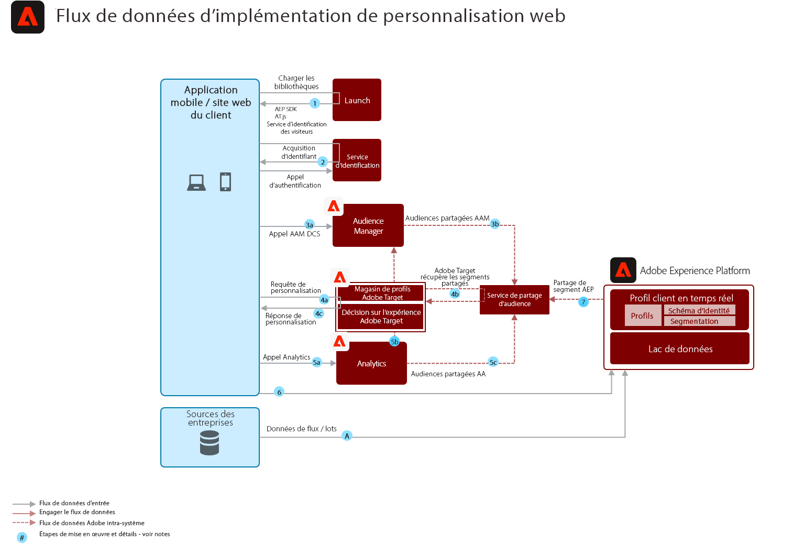

# Modèle de personnalisation Web comportementale

Personnalisez en fonction du comportement en ligne et des données d’audience.

## Cas d’utilisation

* Optimisation des landings page
* Ciblage comportemental
* Personnalisation basée sur des vues de produit/contenu antérieures, l’affinité de produit/contenu, les attributs environnementaux, les données d’audience tierces et les données démographiques

## Applications

* Adobe Target
* Adobe Analytics (facultatif)
* Adobe Audience Manager (facultatif)

## Architecture

## Gardiens

Par défaut, le service de partage de segments permet le partage d’un maximum de 75 audiences pour chaque suite de rapports Adobe Analytics. Si l&#39;Audience Manager est utilisée pour le partage des audiences, il n&#39;y a pas de limite au nombre d&#39;audiences pouvant être partagées. 

## Modèles d’implémentation

Le modèle de personnalisation Web/Mobile peut être mis en oeuvre par les approches suivantes, comme indiqué ci-dessous.

1. Utilisation de Platform Web SDK/Mobile SDK et Edge Network.
1. Utilisation de kits SDK spécifiques aux applications (par exemple, AppMeasurement.js)

### 1. Plateforme Web/Mobile SDK et approche Edge

### 2. Approche SDK spécifique à l&#39;application

## Conditions préalables à l’implémentation

| Application/Service | Bibliothèque requise | Notes |
|---|---|---|
| Adobe Target | Platform Web SDK*, at.js 0.9.1+ ou mbox.js 61+ | at.js est préférable car mbox.js n’est plus développé. |
| Adobe Audience Manager (facultatif) | Platform Web SDK* ou dil.js 5.0+ |  |
| Adobe Analytics (facultatif) | Platform Web SDK* ou AppMeasurement.js 1.6.4+ |  |
| Experience Cloud Identity Service | Platform Web SDK* ou VisitorAPI.js 2.0+ |  |
| Experience Platform Mobile SDK (facultatif) | 4.11 ou version ultérieure pour iOS et Android™ |  |
| SDK Web Experience Platform | 1.0, la version actuelle du SDK Experience Platform contient [divers cas d’utilisation non encore pris en charge pour les applications Experience Cloud](https://github.com/adobe/alloy/projects/5) |  |

## Etapes de mise en oeuvre

1. [Mise en oeuvre du ](https://experienceleague.adobe.com/docs/target/using/implement-target/implementing-target.html) ciblage d’Adobe pour vos applications Web ou mobiles.

   Si vous utilisez Audience Manager ou Analytics :

1. [Mise en oeuvre de Adobe Audience Manager](https://experienceleague.adobe.com/docs/audience-manager/user-guide/implementation-integration-guides/implement-audience-manager.html)
1. [Mise en oeuvre de Adobe Analytics](https://experienceleague.adobe.com/docs/analytics/implementation/home.html)
1. [Mise en oeuvre du service d&#39;identité Experience Cloud](https://experienceleague.adobe.com/docs/id-service/using/implementation/implementation-guides.html)

   >[!NOTE]
   >
   >Chaque application doit utiliser l’ID d’Experience Cloud et faire partie de la même organisation d’Experience Cloud pour permettre le partage des audiences entre les applications.

1. [Demander la mise en service des services de partage de personnes et d’Audiences (Audiences partagées)](https://www.adobe.com/go/audiences)
1. Créez des segments dans [Adobe Analytics](https://experienceleague.adobe.com/docs/analytics/components/segmentation/segmentation-workflow/seg-build.html) ou [Adobe Audience Manager](https://experienceleague.adobe.com/docs/audience-manager/user-guide/features/segments/segment-builder.html) et [configurez ces audiences pour le partage avec l’Experience Cloud](https://experienceleague.adobe.com/docs/analytics/components/segmentation/segmentation-workflow/seg-publish.html) (en cas d’Audience Manager ou d’Adobe Analytics).
1. Une fois les audiences disponibles dans Adobe Target, elles peuvent être utilisées pour [cibler des expériences avec Adobe Target](https://experienceleague.adobe.com/docs/target/using/audiences/target.html)

## Documentation connexe

* [audiences Experience Cloud](https://experienceleague.adobe.com/docs/core-services/interface/audiences/audience-library.html)
* [Intégrer l&#39;Audience Manager à Adobe Target](https://experienceleague.adobe.com/docs/audience-manager/user-guide/implementation-integration-guides/integration-other-solutions/aam-target-integration.html)
* [Partage de segments Adobe Analytics via Adobe Audience Manager](https://experienceleague.adobe.com/docs/analytics/components/segmentation/segmentation-workflow/seg-publish.html)

## Publications de blog connexes

* [[!DNL Blueprint for Web Personalization using Adobe Experience Platform Real-Time Customer Profile]](https://medium.com/adobetech/blueprint-for-web-personalization-using-adobe-experience-platform-real-time-customer-profile-fef2ce7a4b2f)
* [[!DNL Integrating Adobe Experience Platform Decisioning Engine with AEM Websites]](https://jaeness.medium.com/integrating-adobe-experience-platform-decisioning-engine-with-aem-websites-9c222acd12e2)
* [[!DNL How Adobe Experience Platform Predictive Audiences improves Personalized Experiences]](https://medium.com/adobetech/how-adobe-experience-platform-predictive-audiences-improves-personalized-experiences-1f75a60cb7a3)
* [[!DNL Adobe Experience Platform Web SDK for Audience Management]](https://medium.com/adobetech/adobe-experience-platform-web-sdk-for-audience-management-751fa6d063bc)
* [[!DNL Implementing Adobe Experience Platform Real-Time Customer Profile through our “Customer Zero” Program]](https://medium.com/adobetech/implementing-adobe-experience-platform-real-time-customer-profile-through-our-customer-zero-32e7cd952896)
* [[!DNL How Adobe Experience Platform Can Help Customers Personalize Their Mobile Messaging in Real-Time with Journey Orchestration Service and a Mobile Messaging Vendor]](https://medium.com/adobetech/how-adobe-experience-platform-helped-a-client-personalize-their-mobile-messaging-in-real-time-with-7d634aefa098)
* [[!DNL Segmentation in Seconds: How Adobe Experience Platform Made Real-time Customer Profiles a Reality]](https://medium.com/adobetech/segmentation-in-seconds-how-adobe-experience-platform-made-real-time-customer-profiles-a-reality-a7a8552b0847)
