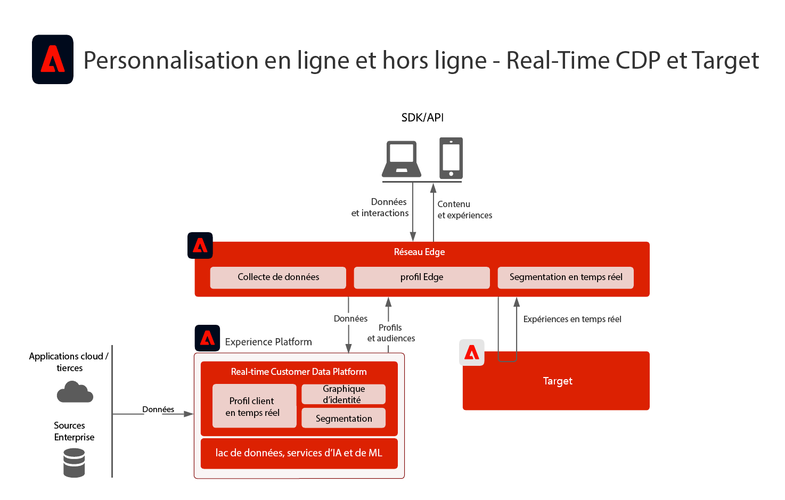
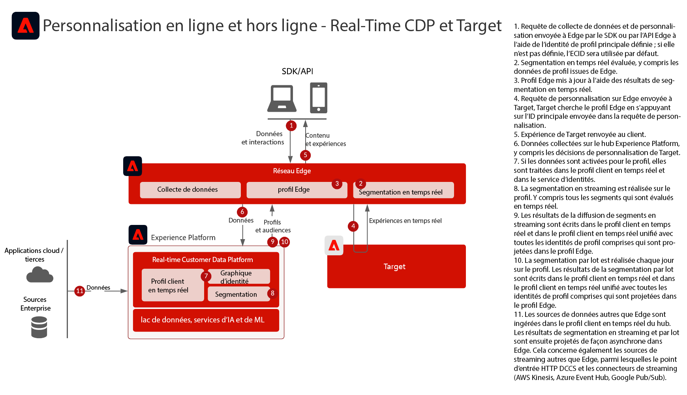
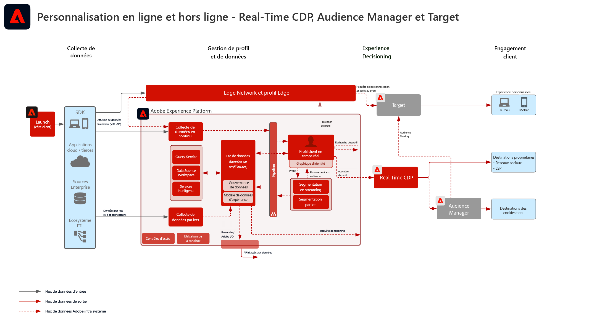
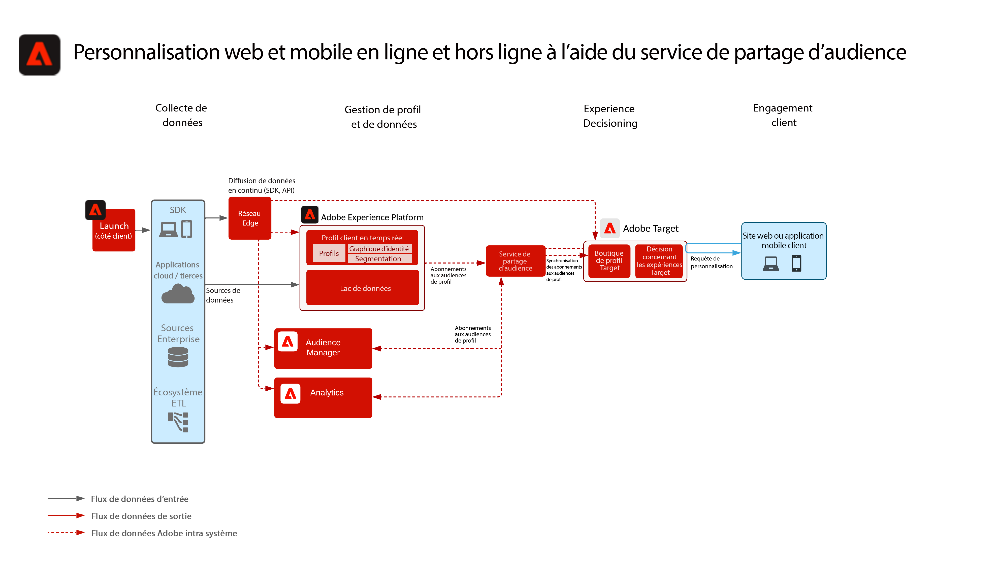
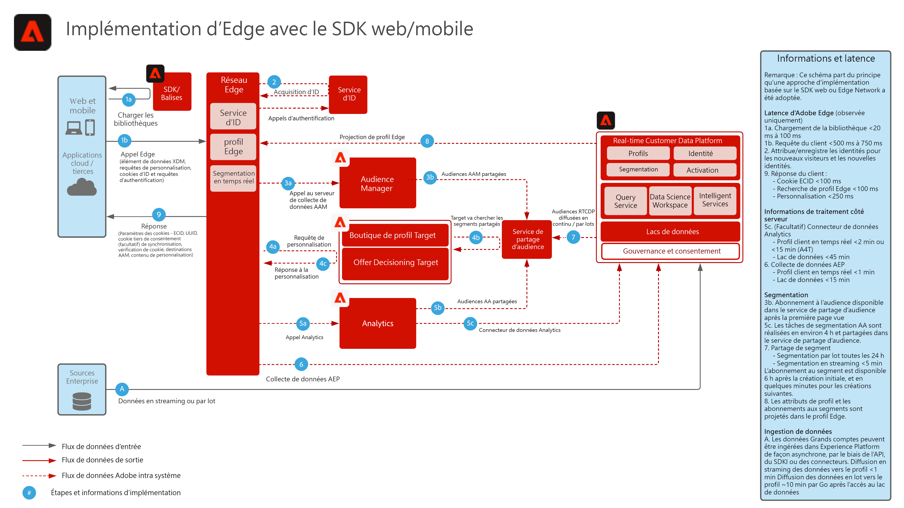
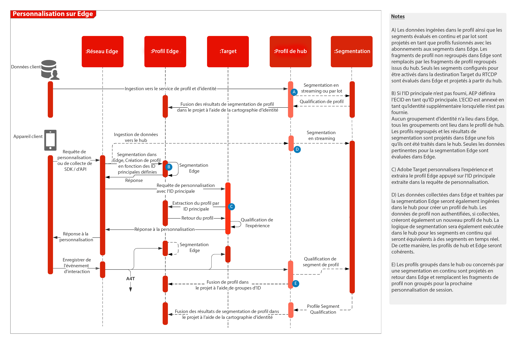

# Personnalisation web/mobile à l’aide de données en ligne et hors ligne

## Cas d’utilisation

* Personnalisation en ligne avec des données en ligne et hors ligne et des profils connus
* Optimisation de la page de destination
* Personnalisation basée sur des consultations antérieures de produit/contenu, l’affinité produit/contenu, les attributs environnementaux et les données démographiques, en plus des données hors ligne telles que les transactions, les données de fidélité et de gestion de la relation client et les informations modélisées
* Partagez et ciblez des audiences définies dans Real-time Customer Data Platform sur les sites web et les applications mobiles à l’aide d’Adobe Target.

## Applications

* [!UICONTROL Real-time Customer Data Platform]
* Adobe Target
* Adobe Audience Manager (facultatif) : Ajoute des données d’audience tierces, un graphique d’appareil basé sur la coopération, la possibilité d’afficher les audiences Real-time Customer Data Platform dans Adobe Analytics et la possibilité d’afficher les audiences Adobe Analytics dans Real-time Customer Data Platform.
* Adobe Analytics (facultatif) : ajoute la possibilité de créer des segments basés sur des données comportementales historiques et une segmentation fine à partir des données d’Adobe Analytics

## Scénarios de cas d’utilisation

<table class="tg" style="undefined;table-layout: fixed; width: 790px">
<colgroup>
<col style="width: 20px">
<col style="width: 276px">
<col style="width: 229px">
<col style="width: 265px">
</colgroup>
<thead>
  <tr>
    <th class="tg-y6fn">#</th>
    <th class="tg-f7v4">Scénarios de cas d’utilisation</th>
    <th class="tg-y6fn">Fonctionnalité</th>
    <th class="tg-f7v4">Conditions préalables</th>
  </tr>
</thead>
<tbody>
  <tr>
    <td class="tg-0lax">1</td>
<td class="tg-73oq">Évaluation des segments en temps réel sur le serveur Edge partagé de Real-time Customer Data Platform vers Target</td>
    <td class="tg-0lax">- Évaluez les audiences en temps réel pour une personnalisation de même page ou de page suivante sur Edge. - En outre, tous les segments évalués en flux continu ou par lots seront également projetés sur le réseau Edge pour être inclus dans l’évaluation et la personnalisation des segments Edge.</td>
    <td class="tg-73oq">- Modèle de mise en oeuvre 1 décrit ci-dessous. - Le SDK Web/Mobile doit être mis en oeuvre. - Notez que la prise en charge de la segmentation en temps réel par le SDK Mobile et l’API mobile n’est actuellement pas disponible. - Le flux de données doit être configuré dans Experience Edge avec l’extension Target et l’extension Experience Platform activée. L’identifiant du flux de données sera fourni dans la configuration de destination de Target. - La destination Target doit être configurée dans les destinations Real-time Customer Data Platform. - L’intégration à Target requiert la même organisation IMS que pour l’instance Experience Platform.</td> 
  </tr>
  <tr>
    <td class="tg-0lax">2</td>
    <td class="tg-73oq">Diffusion en continu et partage d’audiences par lots de Real-time Customer Data Platform vers Target via l’approche Edge</td>
    <td class="tg-0lax">- Partagez des audiences en continu et par lots de Real-time Customer Data Platform vers Target par le biais du réseau Edge. Les audiences évaluées en temps réel nécessitent l’évaluation de l’audience en temps réel et le SDK web tels que décrits dans le motif d’intégration 1. - Cette intégration est généralement utilisée pour partager des audiences par lots et en flux continu à l’aide des SDK traditionnels au lieu de migrer vers Edge Collection et WebSDK qui optimise les audiences en temps réel, en flux continu et par lots comme indiqué dans le modèle d’intégration 1.</td>
    <td class="tg-73oq">- Modèles de mise en oeuvre 1 ou 2 décrits ci-dessous. - Le SDK Web/Mobile n’est pas requis pour le partage d’audiences par lots et en flux continu vers Target, bien qu’il soit nécessaire pour activer l’évaluation de segments en temps réel en périphérie, comme indiqué dans le modèle d’intégration 1.  - Si vous utilisez AT.js, seule l’intégration de profil par rapport à l’espace de noms d’identité ECID est prise en charge.  - Pour les recherches d’espaces de noms d’identité personnalisés sur Edge, le déploiement du SDK Web est requis et chaque identité doit être définie en tant qu’identité dans la carte d’identité. - Le flux de données doit être configuré dans Experience Edge, l’identifiant du flux de données sera fourni dans la configuration de destination Target. - La destination Target doit être configurée dans les destinations Real-time Customer Data Platform. - L’intégration à Target requiert la même organisation IMS que pour l’instance Experience Platform.</td>
  </tr>
  <tr>
    <td class="tg-0lax">3</td>
    <td class="tg-73oq">Diffusion en continu et partage d’audiences par lots de Real-time Customer Data Platform vers Target et Audience Manager via l’approche du service de partage d’audiences</td>
    <td class="tg-0lax">- Partagez des audiences en continu et par lots de Real-time Customer Data Platform vers Target et l’Audience Manager via le service de partage d’audience.  -Ce modèle d’intégration peut être utilisé lorsque vous souhaitez enrichir davantage des données et des audiences tierces en Audience Manager. Dans le cas contraire, les modèles d’intégration 1 et 2 sont recommandés. Les audiences évaluées en temps réel nécessitent l’évaluation de l’audience en temps réel et le SDK web tels que décrits dans le motif d’intégration 1.</td>
    <td class="tg-73oq">- Modèles de mise en oeuvre 1 ou 2 décrits ci-dessous. - Le déploiement du SDK Web/Mobile n’est pas requis pour cette intégration. - La projection de l’audience par un service de partage d’audience doit être configurée. - L’intégration à Target requiert la même organisation IMS que pour l’instance Experience Platform. - L’identité doit être résolue sur l’ECID et pouvoir être partagée sur Edge pour que Target puisse agir dessus.</td>
  </tr>
</tbody>
</table>

## Scénario 1 et 2 - Partage d’audiences en temps réel, en flux continu et par lots vers Adobe Target

Architecture

Détails de la séquence

Architecture d’aperçu des scénarios d’utilisation 1 et 2

### Les étapes de mise en oeuvre du scénario de cas d’utilisation 1 prennent également en charge le scénario de cas d’utilisation 2

1. [Implémentez Adobe Target](https://experienceleague.adobe.com/docs/target/using/implement-target/implementing-target.html?lang=fr) pour vos applications web ou mobiles
1. [Mise en oeuvre de l’Experience Platform et [!UICONTROL Real-time Customer Profile]](https://experienceleague.adobe.com/docs/platform-learn/getting-started-for-data-architects-and-data-engineers/overview.html?lang=fr) assurez-vous que les audiences créées sont activées sur le Edge en configurant la variable [stratégie de fusion](https://experienceleague.adobe.com/docs/experience-platform/profile/merge-policies/ui-guide.html?lang=en#create-a-merge-policy) comme principal sur l’Edge.
1. Mise en oeuvre [SDK Web Experience Platform](https://experienceleague.adobe.com/docs/experience-platform/edge/home.html?lang=fr). Le SDK Web Experience Platform est requis pour la segmentation Edge en temps réel, mais pas pour le partage d’audiences par lots et en flux continu de Real-time Customer Data Platform vers Target. Notez que la prise en charge de la segmentation en temps réel via le SDK Mobile et l’API n’est actuellement pas disponible.
1. [Configuration du réseau Edge avec un flux de données Edge](https://experienceleague.adobe.com/docs/experience-platform/edge/fundamentals/datastreams.html)
1. [Activation d’Adobe Target en tant que destination dans Real-time Customer Data Platform](https://experienceleague.adobe.com/docs/experience-platform/destinations/catalog/personalization/adobe-target-connection.html?lang=fr)

 

## Scénario 3 - Partage d’audiences par flux et par lots via le service de partage d’audiences vers Adobe Target et Audience Manager

Architecture

### Étapes de mise en oeuvre du scénario 3, prend également en charge le scénario 2

1. [Implémentez Adobe Target](https://experienceleague.adobe.com/docs/target/using/implement-target/implementing-target.html) pour vos applications web ou mobiles
1. [Implémentez Adobe Audience Manager](https://experienceleague.adobe.com/docs/audience-manager/user-guide/implementation-integration-guides/implement-audience-manager.html?lang=fr) (facultatif)
1. [Implémentez Adobe Analytics](https://experienceleague.adobe.com/docs/analytics/implementation/home.html?lang=fr) (facultatif)
1. [Implémentez Experience Platform et le [!UICONTROL profil client en temps réel]](https://experienceleague.adobe.com/docs/platform-learn/getting-started-for-data-architects-and-data-engineers/overview.html)
1. Mise en oeuvre [Service Experience Cloud Identity](https://experienceleague.adobe.com/docs/id-service/using/implementation/implementation-guides.html?lang=fr)
1. [Demande d’attribution de privilèges d’accès pour le partage d’audiences entre Experience Platform et Adobe Target (audiences partagées)](https://www.adobe.com/go/audiences) pour partager des audiences de l’Experience Platform vers Target.
1. (Facultatif) [Configuration du réseau Edge avec un flux de données Edge](https://experienceleague.adobe.com/docs/experience-platform/edge/fundamentals/datastreams.html) (Cela n’est nécessaire que pour le modèle d’intégration 2, où les audiences n’ont pas besoin d’être partagées vers l’Audience Manager ou enrichies par les audiences ou les données de l’Audience Manager).
1. (Facultatif) [Activation d’Adobe Target en tant que destination dans Real-time Customer Data Platform](https://experienceleague.adobe.com/docs/experience-platform/destinations/catalog/personalization/adobe-target-connection.html?lang=en) pour partager des audiences en continu et par lots de Real-time Customer Data Platform directement vers Edge par rapport au service de partage d’audience et à l’Audience Manager.

 

## Modèles d’implémentation

La personnalisation en ligne et hors ligne est prise en charge par plusieurs méthodes d’implémentation.

### Modèle de mise en oeuvre 1 - Prend en charge les scénarios de cas d’utilisation 1 et 2. Réseau Edge avec SDK web/mobile (approche recommandée)

Utilisation du réseau Edge avec le SDK Web/mobile

Diagramme de séquence

 

### Modèle de mise en oeuvre 2 - Prend en charge les scénarios de cas d’utilisation 2 et 3. SDK spécifiques à l’application

Utilisation de SDK traditionnels spécifiques à l’application (par exemple, AT.js et AppMeasurement.js)

 

## Garde-fous

[Référez-vous aux garde-fous décrits sur la page de présentation des plans directeurs de personnalisation web et mobile.](overview.md)

## Considérations de mise en œuvre

Conditions préalables requises pour les identités

* Toute identité Principale peut être utilisée lors de l’utilisation du modèle de mise en oeuvre 1 décrit ci-dessus avec le réseau Edge et le SDK WebSDK. La personnalisation de la première connexion nécessite que l’identité Principale du jeu de requêtes de personnalisation corresponde à l’identité Principale du profil de Real-time Customer Data Platform. La combinaison des identités entre les appareils anonymes et les clients connus est traitée sur le hub et projetée ultérieurement vers le edge.
* Le partage d’audiences de Adobe Experience Platform vers Adobe Target nécessite l’utilisation d’ECID en tant qu’identité lors de l’utilisation du service de partage d’audience, comme indiqué dans le cas d’utilisation 3 ci-dessus.
* D’autres identités peuvent également être utilisées pour partager des audiences Experience Platform vers Adobe Target à l’aide d’Audience Manager. Experience Platform active les audiences vers Audience Manager à l’aide des espaces de noms pris en charge suivants : IDFA, GAID, AdCloud, Google, ECID, EMAIL_LC_SHA256. Notez qu’Audience Manager et Target résolvent les abonnements aux audiences par le biais de l’identité ECID. Par conséquent, l’ECID est toujours requis pour le partage d’audience final vers Adobe Target.

## Documentation connexe

### Documentation du SDK

* [Documentation pour le SDK web d’Adobe Experience Platform](https://experienceleague.adobe.com/docs/experience-platform/edge/home.html)
* [Documentation pour les balises Experience Platform](https://experienceleague.adobe.com/docs/experience-platform/tags/home.html?lang=fr)
* [Documentation sur le service Experience Cloud ID](https://experienceleague.adobe.com/docs/id-service/using/home.html?lang=fr)

### Documentation de la connexion

* [Connexion Adobe Target pour Real-time Customer Data Platform](https://experienceleague.adobe.com/docs/experience-platform/destinations/catalog/personalization/adobe-target-connection.html?lang=en)
* [Configuration de la banque de données Edge](https://experienceleague.adobe.com/docs/experience-platform/edge/fundamentals/datastreams.html)
* [Partage de segments Experience Platform avec Audience Manager et d’autres solutions Experience Cloud](https://experienceleague.adobe.com/docs/audience-manager/user-guide/implementation-integration-guides/integration-experience-platform/aam-aep-audience-sharing.html?lang=fr)

### Documentation sur la segmentation

* [Présentation de la segmentation dans Experience Platform](https://experienceleague.adobe.com/docs/experience-platform/segmentation/home.html?lang=fr)
* [Segmentation en temps réel](https://experienceleague.adobe.com/docs/experience-platform/segmentation/ui/edge-segmentation.html)
* [Segmentation en streaming](https://experienceleague.adobe.com/docs/experience-platform/segmentation/api/streaming-segmentation.html?lang=fr)
* [Partage de segments Adobe Analytics via Adobe Audience Manager](https://experienceleague.adobe.com/docs/analytics/components/segmentation/segmentation-workflow/seg-publish.html?lang=fr)
* [Configuration des stratégies de fusion](https://experienceleague.adobe.com/docs/experience-platform/profile/merge-policies/ui-guide.html?lang=en#create-a-merge-policy)

### Tutoriels

* [Personnalisation par « Prochain accès » avec Real-Time CDP et Adobe Target](https://experienceleague.adobe.com/docs/platform-learn/tutorials/experience-cloud/next-hit-personalization.html?lang=fr)

### Articles de blog connexes

* [Adobe annonce la personnalisation améliorée de la même page avec Adobe Target et Real-time Customer Data Platform](https://blog.adobe.com/en/publish/2021/10/05/adobe-announces-same-page-enhanced-personalization-with-adobe-target-real-time-customer-data-platform)
* [[!DNL Blueprint for Web Personalization using Adobe Experience Platform Real-Time Customer Profile]](https://medium.com/adobetech/blueprint-for-web-personalization-using-adobe-experience-platform-real-time-customer-profile-fef2ce7a4b2f)
* [[!DNL Adobe Experience Platform’s Identity Service — How to Solve the Customer Identity Conundrum]](https://medium.com/adobetech/adobe-experience-platforms-identity-service-how-to-solve-the-customer-identity-conundrum-f95e22d16ea9)
* [[!DNL Adobe Experience Platform Web SDK for Audience Management]](https://medium.com/adobetech/adobe-experience-platform-web-sdk-for-audience-management-751fa6d063bc)
* [[!DNL Implementing Adobe Experience Platform Real-Time Customer Profile through our “Customer Zero” Program]](https://medium.com/adobetech/implementing-adobe-experience-platform-real-time-customer-profile-through-our-customer-zero-32e7cd952896)
* [[!DNL Segmentation in Seconds: How Adobe Experience Platform Made Real-time Customer Profiles a Reality]](https://medium.com/adobetech/segmentation-in-seconds-how-adobe-experience-platform-made-real-time-customer-profiles-a-reality-a7a8552b0847)
