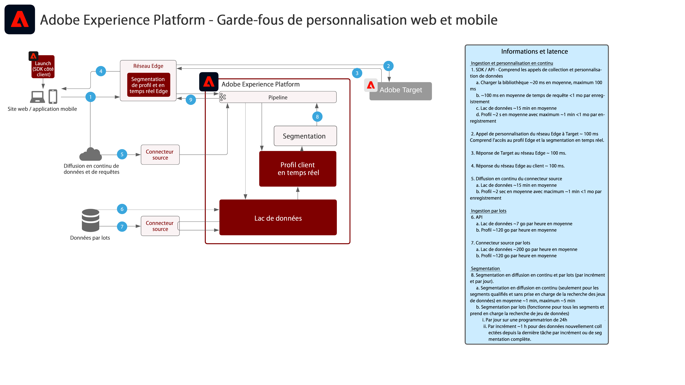

# Personnalisation web et mobile

La personnalisation web et mobile permet d’utiliser la segmentation de profil et d’audience sur plusieurs applications pour personnaliser et optimiser les expériences client. Les comportements des clients, les données démographiques, le niveau de fidélité et les transactions antérieures peuvent être utilisés pour personnaliser les mises en page, les appels à l’action et le contenu.

 

| Plan directeur | Description | Applications Experience Cloud |
|---|---|---|
| **[Personnalisation comportementale web ou mobile](behavioral.md)** | <ul><li>Personnalisation en fonction du comportement en ligne et des données d’audience</li></ul> | <ul><li>Adobe Target</li><li>Adobe Real-time Customer Data Platform *(facultatif)*</li><li>Adobe Analytics *(facultatif)*</li><li>Adobe Audience Manager *(facultatif)*</li></ul> |
| **[Personalization Web/Mobile avec données client connues](known-personalization.md)** | <ul><li>L’intégralité des profils client et l’amélioration de la segmentation offrent des expériences personnalisées optimisées.</li><li>Réalisez des personnalisations avec des attributs et événements hors ligne (transactions, réservations, CRM, et degré de fidélité).</li><li>Synchronisez la personnalisation sur le web, la messagerie électronique et d’autres canaux connus.</li></ul> | <ul><li>Adobe Target</li><li>[!UICONTROL Real-time Customer Data Platform]</li><li>Adobe Analytics *(facultatif)*</li><li>Adobe Audience Manager *(facultatif)*</li></ul> |

 

## Garde-fous pour la personnalisation web et mobile.

[Pour les garde-fous relatifs à l’activation des audiences et des profils, reportez-vous à la documentation sur les garde-fous de profil et de segmentation.](https://experienceleague.adobe.com/docs/experience-platform/profile/guardrails.html?lang=fr)

 

### Diagramme de sécurité Personalization client connu

## Articles de blog connexes

* [[!DNL Blueprint for Web Personalization using Adobe Experience Platform Real-Time Customer Profile]](https://medium.com/adobetech/blueprint-for-web-personalization-using-adobe-experience-platform-real-time-customer-profile-fef2ce7a4b2f)
* [[!DNL Integrating Adobe Experience Platform Decisioning Engine with AEM Websites]](https://jaeness.medium.com/integrating-adobe-experience-platform-decisioning-engine-with-aem-websites-9c222acd12e2)
* [[!DNL Content and Commerce AI: Personalizing Your Interactions with Customers Through Content Intelligence]](https://medium.com/adobetech/content-and-commerce-ai-personalizing-your-interactions-with-customers-through-content-intelligence-dc182601deab)
* [[!DNL How Adobe Experience Platform Predictive Audiences improves Personalized Experiences]](https://medium.com/adobetech/how-adobe-experience-platform-predictive-audiences-improves-personalized-experiences-1f75a60cb7a3)
* [[!DNL Adobe Experience Platform Web SDK for Audience Management]](https://medium.com/adobetech/adobe-experience-platform-web-sdk-for-audience-management-751fa6d063bc)
* [[!DNL Implementing Adobe Experience Platform Real-Time Customer Profile through our “Customer Zero” Program]](https://medium.com/adobetech/implementing-adobe-experience-platform-real-time-customer-profile-through-our-customer-zero-32e7cd952896)
* [[!DNL Segmentation in Seconds: How Adobe Experience Platform Made Real-time Customer Profiles a Reality]](https://medium.com/adobetech/segmentation-in-seconds-how-adobe-experience-platform-made-real-time-customer-profiles-a-reality-a7a8552b0847)
* [[!DNL Build an Optimal Online Experience: Enrich Unified Profile with Query Service]](https://medium.com/adobetech/build-an-optimal-online-experience-enrich-unified-profile-with-query-service-8027c196ab33)
